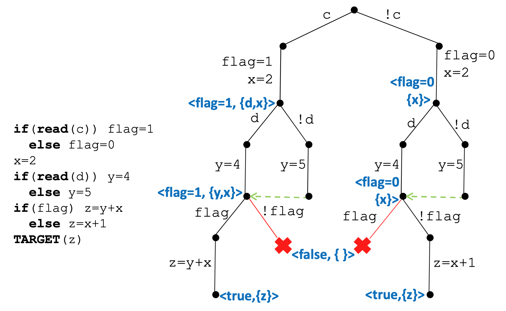
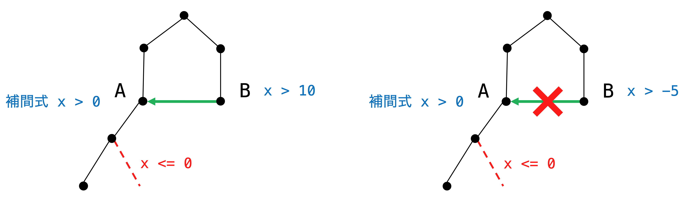
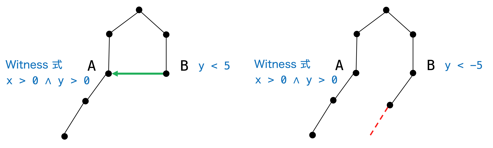

# 論文紹介

### A Path-Sensitively Sliced Control Flow Graph [FSE'14]

## 概要


## Introduction

- C プログラムから新しいグラフを構築

- Path-Sensitively Sliced Control Flow Graph (PSS-CFG) の特徴

  1. Path-sensitive である

        同じプログラムポイントを表す複数のノードが存在
   
  2. ターゲット変数に対してスライスされている

### Example

```c=
if (c)
    p = 1;
else
    p = 0;
x = 0;
if (p > 0)
    x = 1;
if (x == 0)
    z = 1;
target: {z}
```

これは以下のように変換できる. `z` の性質を知りたければ変換後のプログラムの方が効率的

```c=
if (!c)
    z = 1;
```

- (1行目) c のとき
  
  (2行目) `p = 1`

  (7行目) `x = 1`

  -> `z` の値は変化しない

- (1行目) !c のとき
  
  (4行目) `p = 0`

  (5行目) `x = 0`

  -> (9行目) `z = 1`

このように path-sensitive に考えるとスライシングが効果的に行える

<br/>

しかし、単純に path-sensitive に考えるとプログラムは元のサイズの指数倍

```c
if (c) p = 1; else p = 0;
S;
```
```c
if (c) { p = 1; S; } 
else { p = 0; S; } 
```

完全な path-sensitivity を確保することは困難なのでマージを行う

<br/>

**どのくらいマージする？**

この論文ではスライシングに影響する情報を残しつつ, マージを行った記号実行木 (Symbolic Execution Tree) を生成

それに対してスライシングを行うことで path-sensitive CFG を構築


## Basic Idea

アルゴリズム 2ステップ

1. 各頂点に target 変数の依存情報を付与した記号実行木の生成
   
   依存情報がより正確になるように path-sensitive に考える

   サイズの増加を防ぐため, 依存情報の精度を落とさないように頂点同士をマージ

2. Step1 の記号実行木のスライシングを行い, 最終的な PSS-CFG を生成


### Step1: 記号実行木の生成



- 各ノードはあるパスを実行した時のプログラムポイント間の状態

- 深さ優先でグラフを構築

#### 各ノードが持つもの

- 依存集合 (Dependency set)

  Target 変数に影響を与える変数の集合

- Witness path

  そのノードから各依存変数が target 変数に影響を与えるまでのパス

  Witness 式 : Witness path を $\wedge$ で結合したもの 

  実行可能なパスを見つけたら, そこから逆向きに計算していく

- 補間式 (Interpolant)

  そのノードからの実行不可能なパスが満たさない性質

  なるべく大きい範囲を取ると別のノードからマージされやすくなる

  実行不可能なパスを見つけたら, そこから逆向きに計算していく

#### ノードをマージするとき

ノード B を A にマージするとする

- A の補間式は A からの実行不可能なパスが満たさない性質

  - B がその性質を満たせば A からの実行不可能なパスを通ることがない

    -> B は A にマージ可能 (Soundness)

  - B が A からの実行不可能なパスを通る可能性があるなら, マージしてはいけない

  


- A の witness 式は A の各依存変数が target 変数に影響を与えるまでの条件

  - (A の各依存変数の witness 式) $\wedge$ (B までの性質) で成り立たないものがある

    -> B から A にはない実行不可能なパスが存在する (精度の向上)

    
