# 論文紹介

### A Path-Sensitively Sliced Control Flow Graph [FSE'14]

## 概要

- ターゲット変数を指定したプログラムの新しいグラフ表現の提案

- 新しいグラフ

  - Path-sensitive である

  - ターゲット変数に対してスライスされている

    - "Tree Sliceing" という手法でより効果的にスライシング

- 実験と結果

  - 元のプログラムと比較して, プログラムの大きさはそこまで大きくならない (平均して2倍程度)

  - 従来の静的スライスしたプログラムと比較して, テストとプログラム検査の速度が向上した

## Introduction

- C プログラムから新しいグラフを構築

- オフラインに (その他の解析とは別に) グラフを構築し, テストやプログラム検査を行うことを想定

- Path-Sensitively Sliced Control Flow Graph (PSS-CFG) の特徴

  1. Path-sensitive である

        同じプログラムポイントを表す複数のノードが存在
   
  2. ターゲット変数に対してスライスされている

### Example

```c=
if (c)
    p = 1;
else
    p = 0;
x = 0;
if (p > 0)
    x = 1;
if (x == 0)
    z = 1;
target: {z}
```

これは以下のように変換できる. `z` の性質を知りたければ変換後のプログラムの方が効率的

```c=
if (!c)
    z = 1;
```

- (1行目) c のとき
  
  (2行目) `p = 1`

  (7行目) `x = 1`

  -> `z` の値は変化しない

- (1行目) !c のとき
  
  (4行目) `p = 0`

  (5行目) `x = 0`

  -> (9行目) `z = 1`

このように path-sensitive に考えるとスライシングが効果的に行える

<br/>

しかし、単純に path-sensitive に考えるとプログラムは元のサイズの指数倍

```c
if (c) p = 1; else p = 0;
S;
```
```c
if (c) { p = 1; S; } 
else { p = 0; S; } 
```

完全な path-sensitivity を確保することは困難なのでマージを行う

<br/>

**どのくらいマージする？**

この論文ではスライシングに影響する情報を残しつつ, マージを行った記号実行木 (Symbolic Execution Tree) を生成

それに対してスライシングを行うことで path-sensitive CFG を構築


## Basic Idea

アルゴリズム 2ステップ

1. 各頂点に target 変数の依存情報を付与した記号実行木の生成
   
   依存情報がより正確になるように path-sensitive に考える

   サイズの増加を防ぐため, 依存情報の精度を落とさないように頂点同士をマージ

2. Step1 の記号実行木のスライシングを行い, 最終的な PSS-CFG を生成


### Step1: 記号実行木の生成


- 各ノードはあるパスを実行した時のプログラムポイント間の状態

- 深さ優先でグラフを構築

#### 各ノードが持つもの

Witness path と補間式はノードをマージするときに必要

- 依存集合 (Dependency set)

  Target 変数に影響を与える変数の集合

  スライシングで用いる

- Witness path

  そのノードから各依存変数が target 変数に影響を与えるまでのパス

  Witness 式 : Witness path を $\wedge$ で結合したもの 

  実行可能なパスの最終地点から逆向きに計算していく

- 補間式 (Interpolant)

  そのノードからの実行不可能なパスを通らないことを保証できる性質

  なるべく緩い条件を取ると別のノードからマージされやすくなる

  実行不可能なパスを見つけたら, そこから逆向きに計算していく

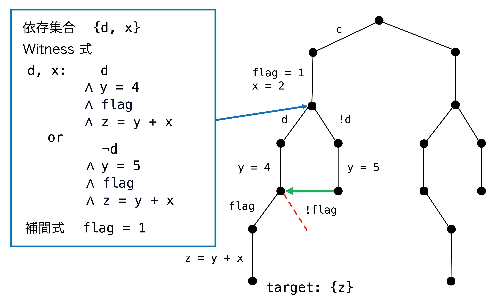

#### ノードをマージするとき

ノード B を A にマージするとする

- A の補間式は A からの実行不可能なパスが満たさない性質

  - B がその性質を満たせば A からの実行不可能なパスを通ることがない

    -> B は A にマージ可能 (Soundness)

  - B が A からの実行不可能なパスを通る可能性があるなら, マージしてはいけない

  


- A の witness 式は A の各依存変数が target 変数に影響を与えるまでの条件

  - (A の各依存変数の witness 式) $\wedge$ (B までの性質) で充足不可能なものがある

    -> B から A にはない実行不可能なパスが存在する (精度の向上)

    


<br/>

[**Example**](slides/pss-cfg-ex.pdf)

<br/>


### Step2: スライシング

Target 変数の最終的な値が変わらないように記号実行木をスライシング

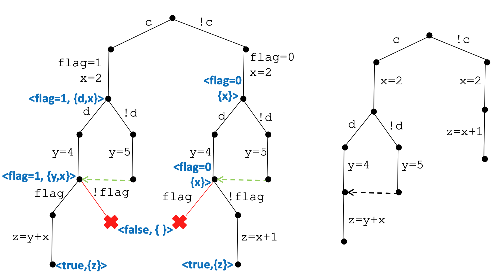

#### 3つの変換ルール

1. 代入文の左辺がそれ以降の依存集合に現れなければその文を削除

  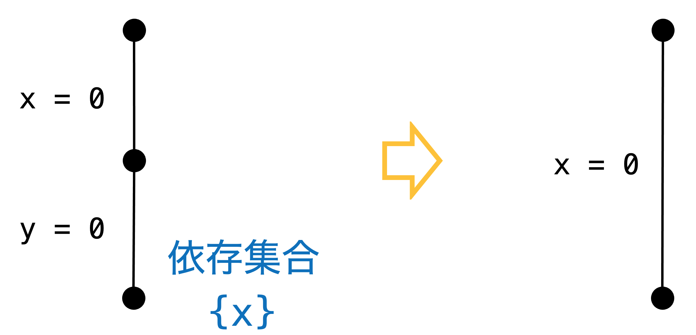

2. ある分岐点からの実行可能なパスが 1つしかないとき, その分岐文を削除

  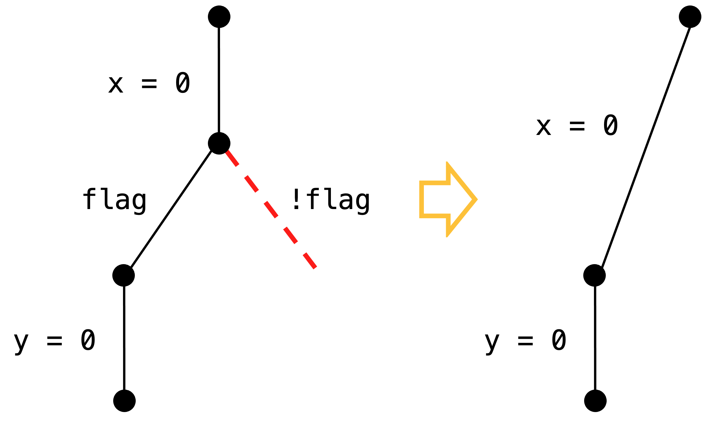

3. Tree Slicing

   分岐の "then", "else" 節両方に target 変数に影響を与える文がない かつ
  
   分岐の最終地点でノードがマージされているとき, 分岐全体を削除

   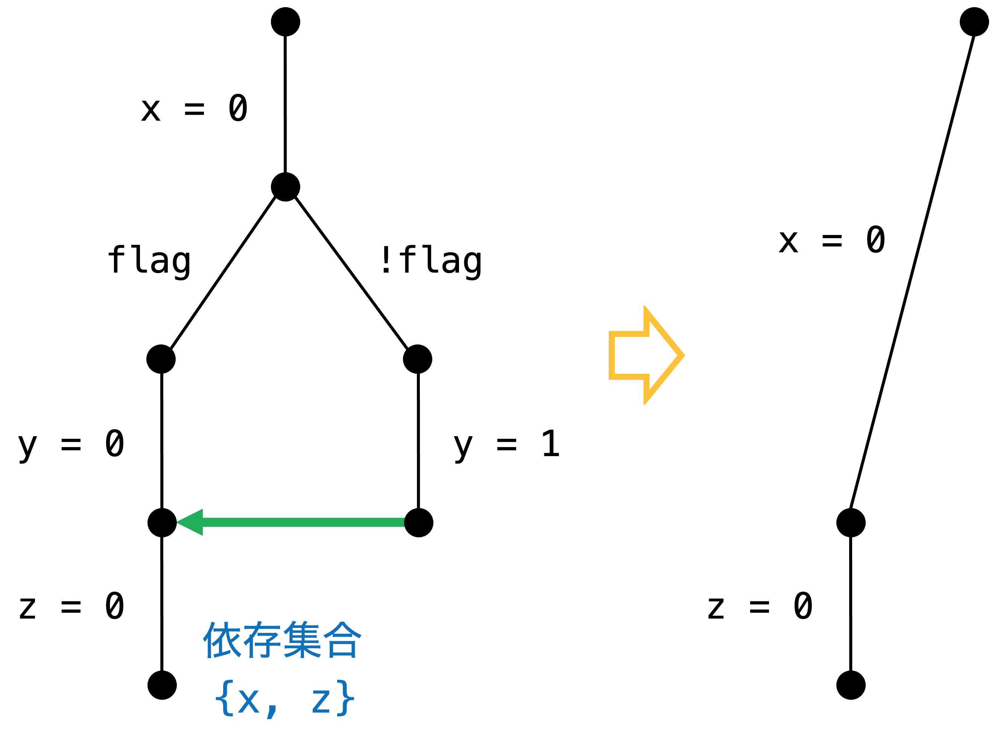

[**Example**](slides/pss-cfg-ex-slicing.pdf)


### PSS-CFG

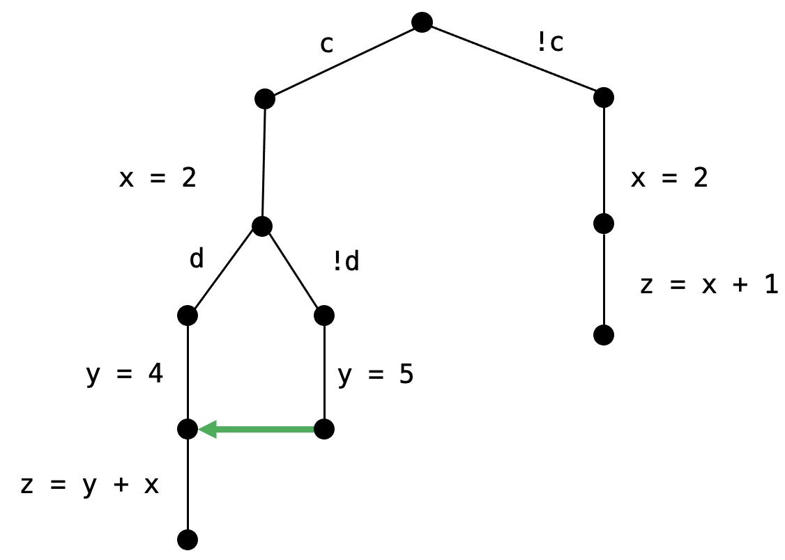

- 2つのアルゴリズムによって元のコードを以下のように変換できる

```c=
bool flag, c, d;
int x, y, z;
if (c) flag = 1;
else flag = 0;
x = 2;
if (d) y = 4;
else y = 5;
if (flag) z = y + x;
else z = x + 1;
TARGET: {z}
```

```c=
bool c, d;
int x, y, z;
if (c) {
    x = 2;
    if (d) y = 4;
    else y = 5;
    z = y + x;
} else {
    x = 2;
    z = x + 1;
}
```

- 純粋に path-sensitive に考えたときの実行パス : 8本
  
  PSS-CFG の実行パス : 3本

- 従来の静的スライサーではできないこと

  - $c = false$ のとき $d$ の値を考えないこと

  - $flag$ の代入や分岐を sound に削除すること

<br/>

## Algorithm

今まで見てきた手法を形式的に表す

### 事前準備

#### プログラム言語

ここで扱うプログラミング言語は簡単なもの

- 変数集合 $Var$ : 型はすべて整数

- 命令 (命令集合 $Ops$)

  - 代入 `x := e`

  - 仮定 `assume(c)` 

- プログラムの遷移 $~\ell \stackrel{\mathsf{op}}{\longrightarrow} \ell^{\prime}$  ( $\ell$ はプログラムポイント )

<details>
<summary>Example</summary>
<div class="details-inner">

```c=
y = 0;
if (x > 0)
    z = 1;
else
    z = 0;
w = 1;
```

```=
y := 0
assume(x > 0)
z := 1
assume(x <= 0)
z := 0
w := 1
```

$1 \stackrel{\mathsf{y\ :=\ 0}}{\longrightarrow} 2$

$2 \stackrel{\mathsf{assume(x > 0)}}{\longrightarrow} 3$

$3 \stackrel{\mathsf{z\ :=\ 1}}{\longrightarrow} 6$

$2 \stackrel{\mathsf{assume(x <= 0)}}{\longrightarrow} 5$

$5 \stackrel{\mathsf{z\ :=\ 0}}{\longrightarrow} 6$

$6 \stackrel{\mathsf{w\ :=\ 1}}{\longrightarrow} 7$

</div>
</details>

<br/>

#### シンボリック実行

##### シンボリック状態 

$$v : \langle\ell, s, \Pi\rangle$$

- $\ell$ : プログラムポイント

- $s$ : シンボリックストア : プログラム変数からシンボル変数への関数

  $s$ における式 $e$ の評価 $[e]_s$

  - 変数 $v$ : $<v _s = s(v)$

  - 整数 $n$ : $[n] _s = n$

  - $[e\ \mathsf{op}\ e']_s = [e]_s\ \mathsf{op}\ [e']_s$

- $\Pi$ : パス条件

<br/>

##### シンボリック実行

$v \equiv\langle\ell, s, \Pi\rangle$, $\ell \stackrel{\mathsf{op}}{\longrightarrow} \ell^{\prime}$ におけるシンボリック実行

$$v^{\prime} \triangleq \begin{cases}\left\langle\ell^{\prime}, s, \Pi \wedge [ c ] _s\right\rangle & \text { if op } \equiv \text { assume(c) }\ \text{ and }\  \Pi \wedge [ c ] _s \text { is satisfiable } \\ \left\langle\ell^{\prime}, s[x \mapsto [ e ] _s], \Pi\right\rangle & \text { if } \mathrm{op} \equiv \mathrm{x}:=\mathrm{e}\end{cases}$$

- パス条件に $c$ を追加

  $\Pi \wedge [ c ] _s$ が充足可能かどうかは制約ソルバーを用いる

- シンボリックストアに $x$ を追加

<br/>

##### 変数の条件とパス条件の結合

$$[v] : \left(\bigwedge_ {x \in \operatorname{Vars}} [x] _s\right) \wedge \Pi$$

<br/>

#### 記号実行木

シンボリック状態 $v \equiv\langle\ell, s, \Pi\rangle$ をノードとして, 以下の2つの情報を付加する

- 補間式 : $\overline{\Psi}$

- 依存変数と witness 式の組 : $\langle x, \omega_x\rangle$

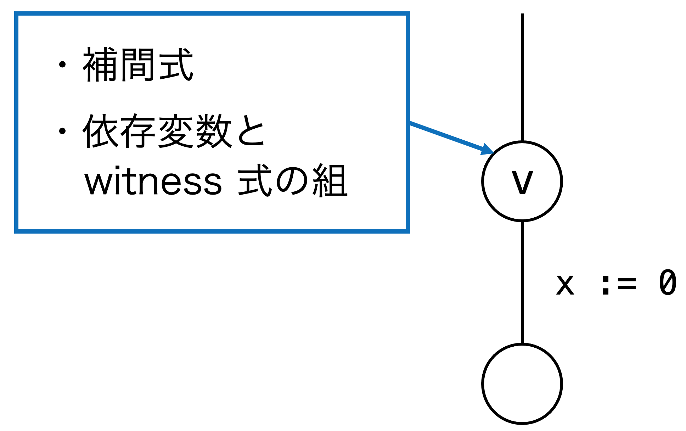

<br/>

#### 補間式

$A \wedge B$ が $false$ となる一階論理式 $A,\ B$ が与えられたとき, 補間式 $\overline{\Psi}$ は以下のように定義される

1. $A \models \overline{\Psi}$

2. $B \wedge \overline{\Psi}$ が $false$

3. $\overline{\Psi}$ の変数は $A, B$ の共通の変数

<details>
<summary>Example</summary>
<div class="details-inner">

ここで扱う補間式の性質:

そのノードから実行不可能なパスを通らないことを保証できる性質

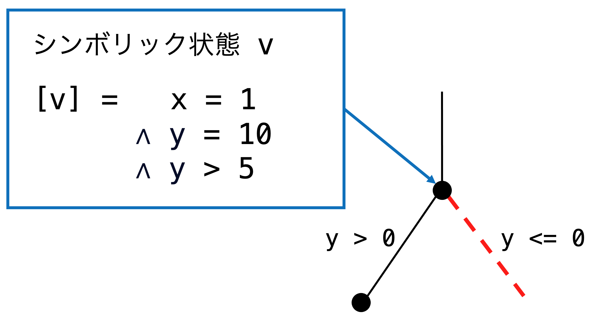

分岐直前のシンボリック状態 $v$ に対して

$$[v] : x = 1 \wedge y = 10 \wedge y > 5$$

$A : x = 1 \wedge y = 10 \wedge y > 5$, $\ B : y \leq 0\ $ としたとき

1. $x = 1 \wedge y = 10 \wedge y > 5 \models \overline{\Psi}$ 

2. $y \leq 0 \wedge \overline{\Psi}$ が $false$

3. $\overline{\Psi}$ の変数は $A, B$ の共通の変数

となる補間式 $\overline{\Psi}$ の一つは $y > 0$.

<br/>

この例での補間式 $\overline{\Psi}$ は $y > 1$ なども満たすが, $y > 0$ が最も良い.

別のシンボリック状態 $v'$ が $v$ に sound にマージできるということは $v'$ が $v$ からの実行不可能なパスを絶対に通らないということ.

$$ [v'] \models \overline{\Psi}_s $$

よって $\overline{\Psi}_s$ の条件が緩い方がマージされる可能性が高くなる.

</div>
</details>

<br/>

#### 依存変数

依存集合 : $\sigma _v$

- プログラムの最終地点における $\sigma _v$ : Target 変数の集合 $\mathcal{V}$

- Backward に依存集合を更新

  $v \stackrel{\mathsf{op}}{\longrightarrow} v^{\prime}$ とする

  - $\mathsf{op} \equiv \mathsf{x := e}$ のとき

    - $\mathsf{x}$ が $\sigma_{v'}$ に含まれる ($\ \sigma_{v'} \cap def(\mathsf{op}) \neq \emptyset\ $) のとき

$$\sigma_v\ \triangleq\ \left(\sigma_{v^{\prime}} \backslash def(\mathsf{op})\right) \cup use(\mathsf{op})$$

<ul>
<ul>
<ul>

この条件を満たして依存変数が更新されたとき, $\ v \stackrel{\mathsf{op}}{\longrightarrow} v^{\prime}$ が "スライスに含まれる" と言う

</ul>
</ul>
</ul>

<ul>
<ul>

- それ以外のとき

$$\sigma_v\ \triangleq\ \sigma_{v'}$$

</ul>

- $\mathsf{op} \equiv \mathsf{assume}(c)$ のとき

  - この命令から分岐の合流地点までの命令のいずれかがスライスに含まれるとき

$$\sigma_v\ \triangleq\ \sigma_{v^{\prime}} \cup u s e(\mathsf{op})$$

<ul>
<ul>

この条件を満たして依存変数が更新されたとき, $\ v \stackrel{\mathsf{op}}{\longrightarrow} v^{\prime}$ が "スライスに含まれる" と言う

</ul>

- それ以外のとき

$$\sigma_v\ \triangleq\ \sigma_{v'}$$

</ul>
</ul>

<details>
<summary>Example</summary>
<div class="details-inner">

$v \stackrel{\mathsf{op}}{\longrightarrow} v^{\prime}$, $\mathsf{op} \equiv \mathsf{x := y + z}$ 

$x \in \sigma _{v'}$ のとき

$$\sigma_v = \left(\sigma_{v^{\prime}} \backslash \{x\} \right) \cup \{ y, z \}$$

</div>
</details>

<br/>

#### 依存変数と witness 式

Target 変数の集合 : $\mathcal{V}$

シンボリック状態 $v$ の依存変数 $x \in \sigma_v$ が $\mathcal{V}$ の変数に影響を与えるまでのパス 

$$\pi \equiv v \dots v_{end}$$ 

を witness path とする. 

witness 式 $\ \omega_x$ : パス $\pi$ について変数とパスの条件を結合したもの

<br/>

依存変数と witness 式の組を考える

- 抽象ドメイン : $\ \ \mathcal{D} \triangleq\{\perp\} \cup \mathcal{P}(Vars \times FOL)$

- 抽象演算 : $\ \sqcup = \cup$, $\ \sqsubseteq = \subseteq$

- $\widehat{pre}$ : $\mathsf{op}$ の事後状態から事前状態を求める関数

  - 依存変数 : 上記の定義
  - witness 式 : (事後状態の依存変数に対する witness 式) $\wedge$ ($\mathsf{op}$ の論理的制約)

これ以降は依存変数と witness 式の組の集合を $\sigma$ で表す


<br/>

#### マージ

シンボリック状態 : $v \equiv \langle\ell, s, \Pi\rangle$ 

すでに計算された状態 :  $v' \equiv \langle\ell, s', \Pi'\rangle$ (補間式 : $\overline{\Psi}_{v'}$, 依存変数と witness 式の組の集合 : $\sigma _ { v ' }$)

<br/>

次の条件を満たすとき $v$ は $v'$ にマージできる

1. $[v] \models \overline{\Psi}_{v'}$

2. $\forall \langle x, \cdot \rangle \in \sigma_{v'},\ \exists \langle x, \omega_x \rangle \in \sigma_{v'}\ \ s.t\ \  [v] \wedge \omega_x \ $ が充足可能


##### 1つ目の条件

$$[v] \models \overline{\Psi}_{v'}$$

$v$ の条件は補間式 $\overline{\Psi}_{v'}$ を満たす

$v'$ からのパスは $v$ から実行不可能なパスを絶対に通らない (soundness)

<br/>

**補題 1 :**

<ul>

$[v] \models \overline{\Psi}_{v'}$ が成り立つとき, $v$ からの実行可能なパスの集合は $v'$ からの実行可能なパスの集合の 部分集合 である

</ul>

<details>
<summary>背理法による証明</summary>
<div class="details-inner">

$v$ から実行可能で $v'$ から実行不可能なパス条件 $\Pi$ のパス $\pi$ が存在すると仮定する.

- $\pi$ は $v'$ から実行不可能だから, $[v'] \wedge \Pi$ は充足不可能

- 補間式の定義から $\overline{\Psi}_{v'} \wedge \Pi$ は充足不可能

- これと $[v] \models \overline{\Psi}_{v'}$ から, $[v] \wedge \Pi$ は充足不可能

これは $\pi$ が $v$ から実行可能であることに矛盾.

</div>
</details>

<br/>

##### 2つ目の条件

<br/>

<div style="text-align:center;">

$\forall \langle x, \cdot \rangle \in \sigma_{v'},\ \exists \langle x, \omega_x \rangle \in \sigma_{v'}\ \ s.t\ \  [v] \wedge \omega_x \ $ が充足可能

</div>

<br/>

<ul>

$v'$ のすべての依存変数について $v$ から実行可能な witness path が 1つ以上存在する

これはマージしても精度が低下しないことを保証する

純粋な依存変数の集合 ($\neq$ witness path との組) を $\sigma'$ で表す

最終的な精度が低下しないことは, 2つのマージするノードの $\sigma'$ が等しいことを言えば良い

</ul>

**定理 1 :**

<ul>

$v$ が $v'$ にマージ可能とする. このとき, $v$ をマージせずに記号実行を進めたとしても, 必ず $\sigma ' _v = \sigma ' _{v'}$ となる.

</ul>

<details>
<summary>証明</summary>
<div class="details-inner">

- $\sigma ' _{v'} \subseteq \sigma ' _{v}$

  $v$ が $v'$ にマージされるとき, $\forall x \in \sigma ' _{v'}$ について $[v] \wedge \omega_x$ が充足可能となるような witness path $\pi_x$ が存在する. これは $\pi_x$ が $v$ から実行可能なことを表し, $\pi_x$ は $x$ が target 変数に影響を与えるパスであることから, $\sigma' _ {v}$ には $x$ が含まれる.

- $\sigma ' _{v} \subseteq \sigma ' _{v'}$

  (背理法) $x \notin \sigma ' _{v'}$ となるような $x \in \sigma ' _{v}$ が存在するとする. このとき $x$ の witness path を $\pi_x$, witness 式を $\omega_x$ とすると, $[v] \wedge \omega_x$ は充足可能だが, $[v'] \wedge \omega_x$ は充足不可能. これは $\pi_x$ が $v$ から実行可能で $v'$ から実行不可能であることを表すため, 補題1に反する.

</div>
</details>

<br/>

### Step1: 記号実行木の生成

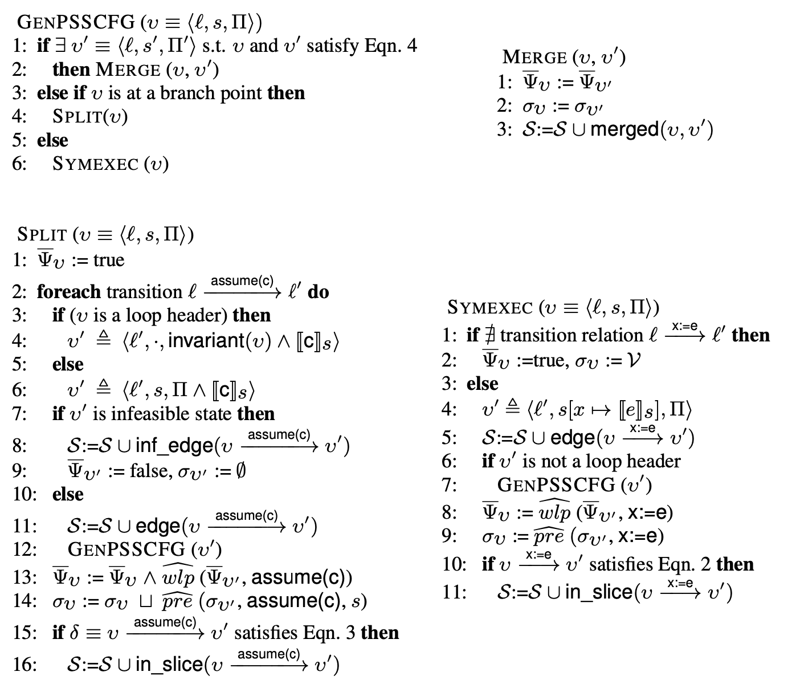

- 再帰的に記号実行を進める

- GENPSSCFG : main 関数

- MERGE : ノードをマージするときの関数

- SPLIT : 分岐地点でのグラフの構築

- SYMEXEC : 代入文でのグラフの構築

- $\mathcal{S}$ : 記号実行木の要素 (辺やマージなどの情報)

<br/>

#### GENPSSCFG

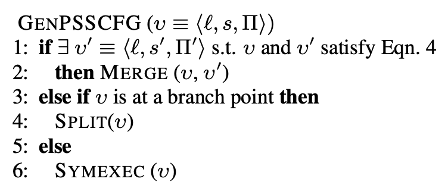

- 初期状態 $v \equiv\langle\ell_{start}, \epsilon, true \rangle$ から始める

- 同じプログラムポイントを表すノードが存在し, マージ条件を満たすとき MARGE に移動

<ul>
<details>
<summary>マージ条件</summary>
<div class="details-inner">

次の条件を満たすとき $v$ は $v'$ にマージできる

1. $[v] \models \overline{\Psi}_{v'}$

2. $\forall \langle x, \cdot \rangle \in \sigma_{v'},\ \exists \langle x, \omega_x \rangle \in \sigma_{v'}\ \ s.t\ \  [v] \wedge \omega_x \ $ が充足可能

</div>
</details>

</ul>

- $v$ が分岐地点のとき SPLIT へ移動

- それ以外のとき SYMEXEC へ移動

<br/>

#### MARGE

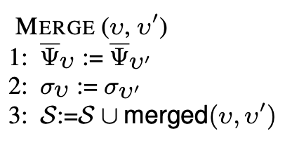

- $v'$ が $v$ にマージできるとき, 補間式と依存集合を $v$ に合わせる

  - 補題1と定理1より, sound かつ精度を落とさない

- $\mathcal{S}$ に $v$ と $v'$ がマージした情報を追加


<br/>

#### SPLIT

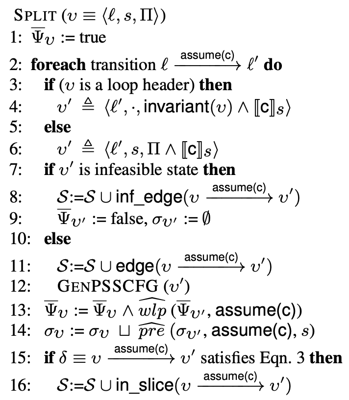

シンボリック状態 $v$ の補間式と依存集合を計算 + 次のシンボリック状態 $v'$ を生成

- (1行目) 補間式 $\overline{\Psi}_v$ の初期状態は $true$

- (2行目) 各分岐について実行

- (4行目) ループの処理 (後述)

- (6行目) 次のシンボリック状態 $v'$ を生成 (パス条件を追加)

<br/>

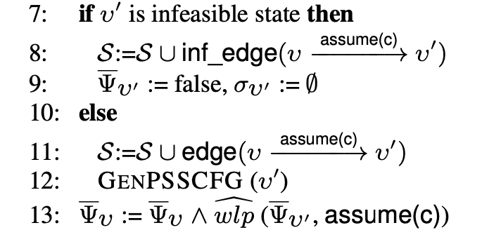

- (7,8,9行目) $v'$ が実行不可能なとき (パス条件が充足可能か制約ソルバーに解かせる)

  - $\mathcal{S}$ にこの分岐が実行不可能という情報を追加
  
  - 補間式は $false$, 依存集合は空集合に初期化

- (11,12行目) $v'$ が実行可能なとき

  - $\mathcal{S}$ にこの分岐の辺を追加

  - 次の状態 $v'$ に移動

- (13行目) 補間式の計算 (ここから後向きの計算)

  - すべての分岐点での補間式の計算結果の $\wedge$ を取る

  - $\widehat{wlp}$ : $\mathsf{assume}(c)$ を実行した後に条件 $\overline{\Psi}_{v '}$ が満たされるような初期条件のうち, 最も条件の緩いものを返す関数

<ul>

<details>
<summary>Example</summary>
<div class="details-inner">

$\widehat{wlp}(false, \mathsf{assume}(x > 0)) \=\ x \leq 0$

$\widehat{wlp}(x > 10, \mathsf{assume}(y > 0)) \ =\ x > 10$

</div>
</details>

</ul>
</ul>

<br/>

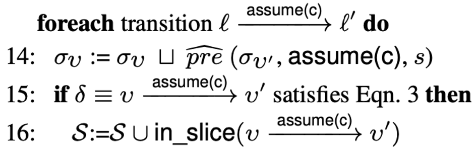

- ここからは今までと別のループ

- (14行目) 依存集合と witness path を後向きに計算 ( $\sqcup$ = $\cup$ )

- (15行目) $v \stackrel{\mathsf{assume}(c)}{\longrightarrow} v^{\prime}$ がスライスに含まれるとき

  - $\mathcal{S}$ にこの辺がスライスに含まれるという情報を追加

<ul>
<ul>

<details>
<summary>スライスに含まれる</summary>
<div class="details-inner">

  $v \stackrel{\mathsf{op}}{\longrightarrow} v^{\prime}$ とする

  - $\mathsf{op} \equiv \mathsf{x := e}$ のとき

    - $\mathsf{x}$ が $\sigma_{v'}$ に含まれる ($\ \sigma_{v'} \cap def(\mathsf{op}) \neq \emptyset\ $) のとき

$$\sigma_v\ \triangleq\ \left(\sigma_{v^{\prime}} \backslash def(\mathsf{op})\right) \cup use(\mathsf{op})$$

<ul>
<ul>

この条件を満たして依存変数が更新されたとき, $\ v \stackrel{\mathsf{op}}{\longrightarrow} v^{\prime}$ が "スライスに含まれる" と言う

</ul>

- それ以外のとき

$$\sigma_v\ \triangleq\ \sigma_{v'}$$

</ul>

- $\mathsf{op} \equiv \mathsf{assume}(c)$ のとき

  - この命令から分岐の合流地点までの命令のいずれかがスライスに含まれるとき

$$\sigma_v\ \triangleq\ \sigma_{v^{\prime}} \cup u s e(\mathsf{op})$$

<ul>
<ul>

この条件を満たして依存変数が更新されたとき, $\ v \stackrel{\mathsf{op}}{\longrightarrow} v^{\prime}$ が "スライスに含まれる" と言う

</ul>

- それ以外のとき

$$\sigma_v\ \triangleq\ \sigma_{v'}$$

</ul>
</ul>

</div>
</details>

</ul>
</ul>

<br/>

#### SYMEXEC

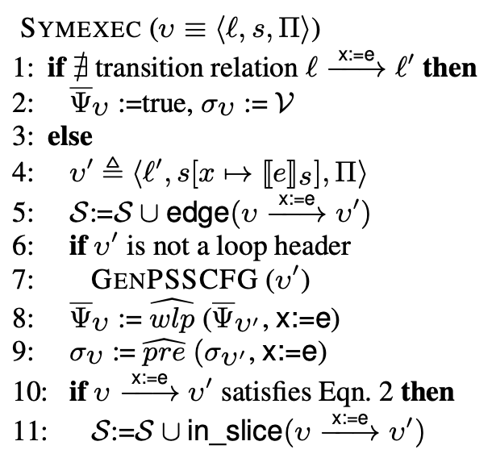

- (1,2行目) $v$ がプログラムの最終地点を表すなら, 補間式を $true$, 依存集合を target 変数の集合 $\mathcal{V}$ に

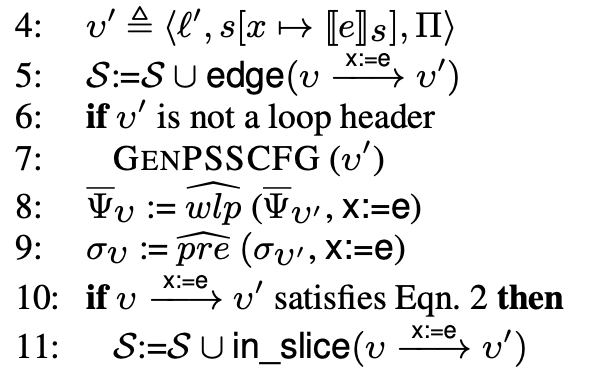

- (4行目) 次の状態 $v'$ を生成し, (5行目) $\mathcal{S}$ に辺を追加
- (6,7行目) ループの header でなければ次の状態 $v'$ に移動 (後述)
- (8,9行目) 補間式, 依存集合を計算
- (10,11行目) $v \stackrel{\mathsf{x := e}}{\longrightarrow} v^{\prime}$ がスライスに含まれるなら $\mathcal{S}$ にその情報を追加

<br/>

#### ループの扱い

記号実行木が無限に構築されるのを防ぐ

1. ループの header で loop invariant を計算
2. ループ1周分のグラフを構築
3. 状態が不動点に到達するまでループの header からアルゴリズムを再開

[**Example**](slides/pss-cfg-loop.pdf)

- この手法で実験的にループを通したほとんどの重要な情報を保持できる

- ループに1つの header があることが前提

<br/>

## 実験・評価

### 実装

- 記号実行フレームワーク [TRACER](https://link.springer.com/chapter/10.1007/978-3-642-31424-7_61) 上に実装

- ポインタ

  - flow-insensitive なポインタ解析を使用してモデル化

- 関数

  - すべてインライン展開

  - 外部の関数は副作用がなく任意の値を返すとしてモデル化

### 実験概要

- ベンチマーク

  - [SV-COMP 2013](https://sv-comp.sosy-lab.org/2013/benchmarks.php) の ntdrivers-simplified カテゴリと tcas を使用

  - プログラムの安全性からターゲット変数を選択

- 比較対象

  - [Frama-C](https://dl.acm.org/doi/10.1007/s00165-014-0326-7) : 定数伝播, 定数畳み込み, 抽象解釈などを使って実行不可能なパスを見つける, path-sensitive な静的スライサー

    - 静的スライサー : 元々のプログラムに対してスライシングを行う

    - PSS-CFG : 元々のプログラムをスライスした新しいプログラムを構築する

```c=
bool flag, c, d;
int x, y, z;
if (c) flag = 1;
else flag = 0;
x = 2;
if (d) y = 4;
else y = 5;
if (flag) z = y + x;
else z = x + 1;
TARGET: {z}
```

```c=
bool c, d;
int x, y, z;
if (c) {
    x = 2;
    if (d) y = 4;
    else y = 5;
    z = y + x;
} else {
    x = 2;
    z = x + 1;
}
```

### PSS-CFG の構築

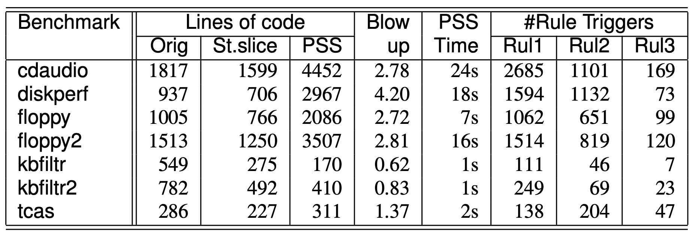

- (Blowup) 静的スライサーと比較したときのプログラム行数の倍率

  - 2倍程度
  - Path-sensitivity を導入したことによるコード行数の増加
  - マージとスラシングによるコード行数の減少

- (PSS Time) PSS-CFG の構築時間

- (Rule Triggers) 変換ルールの適用回数

- 一度 PSS-CFG を構築すれば, 同じ target 変数に関するテストや検証を何度も行うことができる

### テスト

[DART](https://dl.acm.org/doi/10.1145/1064978.1065036) というコンコリックテストの手法を使い, すべての実行可能なパスを通るまでの時間を計測

- あるパスを通ったら分岐で否定を取り,　別のパスへ進む

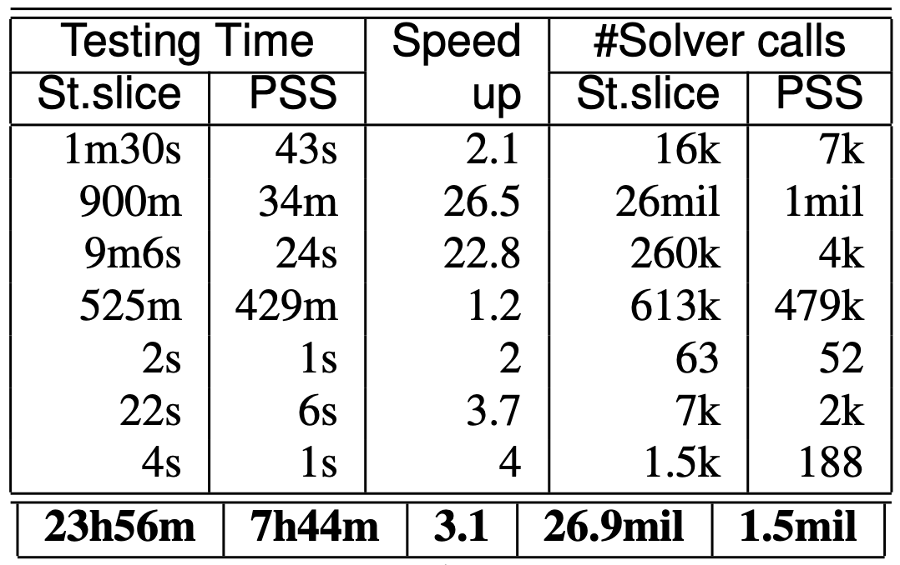

- どの検体でも PSS-CFG の方が早くテストを完了

- コンコリックテスト中にソルバーが呼ばれる回数も PSS-CFG の方が数倍少ない

### 検証

[IMPACT](https://link.springer.com/chapter/10.1007/11817963_14), [ARMC](https://dl.acm.org/doi/10.1007/978-3-540-69611-7_16), [CPA-CHECKER](https://link.springer.com/chapter/10.1007/978-3-642-22110-1_16) の3つの検証器を用いて検証時間を比較

  - 検証アプローチが異なるためこの3つの検証器を選択

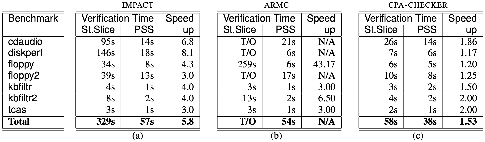

- どのアプローチも PSS-CFG の方が速く検証可能

- タイムアウトは10分

- CPA-CHECKER の効果が薄いのは他の2つよりも洗練されているため

<br/>