# 論文紹介

### SAVER: scalable, precise, and safe memory-error repair [ICSE ’20]

## 概要

$\fre{1}$

SAVER

memory leak, double-free, use-after-free といったメモリエラーを scalable, precise, safe な方法で自動的に修復する

- memory leak

  確保したメモリを解放し忘れること

  ```c
  char *p = (char *)malloc(sizeof(char));
  ...
  ```

- double-free

  同じメモリ領域を2回以上解放すること

  ```c
  char *p = (char *)malloc(sizeof(char));
  free(p);
  free(p);
  ```

- use-after-free

  解放したメモリ領域を再び使用すること

  ```c
  char *p = (char *)malloc(sizeof(char));
  free(p);
  use(p);
  ```

## Overview

### Motivating Examples

#### 1. memory leak の修正

```c=
int append_data(Node *node, int *ndata) {
    if (!(Node *n = malloc(sizeof(Node))))
        return -1;
    // ...
    return 0;
}

Node *lx = ... // a linked list
Node *ly = ... // a linked list

// copy lx to ly
for (Node *node = lx; node != NULL; node = node->next) {
    int *dptr = malloc(sizeof(int));
    *dptr = *(node->data);
    append_data(ly, dptr);  // potential memory-leak
}
```

- `append_data` が `-1` を返したときに `dptr` が解放されない (memory leak).

- <p>静的解析ツールの Infer では以下のエラーを出す.</p>

```
Object allocated at line 12 is unreachable at line 15.
```

- <p>このプログラムと Infer などの静的解析ツールによる error report を入力として, SAVER は自動的に以下のようなパッチを生成する.</p>

```diff_c=
int append_data(Node *node, int *ndata) {
    if (!(Node *n = malloc(sizeof(Node))))
        return -1;
    // ...
    return 0;
}

Node *lx = ... // a linked list
Node *ly = ... // a linked list

// copy lx to ly
for (Node *node = lx; node != NULL; node = node->next) {
    int *dptr = malloc(sizeof(int));
    *dptr = *(node->data);
-   append_data(ly, dptr);
+   if ((append_data(ly, dptr)) == -1)
+       free(dptr);
}
```

- use-after-free などの別のエラーが起きないように修正

- `append_data()` が別の場所でも呼ばれているため, 3行目の直前に `free(ndata);` を挿入するとプログラムの意味が変わる.


#### 2. use-after-free の修正

```c
struct node *cleanup;
struct node *first = NULL;
for (...) {
    struct node *new = malloc(sizeof(*node));
    make_cleanup(new)  // add new to the cleanup list
    new->name = ...;

    if (...) {
        first = new;
        continue;
    }

    if (first == NULL || new->name != first->name)
        continue;
    do_cleanup();  // deallocate all objects in cleanup
}
```

- 1 周目
  - (8行目) true branch と仮定
  　　<p>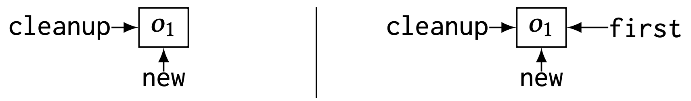</p> 

- 2 周目
  - (8行目) false branch, (13行目) false branch と仮定 (`do_cleanup()` が実行)
     <p>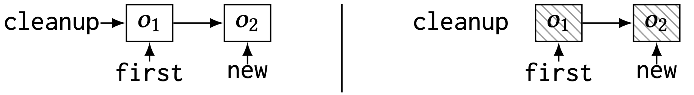</p>

- 3 周目
  - (8行目) false branch と仮定
    <p>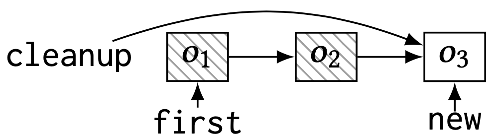</p>

  - `first` は dangling pointer (not NULL).
  
  - (13行目) `first->name` は use-after-free を引き起こす.

```diff_c=
struct node *cleanup;
struct node *first = NULL;
for (...) {
    struct node *new = malloc(sizeof(*node));
    make_cleanup(new)  // add new to the cleanup list
    new->name = ...;

    if (...) {
        first = new;
+       tmp = first->name;
        continue;
    }
   
-   if (first == NULL || new->name != first->name)
+   if (first == NULL || new->name != tmp)
        continue;
    do_cleanup();  // deallocate all objects in cleanup
}
```

- 修正してもプログラムの意味を変えない
  
  - 15行目での `first->name` と `tmp` の値は常に同じ


既存手法 ([FootPatch](https://dl.acm.org/doi/10.1145/3180155.3180250), [MemFix](https://dl.acm.org/doi/10.1145/3236024.3236079), [LeakFix](https://ieeexplore.ieee.org/abstract/document/7194597)) では deallocator の挿入または削除だけでメモリエラーを修正しようとするので, 上記の2つの例は修正できない.

### How SAVER works

簡単に SAVER の動作を説明する.

**Example Code**

```c=
p = malloc(1);  // o1
if (C)
    q = p;
else
    q = malloc(1);  // o2
*p = 1;
free(q);
```

- $\lnot C$ のとき object o1 が解放されない (memory leak)
  
  - 7行目の前に以下のコードを挿入したい

```c
if (not C) 
    free(p);
```

SAVER の動作ステップ

1. Object Flow Graph の作成
   
2. Object Flow Graph のラベルを変える
   
3. パッチの生成


#### 1. Object Flow Graph (OFG) の作成

- <p>初めに SAVER は静的ヒープ解析を行い, 入力プログラムを OFG に変換する</p>

```c=
p = malloc(1);  // o1
if (C)
    q = p;
else
    q = malloc(1);  // o2
*p = 1;
free(q);
```

<p>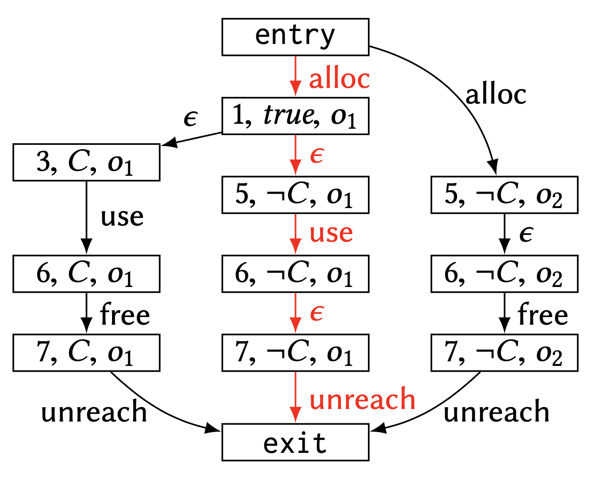</p>

- OFG の頂点はある program point と path condition での heap object を表す.

- OFG の辺はプログラムの制御フローを表し, その object で発生するイベント (alloc, free, use など) でラベル付けをする

#### 2. Object Flow Graph (OFG) のラベルを変える

OFG の赤い path のラベル列は free を含まないため, ここで memory-leak が起きる.

$$ \mathrm{alloc} \cdot \epsilon \cdot \mathrm{use} \cdot \epsilon \cdot \mathrm{unreach} $$

この path でも object が解放されるように空のラベル ( $\epsilon$ ) を free に置き換える.

$$ \mathrm{alloc} \cdot \epsilon \cdot \mathrm{use} \cdot \mathrm{free} \cdot \mathrm{unreach} $$

<p>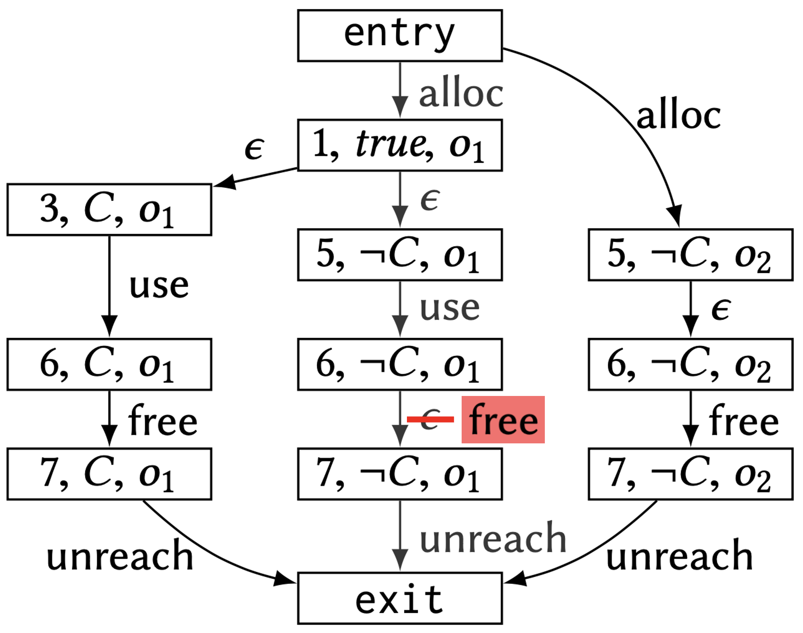</p>

SAVERのラベルの変更方法は以下の4つ.

- (a) free の挿入
  
- (b) free の位置変更
  
- (c) use の位置変更
  
- (d) free の削除

<p>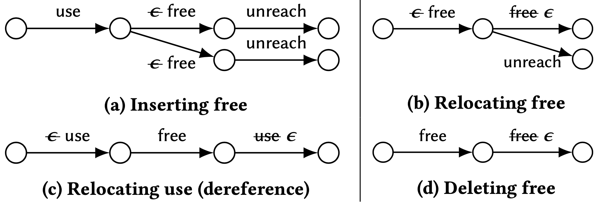</p>


#### 3. パッチの生成

<p></p>

6行目と7行目の間に `if (not C) free(p);` を挿入. ポインタ式 `p` は object $o_1$ の point-to 情報に含まれる (詳細は後述)

```diff_c=
  p = malloc(1);  // o1
  if (C)
      q = p;
  else
      q = malloc(1);  // o2
  *p = 1;
+ if (not C)
+     free(p);
  free(q);
```

<br/>
<br/>


## Approach Details

SAVER に与える入力

- プログラム $P$
  
  - control flow graph $(\mathbb{C}, \hookrightarrow, c_e, c_x)$
  
    - $\mathbb{C}$ : プログラムポイントの集合
  
    - $\hookrightarrow \in \mathbb{C} \times \mathbb{C}$ : 辺の集合
  
    - $c_e$ : entry points
  
    - $c_x$ : exit points
  
  - プログラムポイント $c \in \mathbb{C}$ におけるコマンド $cmd(c)$
  
    - $cmd \to x := y \ |\ x := * y \ |\ *x := y \ |\ \mathrm{alloc}(x) \ |\ \mathrm{free} (x) \ |\ \mathrm{assume} (b)$ 
  
    - $b \to x = n \ |\ x \neq n \ |\ x = y \ |\ x \neq y$
  
  - SAVER はC言語のすべてに対応している

- error report $R = (c_1, ev_1, c_2, ev_2)$ : scalability の向上のために使う
  
  - $(c_1, ev_1)$ : source
  
  - $(c_2, ev_2)$ : sink
  
    - $c_1, c_2 \in \mathbb{C}$ : program points
  
    - $ev_1, ev_2 \in Event = \{ \mathrm{alloc}, \mathrm{free}, \mathrm{use}, \mathrm{def}, \mathrm{unreach} \}$ : events
  
  - ex.) 静的解析器による memory leak の検出 (infer)
    ```
    An object allocated at line 1 is unreachable at line 5
    ```
    このとき $R = (1, \mathrm{alloc}, 5, \mathrm{unreach})$

    - memory leak: $(c_1, \mathrm{alloc}, c_2, \mathrm{unreach})$
  
    - double free: $(c_1, \mathrm{free}, c_2, \mathrm{free})$
  
    - use after free: $(c_1, \mathrm{free}, c_2, \mathrm{use/def})$

<br/>
<br/>


<!-- ここまで完成 !!!!!!!!!!!! -->


### Step1: OFG の構築

- Step 1-1 : Static Heap Analysis を行う
  
- Step 1-2 : この解析をもとに Object flow graph を構築する

#### Static Heap Analysis

- 正確な OFG を構築するために静的なヒープ解析を行う.
  
  - ポイント
  
    - path-sensitivity : error の起きるパスと通常のパスを分ける必要性
  
    - heap abstraction : linked list などのデータ構造に格納されたオブジェクトと外部のメモリオブジェクトを正確に区別するために, 各ヒープオブジェクトはそれが割り当てられた場所とオブジェクトを必ず指している変数の組で表す

- 抽象ドメイン

$$\begin{aligned}
A ~~~~~& \in ~~~~~~~\mathbb{D}~~~~~~~ = ~~~\mathbb{C} \rightarrow \mathcal{P}(\text {State}) \\
s ~~~~~& \in  ~~~ \text { State } ~~~ = ~~~ P C \times \text { Store } \\
\pi ~~~~~& \in  ~~~~~ P C ~~~~~~ = ~~~ \mathcal{P}(\text { Var } \times\{=, \neq\} \times(\text {Var}+\mathbb{Z})) \\
\sigma ~~~~~& \in ~~~ \text { Store } ~~~ = ~~~ \text { Loc } \rightarrow \mathcal{P}(\text {Heap}) \\
l ~~~~~& \in ~~~~~ \text { Loc } ~~~~ = ~~~ \text { Var }+\text { Heap } \\
h ~~~~~& \in  ~~~ \text { Heap } ~~~  = ~~~ \text { AllocSite } \times \mathcal{P}(\text {Var}) \\
a ~~~~~& \in  \text { AllocSite }  \subseteq ~~~ \mathbb{C}
\end{aligned}$$

<ul>

- 抽象要素 $A \in \mathbb{D}$ : プログラムポイントから到達可能な状態集合への関数
  
- 状態 $s = (\pi, \sigma) \in \text{State}$ : パス条件 $\pi$ と store $\sigma$ の組
  
- パス条件 $\pi$ : プログラムポイント $c$ までに取った分岐条件の集合
  
- store $\sigma$ : locations (variable or heap object) から heap object へのマップ (may-point-to を表す)
  
- heap object $h \in \text{Heap}$ : そのオブジェクトの allocation site と must-point-to 変数の組
  
</ul>

<br/>

<details>
<summary>Example</summary>

<p>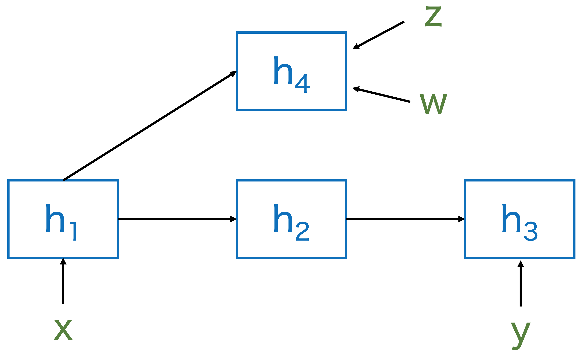</p>

$\text{Heap} = \{ h_1, h_2, h_3, h_4 \}$

$h_1 = (a_1, \{ x \})$

$h_2 = (a_2, \{ \})$

$h_3 = (a_3, \{ y \})$

$h_4 = (a_4, \{ z, w \})$

$\sigma = \{ x \mapsto \{ h_1 \}, y \mapsto \{ h_3 \}, z \mapsto \{ h_4 \}, w \mapsto \{ h_4 \}, h_1 \mapsto \{ h_2, h_4 \}, h_2 \mapsto \{ h_3 \} \}$

</details>

<br/>

ゴールは関数 $F \in \mathbb{D} \to \mathbb{D}$ の最小不動点を見つけること.
(関数 $F$ : control flow graph に従って状態を遷移させていく)

$$F(X)=\lambda c \cdot f_c\left(\bigcup_{c^{\prime} \hookrightarrow c} X\left(c^{\prime}\right)\right)$$

<br/>

$f_c: \mathcal{P}(\text{State}) \to \mathcal{P}(\text{State})$ はプログラムポイント $c$ における遷移関数.
($s \in \text{State}$ : (パス条件, heap のポインタ情報))

$$f_c(S)=\left\{\left(f_c^{P C}(\pi), f_c^{\text {Store }}(\sigma)\right) \mid(\pi, \sigma) \in S \right\}$$

- path条件の更新 $f_c^{P C}(\pi) : PC \to PC$

    - $\text{assume}(b)$で $b$ の条件を追加. 条件式の値が変わると条件から取り除く.

$$f_c^{P C}(\pi)= \left\{\begin{array}{lll}
\pi \cup\{b\} & \cdots & c m d(c)=\text { assume}(b) \\
\pi \backslash \operatorname{Kill}(\pi, x) & \cdots & c m d(c)=x:=y \\
\pi \backslash \operatorname{Kill}(\pi, x) & \cdots & c m d(c)=x:=* y \\
\pi & \cdots & \text {otherwise }
\end{array} \right.$$

<ul>

- $\displaystyle \operatorname{Kill}(\pi, x)=\left\{\left(x^{\prime}, \_ , x^{\prime \prime}\right) \in \pi \mid x=x^{\prime} \vee x=x^{\prime \prime}\right\} \cup\left\{\left(x^{\prime}, \_ , n\right) \in\right. \left.\pi \mid x=x^{\prime}\right\}$

</ul>

- heap のポインタ情報の更新

$$ f_c^{\text{Store}}(\sigma) = \mathcal{T}_c \left( \phi_c(\sigma) | _{\text{reach}\left(\phi_c(\sigma)\right)}\right) $$ 

<ul>

- Store の更新式 $\phi_c : \text{Store} \to \text{Store}$

</ul>

$$\phi_c(\sigma)=\left\{ \begin{array}{lll}
\sigma[x \mapsto\{(c,\{x\} )\}] & \cdots & c m d(c)=\operatorname{alloc}(x) \\
\sigma[x \mapsto \sigma(y)] & \cdots & c m d(c)=x:=y \\
\sigma[x \mapsto \bigcup\{\sigma(l) \mid l \in \sigma(y)\}] & \cdots & c m d(c)=x:=* y \\
\sigma\left[\mathrm{S}_x \mapsto \sigma(y)\right][\mathrm{W}_x \stackrel{\text { weak }}{\mapsto} \sigma(y)] & \cdots & c m d(c)=* x:=y \\
\sigma & \cdots & \text { otherwise }
\end{array}\right.$$

<ul>
<ul>

- ただし $\sigma[X \mapsto Y]$ は strong-update, $\sigma[X \stackrel{\text{weak}}{\mapsto} Y]$ は weak-update を表す.

- $S_x = \{ (a, X) \in \sigma(x) \ |\ x \in X \}$ : オブジェクト内の変数に $x$ が含まれる  ($x$ が確実に指している)  オブジェクトの集合

- $W_x = \sigma(x)$ : $x$ が指しているかもしれないオブジェクトの集合
  
  (論文では $W_x = \sigma(x) \backslash S$ と書かれている)

</ul>
</ul>

<ul>

- 到達可能な変数, オブジェクト 

</ul>

$$reach(\sigma) = \left.\operatorname{lfp}\left(\lambda R . \operatorname{Var} \cup\left\{l \in \sigma\left(l^{\prime}\right) \mid l^{\prime} \in R\right\}\right)\right)$$

<ul>

- heap object 内の変数の更新式 

</ul>

$$ \mathcal{T} _ c(\sigma) = \bigsqcup_{(l, H) \in \sigma} \left[ \tau_c(l) \mapsto \left\{ \tau_c(h) \mid h \in H \right\} \right]$$

$$\begin{aligned}
& \tau_c(x) = x \\
& \tau_c((a, X))= \\
& \left\{\begin{array}{lll}
\{(a, X \backslash\{x\} )\} & \cdots & \operatorname{cmd}(c)=\operatorname{alloc}(x) \text { or } x:=* y \\
\{(a, X \backslash\{x\} \cup\{x \mid y \in X\} )\} & \cdots & c m d(c)=x:=y \\
\{(a, X)\} & \cdots & \text { otherwise }
\end{array}\right.
\end{aligned}$$

<ul>
<ul>

- ただし $cmd(c) = \text{alloc}(x)$ のとき $\phi_c$ によって作られた $(c, \{ x \})$ の $x$ は取り除かない. 

</ul>
</ul>

<br/>

<details>
<summary><span style="color: red; ">Question</span></summary>

<p></p>

$\text{Heap} = \{ h_1, h_2, h_3, h_4 \}$

$h_1 = (a_1, \{ x \}), ~~h_2 = (a_2, \{ \}), ~~h_3 = (a_3, \{ y \}), ~~h_4 = (a_4, \{ z, w \})$

$\sigma = \{ x \mapsto \{ h_1 \}, y \mapsto \{ h_3 \}, z \mapsto \{ h_4 \}, w \mapsto \{ h_4 \}, h_1 \mapsto \{ h_2, h_4 \}, h_2 \mapsto \{ h_3 \} \}$

```
y := *x
```

$c m d(c)=y:=* x$ のとき

(1)   $~~~\sigma$ に $\phi_c$ を適用させた後の $\sigma(y)$

$$\phi_c(\sigma)=\sigma[y \mapsto \bigcup\{\sigma(l) \mid l \in \sigma(x)\}]$$

<details>
<summary> <span style="color: red; "> 答え </span> </summary>

$$\sigma(y) = \{ h_2, h_4 \}$$

</details>

(2)   $~~~h_1, h_2, h_3, h_4$ にそれぞれ $\tau_c$ を適用させたとき

$$\tau_c((a, X))= \{(a, X \backslash\{y\} )\}$$

<details>
<summary> <span style="color: red; "> 答え </span> </summary>

$h_1 = (a_1, \{ x \})$

$h_2 = (a_2, \{ \})$

$h_3 = (a_3, \{ \})$

$h_4 = (a_4, \{ z, w \})$

</details>

</details>


<br/>
<br/>

#### Object Flow Graph

プログラム $P = (\mathbb{C}, \hookrightarrow, c_e, c_x)$ と静的ヒープ解析の結果 $A$ から OFG を構築する.

OFG $G = (V, E, M, \Lambda)$ は4つの要素からなる.

$$\begin{array}{ll}
V \subseteq \mathbb{C} \times P C \times \text { Heap }, & E \subseteq V \times V \\
M \in V \rightarrow \mathcal{P}(\text {Exp}), & \Lambda \in E \rightarrow \text { Event } \cup\{\epsilon\}
\end{array}$$

- 頂点 $V \subseteq \mathbb{C} \times P C \times \text { Heap }$

  - <p>各プログラムポイント $c$, パス条件 $\pi$, 到達可能なヒープオブジェクト $h \in \text{range}(\sigma)$ について1つの頂点を作る.</p>

$$\begin{aligned}
V & =\left\{(c, \pi, h) \mid c \in \mathbb{C} \backslash\left\{c_e, c_x\right\} \wedge(\pi, \sigma) \in A(c) \wedge h \in \text { range }(\sigma)\right\} \\
& \cup\left\{\left(c_e, \text { true }, \perp\right),\left(c_x, \text { true }, \perp\right)\right\}
\end{aligned}$$

<ul>

- プログラムポイント $c$
  
- パス条件 $\pi$
  
- ヒープオブジェクト $h$
  
- entry $(c_e, true, \bot)$
  
- exit $(c_x, true, \bot)$

</ul>

- 辺 $E \subseteq V \times V$

  - <p>$(c_1, \pi_1, h_1)$ が $(c_2, \pi_2, h_2)$ を生成するとき, 2つの頂点に辺を張る.</p>

$$
c_1 \hookrightarrow c_2 \ \ \wedge \ \ \pi_2=f_{c_2}^{P C}\left(\pi_1\right) \ \ \wedge \ \ h_2=\tau_{c_2}\left(h_1\right)
$$

<ul>

- <p>entry $(c_e, true, \bot)$ から前の頂点が存在しない頂点への辺, 後の頂点が存在しない頂点から exit $(c_x, true, \bot)$ への辺を張る</p>

</ul>


- $M \in V \rightarrow \mathcal{P}(\text {Exp})$

  - それぞれの頂点 (= heap object) について, その object を指すようなポインタ式を対応させる

$$
M((c, \pi, h))=\{e \in \operatorname{Exp} \mid(\_, \sigma) \in A(c) \wedge h \in \llbracket e \rrbracket(\sigma)\}
$$

<ul>

- $Exp = \{ x, *x ~|~ x \in Var\}$

- $\llbracket x \rrbracket(\sigma)=\sigma(x)$

- $\displaystyle \llbracket * x \rrbracket(\sigma)=\bigcup\{\sigma(l) \mid l \in \sigma(x)\}$

</ul>


- $\Lambda \in E \rightarrow \text {Event} \cup \{\epsilon\}$
  - それぞれの辺に event のラベル付けをする.

$$
\begin{aligned}
& \Lambda\left(\left(c_1, \pi_1, h_1\right),\left(c_2, \pi_2, h_2\right)\right)= \\
& \begin{cases}\text { alloc } & \text { if } c m d\left(c_2\right)=\operatorname{alloc}(x) \wedge h_2=\left(c_2,\{x\}\right) \\
\text { free } & \text { if } \operatorname{cmd}\left(c_2\right)=\text { free }(x) \wedge x \in M\left(\left(c_2, \pi_2, h_2\right)\right) \\
\text { def } & \text { if } \operatorname{cmd}\left(c_2\right)=* x:=y \wedge x \in M\left(\left(c_2, \pi_2, h_2\right)\right) \\
\text { use } & \text { if } \operatorname{cmd}\left(c_2\right)=x:=* y \wedge y \in M\left(\left(c_2, \pi_2, h_2\right)\right) \\
\text { unreach } & \text { if }\left(c_2, \pi_2, h_2\right)=\left(c_x, \text { true, } \perp\right) \\
~\epsilon \text { (empty event) } & \text { otherwise }\end{cases}
\end{aligned}
$$


<details>
<summary>Example</summary>

```c
 1  p = malloc(1);  // o1
 2  if (C)
 3      q = p;
 4  else
 5      q = malloc(1);  // o2
 6  *p = 1;
 7  free(q);
```

<p></p>

- 頂点 $V \subseteq \mathbb{C} \times P C \times \text { Heap }$
  
  - $(1, true, o_1), (7, C, o_1)$ など

- 辺 $E \subseteq V \times V$

  - $((6, C, o_1), (7, C, o_1))$ など

- $M \in V \rightarrow \mathcal{P}(\text {Exp})$
  
  - $M((6, C, o_1)) = \{ p, q \}, ~M((5, \lnot C, o_2)) = \{ q \}$ など

- $\Lambda \in E \rightarrow \text {Event} \cup \{\epsilon\}$
  
  - $\Lambda(((6, C, o_1), (7, C, o_1))) = \text{free}$ など
  
</details>

<br/>
<br/>


### Step2: OFG のラベルを変える

OFG のラベルをすべての object が安全に解放されるように置き換える.

<p></p>

<p></p>


#### Error Paths

直感的には, Error report に基づいた source から sink への OFG 上のすべての path.

   - ex.) double-free: 1度目の free を表す頂点から2度目の free を表す頂点までのすべてのパス

Error report $R = (c_1, ev_1, c_2, ev_2)$ からその source $(c_1, ev_1)$ と sink $(c_2, ev_2)$ に一致する OFG 上の頂点を $V^{c_1}_{ev_1}, V^{c_2}_{ev_2}$ とする.

$$\begin{aligned}
& V_{e v_1}^{c_1}=\left\{v \in V \mid v=\left(c_1,\_,\_\right) \wedge \exists v^{\prime} .\left(v^{\prime}, v\right) \in E \wedge \Lambda\left(\left(v^{\prime}, v\right)\right)=e v_1\right\} \\
& V_{e v_2}^{c_2}=\left\{v \in V \mid v=\left(c_2,\_,\_\right) \wedge \exists v^{\prime} .\left(v^{\prime}, v\right) \in E \wedge \Lambda\left(\left(v^{\prime}, v\right)\right)=e v_2\right\}
\end{aligned}$$

<p>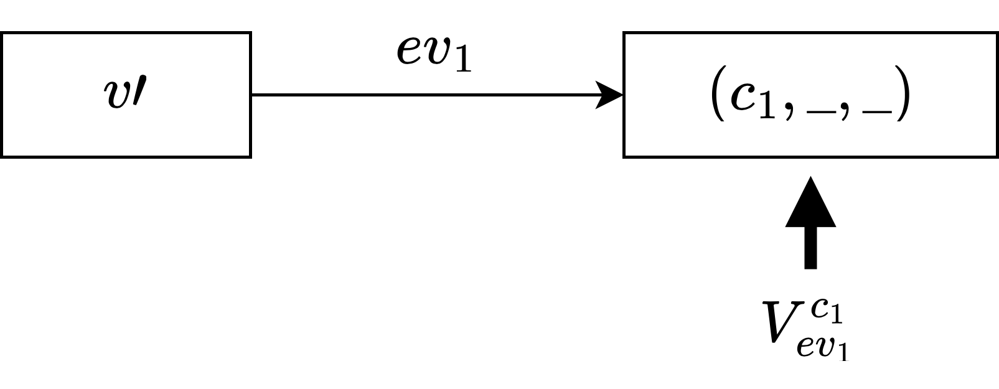</p>

$\operatorname{Paths}(G)$ を $G$ のすべての path とする. path $p = e_1 \cdots e_n$ としたとき, $\Lambda (p) = \Lambda (e_1) \cdots \Lambda (e_n)$ (ラベルの連結)で表す.

このとき, error path $EP(G, R)$ は

$$E P(G, R)=\left\{p \in \operatorname{Paths}(G) \mid\left(p_0, p_{\dashv}\right) \in V_{e v_1}^{c_1} \times V_{e v_2}^{c_2} \wedge \Lambda(p) \in \mathcal{R}_{e v_2}^{e v_1}\right\}$$

ただし, $p_0, p_{\dashv}$ は path $p$ の最初と最後の辺を表す.

また, $\mathcal{R}_{e v_2}^{e v_1}$ は event の string の集合.

$$\begin{aligned}
\mathcal{R}_{\text {unreach}}^{\text {alloc}} & = \text {alloc (use | def)}{ }^* \text { unreach } \\
\mathcal{R}_{\text {free}}^{\text {free}} & = \_^* \text{free}\_^* \text{free}\_^* \\
\mathcal{R}_{\text {use}}^{\text {free}}=\mathcal{R}_{\text {def}}^{\text {free}} & = \_^* \text{free}\_^* \text {alloc (use | def)}\_^*
\end{aligned}$$

- $\mathcal{R}_{\text {unreach}}^{\text {alloc}}$ : memory leak
- $\mathcal{R}_{\text {free}}^{\text {free}}$ : double free
- $\mathcal{R}_{\text {use}}^{\text {free}}, \mathcal{R}_{\text {def}}^{\text {free}}$  : use after free


<details>
<summary>Example</summary>

```c
 1  p = malloc(1);  // o1
 2  if (C)
 3      q = p;
 4  else
 5      q = malloc(1);  // o2
 6  *p = 1;
 7  free(q);
```

<p></p>

$V_{e v_1}^{c_1}$: $(1, true, o_1)$

$V_{e v_2}^{c_2}$: exit node

Error path は赤いパス

</details>


<br/>

#### Labeling Operators

Labeling operator には4種類ある.

- free の挿入
- free の削除
- free の位置変更
- use の位置変更 


$$\begin{array}{llll}
\text { free }_e^{+}(\Lambda) & = & \Lambda \{e \mapsto \text {free} \}  & \text { if } \Lambda(e)=\epsilon \\
\text { free }_e^{-}(\Lambda) & = & \Lambda \{ e \mapsto \epsilon \} & \text { if } \Lambda(e)=\text { free} \\
\text { free }_{e_1, e_2}^{\leadsto}(\Lambda) & = & \Lambda \left\{ e_1 \mapsto \epsilon, e_2 \mapsto \text { free } \right\} & \text { if } \Lambda (e_1) = \text {free} \wedge \Lambda (e_2)=\epsilon \\
\text { use }_{e_1, e_2}^{\leadsto}(\Lambda) & = & \Lambda \left\{e_1 \mapsto \epsilon, e_2 \mapsto \text { use } \right\} & \text { if } \Lambda(e_1)=\text {use} \wedge \Lambda(e_2)=\epsilon
\end{array}$$

Labeling operator の集合 $\mathcal{O} = \{ o_1, \dots, o_n \}$

新しいラベルに書き換える関数 $\mathcal{O}(\Lambda)=\left(o_1 \circ \cdots \circ o_n\right)(\Lambda)$

<br/>

#### Finding Labeling Operators

$G' = (V, E, M, \mathcal{O}(\Lambda))$ を OFG $G$ を $\mathcal{O}$ によってラベルを書き換えた OFG とする.

ここでの目標は以下を満たす labeling operator の集合 $\mathcal{O}$ を見つけること.

1. error path がない $EP(G', R) = \emptyset$
2. $G$ で存在しないエラーは $G'$ でも存在しない
3. $G'$ と $G$ の動作は変わらない

<br/>

#### Algorithm

入力: OFG $G$, error report $R$
出力: 上の条件を満たすすべてのあり得る $\mathcal{O}$ の集合

<p>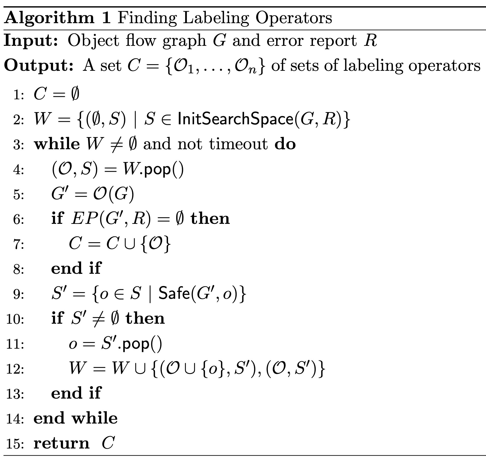</p>

worklist $W$ は組 $(\mathcal{O}, S)$ の集合

<ul>

  - $\mathcal{O}$ : それまでのアルゴリズムの計算で安全に (別のエラーを追加することなく) ラベルを変更できる labeling operater の集合
  - $S$ (探索空間) : $\mathcal{O}$ を適用した新しいグラフ $G'$ に対して, 1回のラベルの変更 $o \in S$ 適用したときに, 安全であるような $o$ の集合

</ul>

- 探索空間 $S$ の初期値は可能性のあるラベルの変更すべて
  - ex.) free の挿入であれば, error path 上のラベルが $\epsilon$ の辺をすべて free を挿入する候補としておく

<p>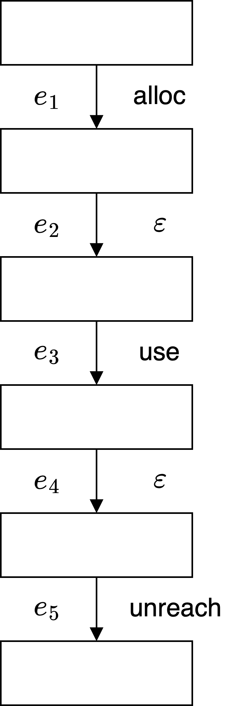</p>

<p>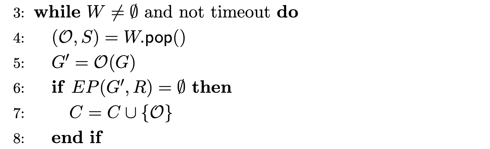</p>

<ul>

  - (4行目) worklist から1つ取り出す
  - (5行目) $\mathcal{O}$ を OFG $G$ に適用
  - (6, 7行目) もし $G'$ の error path がなければ解に追加

</ul>

<p>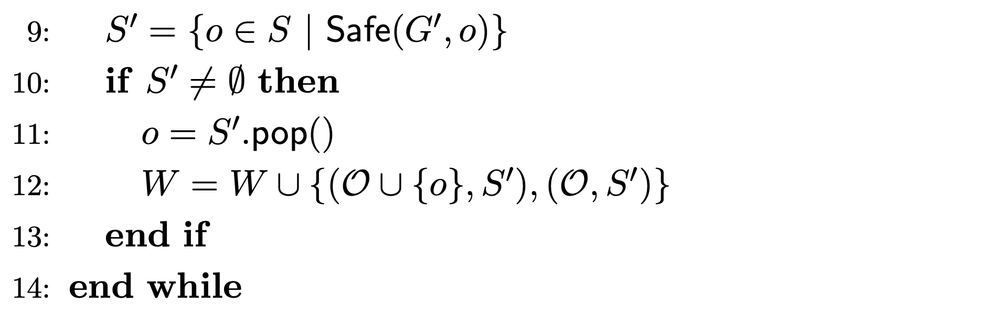</p>

<ul>

  - (9行目) $G'$ に対して labeling operator $o$ を適用したときに新しいエラーを引き起こさない $o$ の集合 (探索空間を減らす)
  - (10, 11, 12 行目) $S' \neq \emptyset$ のとき $S'$ から labeling operator を1つ取り出し, worklist に $(\mathcal{O} \cup \{ o \}, S'), (\mathcal{O}, S')$ を追加

</ul>


<br/>

<br/>

- $\mathsf{InitSerarchSpace}(G,R)$

  - 各エラーに対して使われる labeling operator
    - memory leak: $\text {free}_e^{+}, \text {free}_{e_1, e_2}^{\leadsto}$ (free の追加, freeの位置変更)
    - double free: $\text {free}_e^{-}$ (free の削除)
    - use after free: $\text {free}_{e_1, e_2}^{\leadsto}, \text {use}_{e_1, e_2}^{\leadsto}$ (free の位置変更, use の位置変更)


$$
\begin{aligned}
& \text { InitSearchSpace }\left(G,\left(c_1, e v_1, c_2, e v_2\right)\right)= \\
& \begin{cases}\left\{\mathcal{S}_{\text {free}^{+}}^{M L}, \mathcal{S}_{\text {free}^{\leadsto}}^{M L}\right\} & \text { if } e v_1=\text { alloc } \wedge e v_2=\text { unreach } \\
\left\{\mathcal{S}_{\text {free}^{-}}^{D F}\right\} & \text { if } e v_1=\text { free } \wedge e v_2=\text { free } \\
\left\{\mathcal{S}_{\text {free }^{\leadsto}}^{UAF}, \mathcal{S}_{\text {use}^{\leadsto}}^{U A F}\right\} & \text { if } e v_1=\text { free } \wedge\left(e v_2=\text { use } \vee e v_2=\text { def }\right)\end{cases}
\end{aligned}
$$

<ul>

- 直感的には可能性のある操作をすべて追加しておく
  - ex.) free の挿入であれば, error path 上のラベルが $\epsilon$ の辺をすべて free を挿入する候補としておく

</ul>

$$
\begin{aligned}
& \mathcal{S}_{\text {free}^{+}}^{ML} = \left\{\text {free}_e^{+} ~|~ e \in E \wedge \Lambda(e)=\epsilon \wedge e \in EP(G, R)\right\} \\
& \mathcal{S}_{\text{free}^{\leadsto}}^{ML} = \{ \text{free}^{\leadsto}_{e_1, e_2} ~|~ e_1, e_2 \in E, \Lambda(e_1)=\text{free} \wedge \Lambda(e_2)=\epsilon \wedge \\
&~~~~~~~~~~~~~ e_1 \notin EP(G, R) \wedge e_2 \in E P(G, R) \} \\
& \mathcal{S}_{\text{free}^{-}}^{DF} = \{\text{free}_e^{-} ~|~ e \in E \wedge \Lambda(e)=\text { free } \wedge e \in E P(G, R) \} \\
& \mathcal{S}_{\text{free}^{\leadsto}}^{UAF} = \{\text{free}_{e_1, e_2}^{\leadsto} ~|~ e_1, e_2 \in E, \Lambda(e_1)=\text{free} \wedge \Lambda(e_2)=\epsilon \wedge \\
&~~~~~~~~~~~~~ e_1 \in EP(G, R) \wedge e_2 \notin EP(G, R) \wedge e_1 \leadsto e_2 \} \\
& \mathcal{S}_{\text{use}^{\leadsto}}^{UAF} = \{\text{use}_{e_1, e_2}^{\leadsto} ~|~ e_1, e_2 \in E, \Lambda(e_1)=\text{use} \wedge \Lambda(e_2)=\epsilon \wedge \\
&~~~~~~~~~~~~~ e_1 \in EP(G, R) \wedge e_2 \notin EP(G, R) \wedge e_2 \leadsto e_1 \} \\
\end{aligned}
$$

<br/>

- $\mathsf{Safe}(G,o)$

  - OFG $G$ に labeling operator $o$ を適用したときに新しいエラーを引き起こさないかチェックする
  
    - $E_{ev}$: $G$ の中でラベルが $ev$ の辺の集合
    - $e_1 \leadsto e_2$: 辺 $e_1$ から辺 $e_2$ に到達可能
    - $E_1 \preceq_{\text{dom}} e, E_1 \preceq_{\text{postdom}} e$ : $E_1$ が $e$ を支配する
      
      ($e$ に到達するすべてのパスが $E_1$ 内の辺を通る )

  - $o = \text {free}_e^{+}$ のとき
  
$$\forall e^{\prime} \in \left( E_{\text {free }} \cup\{e\} \right) . e^{\prime} \not \leadsto e ~~\wedge~~ \forall e^{\prime} \in \left( E_{\text {free}} \cup E_{\text {use}} \cup E_{\text {def}} \right) . e \not \leadsto e^{\prime}$$

<ul>
<ul>

- 新しい double free と use after free を引き起こさない

</ul>
</ul>

<ul>

- $o = \text {free}_e^{-}$ のとき

</ul>

$$E_{\text{free}} \preceq_{\text{dom}} e \lor E_{\text{free}} \preceq_{\text{postdom}} e$$

<ul>
<ul>

- 新しい memory leak を引き起こさない

</ul>
</ul>

<ul>

- $o = \text{free}_{e_1, e_2}^{\leadsto}$ のとき

</ul>

$$\begin{array}{r}
\left(E_{\text {free}} \cup \{e_2\} \preceq_{\text {dom}} e_1 \vee E_{\text {free}} \cup \{e_2\} \preceq_{\text{postdom}} e_1 \right) \wedge \\
\forall e \in \left( \left( E_{\text{free}} \backslash \{e_1\} \right) \cup \{e_2\}\right) . e \not \leadsto e_2 \wedge \\
\forall e \in \left( E_{\text{free}} \cup E_{\text{use}} \cup E_{\text{def}} \backslash \{e_1\} \right) . e_2 \not \leadsto e
\end{array}$$

<ul>
<ul>

- 1行目は memory leak を起こさない, 2行目は double free を起こさない, 3行目は double free と use after free を起こさない条件を表す.

</ul>
</ul>

<ul>

- $o = \text{use}_{e_1, e_2}^{\leadsto}$ のとき

</ul>

<ul>
<ul>

- 新たに use after free を引き起こさない

</ul>
</ul>

$$\forall e \in E_{\text{free}} . e \not \leadsto e_2$$

<ul>
<ul>

- プログラムの意味を変えない

  $e_1$ と $e_2$ の間に定義がない, $e_2$ から必ず $e_1$ に到達する


</ul>
</ul>

$$\left(\nexists e \in E_{\text {def }} . e_2 \leadsto e \wedge e \leadsto e_1\right) \wedge e_2 \preceq_{\text {dom }} e_1$$

<br/>


- アルゴリズムの注意点
  - $\mathcal{O}$ には同じ種類の labeling operator しか含まないようにする.
    - 修復精度を大きく損なうことなく, 効率を上げる.


<br/>
<br/>

### Step3: パッチの生成

今までのアルゴリズムで labering operator の集合 $\mathcal{O}$ の集合 $C$ が求められた.

- $C = \emptyset$ のとき, 修正に失敗. 
- $\mathcal{O} \in C$ でパッチの生成を試みる. 成功すればそれを最終結果とし, 失敗すれば次のパッチ候補 $\mathcal{O}' \in C$ でパッチ生成を試みる. $C$の中でパッチの生成に成功する候補がない場合は, 修正に失敗したとする.

#### $\mathcal{O} \in C$ でのパッチの生成方法 

- $\mathcal{O} = \{ \text {free}_{e_1}^{+}, \dots,  \text {free}_{e_n}^{+} \}$
  - 直感的には同じプログラムポイントに free を挿入すべきものはまとめる
  - 合同関係

$$\text { free }_{e_i}^{+} \sim \text { free }_{e_j}^{+} \Longleftrightarrow \operatorname{dest}(e_i)=\operatorname{dest}(e_j)$$

$$\operatorname{dest}(\_, (c,\_,\_)) = c$$

<ul>

- $Q$ : すべての合同クラスの集合

</ul>

$$Q=\left\{(\operatorname{dest}(e), O) \mid O \in \mathcal{O} /\sim \wedge \text { free }_e^{+} \in O\right\}$$

<ul>

- それぞれのクラス $(c_i, O_i) \in Q$ で以下のプログラムをプログラムポイント $c_i$ に挿入する.

</ul>

$$\text {if}(\pi_i) \text { free}(\exp _i)$$

<ul>
<ul>

- パス条件 $\pi_i$ : free を挿入するオブジェクトが満たすべき条件の論理和を取る.

</ul>
</ul>

$$\pi_i=\bigvee_{(\_,\pi_{j},\_) \in V_i} \pi_j$$

<ul>
<ul>
<ul>

- $V_i = \{ v ~|~ \text {free}_{e}^{+} \in O_i \wedge e = (\_, v) \}$ : free を挿入するオブジェクト (頂点)

</ul>

- $\exp_i$: OFG 上の $M$ から $V_i$ のオブジェクトを指していて, かつ他のオブジェクトを指していない変数を選択する.(その頂点のオブジェクトだけを指すような変数)

</ul>
</ul>

$$\exp \in \bigcap_{v \in V_i} M(v) \wedge \exp \notin \bigcup_{V_i^{\prime} \backslash V_i} M(v)$$

<ul>
<ul>
<ul>

- $V'_i = \{ (c_i, \pi', \_) \in V ~|~ \pi_i \wedge \pi' \text{ is satisfiable } \}$ : $c_i$ で利用可能な, パス条件 $\pi_i$ を満たすオブジェクトを表す頂点の集合

</ul>
</ul>
</ul>

- $\mathcal{O} = \{ \text {free}_{e_1}^{-}, \dots,  \text {free}_{e_n}^{-} \}$

  - 合同クラスの集合を作るまでは $\text {free}_{e}^{+}$ の時と同じ
  - それぞれのクラス $(c_i, O_i) \in Q$ で, $c_i$ の free 文を削除し, $c_i$ に $~\text {if}(\lnot \pi_i) \text { free}(\exp _i)~$ を挿入する.

- $\mathcal{O} = \{ \text{free}_{e_1, e'_1}^{\leadsto}, \dots,  \text{free}_{e_n, e'_n}^{\leadsto} \}$

  - 合同関係

$$\text { free }_{e_i, e_i^{\prime}}^{\leadsto} \sim \text { free }_{e_j, e_j^{\prime}}^{\leadsto} ~~\Longleftrightarrow~~ \operatorname{dest}(e_i)=\operatorname{dest}(e_j) \wedge \operatorname{dest}(e_i^{\prime})=\operatorname{dest}(e_j^{\prime})$$

<ul>

- $Q = \{ (c_1, c'_1, O_1), \dots , (c_n, c'_n, O_n) \}$ : すべての合同クラスの集合

- それぞれのクラス $(c_i, c'_i, O_i) \in Q$
  - $c_i$ の free 文を削除し, $c_i$ に $~\text {if}(\lnot \pi_i) \text { free}(\exp _i)~$ を挿入する.
  - $c'_i$ に $~\text {if}\left(\pi'_i\right) \text { free}(\exp _i)~$ を挿入する.

</ul>

- $\mathcal{O} = \{ \text{use}_{e_1, e'_1}^{\leadsto}, \dots,  \text{use}_{e_n, e'_n}^{\leadsto} \}$

  - $Q = \{ (c_1, c'_1, O_1), \dots , (c_n, c'_n, O_n) \}$ : すべての合同クラスの集合

  - それぞれのクラス $(c_i, c'_i, O_i) \in Q$
    - $c_i$ でのload命令 $x := *y$ を $\text {if}(\pi_i) ~~x := t~ ~\text{else} ~~x := *y$ に置き換え
    - $c'_i$ で $\text {if}(\pi'_i) ~~t := *y$ を挿入


### Scalability の向上

今までのアルゴリズムを単純に適用しても大きなプログラムは扱えない. Scalability の向上のために以下の2つの手法を用いる

- Slicing
- Selective Path-Sensitivity

#### Slicing

input error report $R = (c_1, ev_1, c_2, ev_2)$ から手続き間のスライスを行う

- ヒープ解析は $f_{parent}$ から行い, $f_{parent}$ から到達不可能な関数の解析は行わない

  - $f_{src},~f_{sink}$: source($c_1$) と sink($c_2$) の関数

  - $f_{parent}$: $f_{src}$ と $f_{sink}$ の共通の呼び出し元

- sound な事前解析を行いヒープオブジェクトに副作用のない関数は解析を行わない

<p>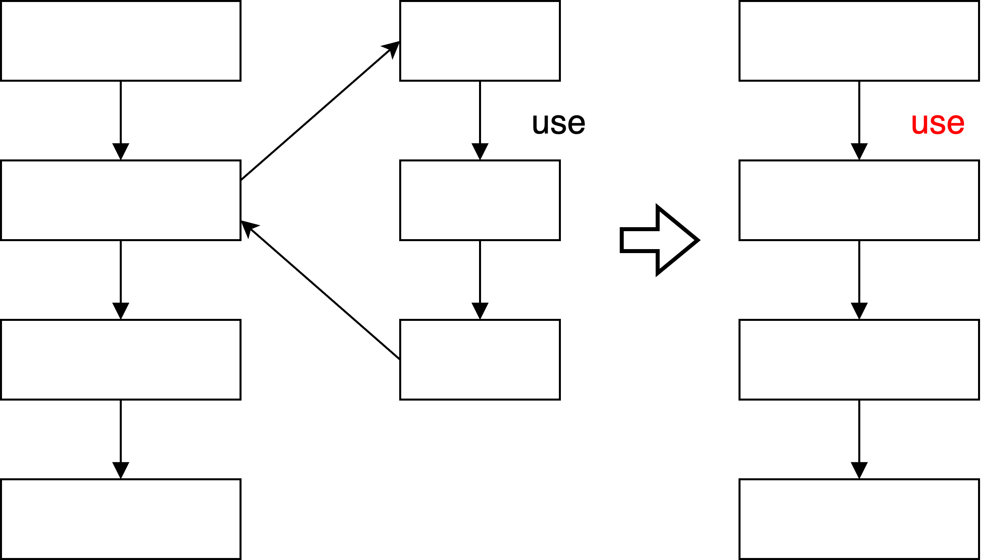</p>
  
#### Selective Path-Sensitivity

最終的な修正率が向上する可能性がある場合のみ path-sensitive に解析を行う ( path-sensitive な解析を行う必要性が少ないとき状態を merge する)

- 2つの状態 $(\pi_1, \sigma_1),~(\pi_2, \sigma_2)$ を join すると $(\pi_1 \cup \pi_2, \sigma_1 \sqcup \sigma_2)$ (論文では $\pi_1 \cap \pi_2$ と書かれていた)

- 2つの状態が以下に関して等価であるとき merge 可能である

  メモリエラーに関するプログラム実行の特徴から, エラーのある経路を merge し, 通常の実行を正確に解析できるように設計している

  - (1) null を指す変数の集合
    
    ポインタが null 化されたり割り当てに失敗する状態を区別する

  - (2) 同じオブジェクトを指す変数の集合

    

  - (3) 返り値とその値

    メモリエラーのシグナルとして使用される異なる戻り値を持つ状態を区別する


## Evaluation

### memory leak 修復の評価

Infer でメモリリークを検出し, メモリエラーの修復を SAVER と 既存のメモリ修復ツール FootPatch で比較した. その他のツール (MemFix, LeakFix) はベンチマークプログラムではスケールしない, エラーを起こすため除外.

オープンソースの選定基準

- Infer がビルドエラーを生成しない
- 少なくとも 1つの 正しいメモリエラーの検知 (true positive)があり, すべてのエラー検知が 100個未満

これら 10個のオープンソースで Infer は 162個 のエラーを出力. 

- 正しい検知: 96個
- 誤検知: 66個

表の見方 (パッチがエラーを正しく修正しているかの判断は手動)

正しい検知 (T), 誤検知 (F) に対して

- G: パッチを生成した
- ✔︎: 正しいパッチ (報告されたエラーを完全に無くし, 他のエラーを追加しなかったパッチ) を生成した
- △: パッチは別のエラーを追加しないが, 報告されたエラーを完全に修復できなかった
- ×: パッチが新たなエラーを引き起こした

<p></p>

- 96件の正しいエラー検知に対して SAVER は 71個 (74%) のエラーを正しく修正した
  - 条件付きのパッチを生成できることで高い修正率を可能にした
- SAVER はメモリエラーの誤検知に対してパッチを生成していない
  
- FootPatch は正しいエラー検知に対して 19個 (20%) のエラーを正しく修正した
- FootPatch はメモリエラーの誤検知に対してもパッチを生成し, 25個の安全ではないパッチを生成した
- FootPatch は全部で 52個のパッチを生成し, そのうち30個 (58%)は新しいエラーを導入した


SAVER は不完全なパッチを 1つ生成した

- 関数 f がメモリリークの有無に関わらず 0 を返すことがある
- エラーのないパスとエラーのあるパスを区別できるように関数 f の本体を修復しないとメモリリークを修正できない

```c
int f (void *p) {
    if (...) return 0;  // memory leak
    if (...) return 1;  // memory leak
    return 0;  // no memory leak
}

int g (void *p) {
    x = f(p);
    /* SAVER:  if (x == -1) free(p); */
}
```

### use-after-free と double-free 修復の評価

オープンソースから use-after-free と double-free に関連する 34件のエラーレポートを使用した. Infer はエラーを検出できなかったため手動でエラーレポートを作成した.

<p></p>

- 34件の use-after-free と double-free エラーに対して 15個 (44%) のエラーを正しく修正した

### Limitations

SAVER はカスタム allocator や deallocatoer の修復ができない

- lxc での例

```c
void put_ctx(ctx *ctx) {
    ...  // some side-effect
    free(ctx);
}

void clone_payload(struct s *s) {
    put_ctx(s->init);   // second call
}

...
init = s->init;
put_ctx(init);  // first call
clone_payload(s);  // double-free
```

- 3行目の free を削除すると(別の場所で) memory-leak が発生するためできない
- `clone_payload(s);` を削除するのは `put_ctx()` での副作用を削除しプログラムの意味を変えてしまうためできない
- これが最も多い失敗パターン (2個目の表の 60%以上)

### Scalability の評価

- Slicing によって snort-2.9.13 の全 7469個の関数のうち 14個の関数にスライスされた (99.8%削減)
- Selective path-sensitivity は高い修正率に貢献した

<p></p>

<ul>

- FULL: full path-sensitivity
- SEL: selective path-sensitivity
- NON: path-insensitivity

</ul>

- NON は不正確, FULL は制限時間内にパッチを生成できないことが多いため, SEL はこの 3つの中で高い修正率を達成している

- SEL は FULL の 6% 以下のコストで 97%の精度

