# Model Checking

### Ch.7 : Automata on Infinite Words and LTL Model Checking

## 概要

- 6章 : タブローを用いた LTL 式の検査

- 7章 : オートマトンを用いた LTL 式の検査

  - システムも性質もオートマトンで表す
  - automaton : 単数形, automata : 複数形

### オートマトンを用いた LTL 式検査の概要

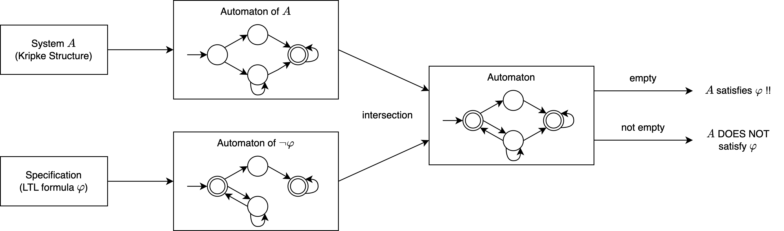

1. システムのオートマトンを構築
2. 満たしたくない性質 (LTL 式の否定) のオートマトンを構築
3. 1 と 2 のオートマトンを合成
4. 3 のオートマトンの受理言語をチェック
   - 受理言語が空: システムは LTL 式を満たす (満たしたくない性質の実行が存在しない)
   - 受理言語が空でない: システムは LTL 式を満たさない (満たしたくない性質の実行が存在する)

### クリプキ構造 ・ LTL 式とオートマトンの関係

#### クリプキ構造

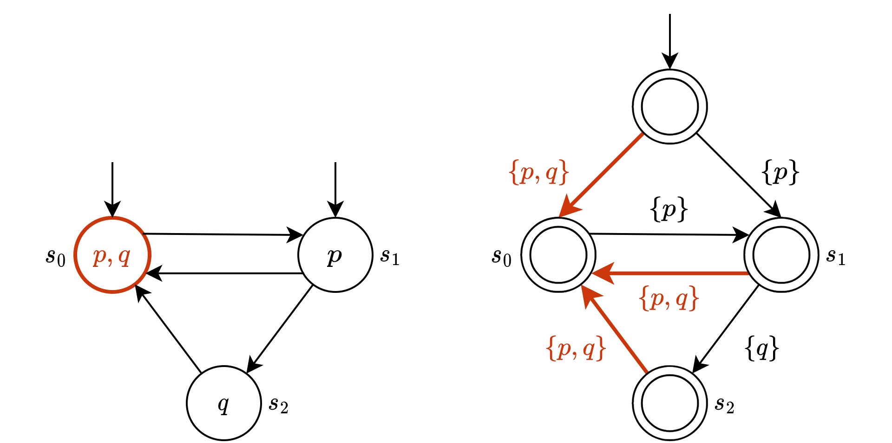

- クリプキ構造上の状態のラベルをそれに向かう辺のラベルに

- システムの状態遷移から得られるラベルの列がオートマトンの受理言語

  - $s_0s_1s_0s_1s_2s_0\dots$ : $\{p,q\}\{p\}\{p,q\}\{p\}\{q\}\{p,q\}\dots$

#### LTL 式

[**Slide**](slides/ltl-automaton.pdf)

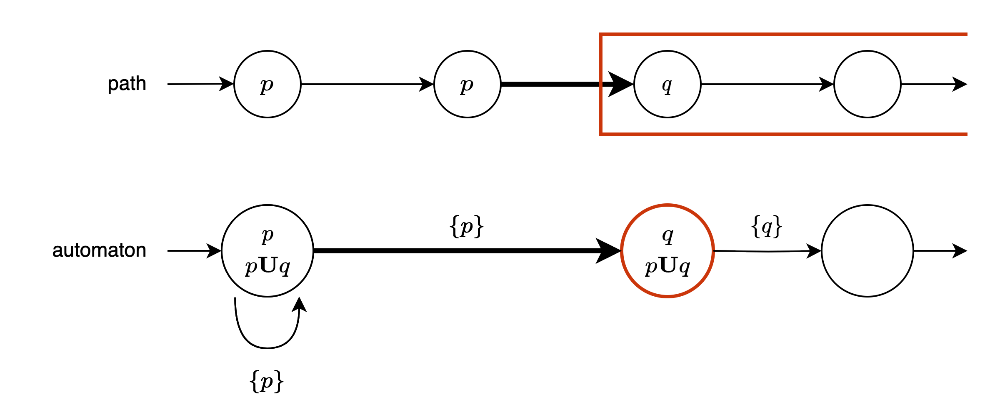

- オートマトンの状態はパスのある状態からの性質を表す

- LTL 式のオートマトンが受理する言語はある LTL パスの状態のラベルの列

  - $\{ p \}\{ p \}\{ q \}...$

### 考えること

- オートマトンについて

  - [7.1 節](#71-finite-automata-on-finite-words) : 有限の文字列を扱える有限オートマトン
  - [7.2 節](#72-automata-on-infinite-words) : 無限の文字列を扱える有限オートマトン (Büchi オートマトン)
  - [7.3 節](#73-deterministic-versus-nonderterministic-büchi-automata) : 決定性・非決定性 Büchi オートマトン
  - [7.6 節](#76-generalized-büchi-automata) : 一般的な Büchi オートマトン について

- オートマトンの合成について

  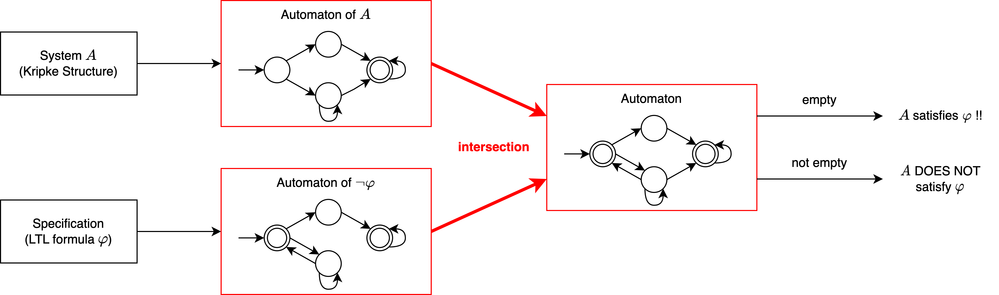

  - [7.4 節](#74-intersection-of-büchi-automata) : Büchi オートマトンの積

<br/>

- オートマトンが空かどうかのチェック

  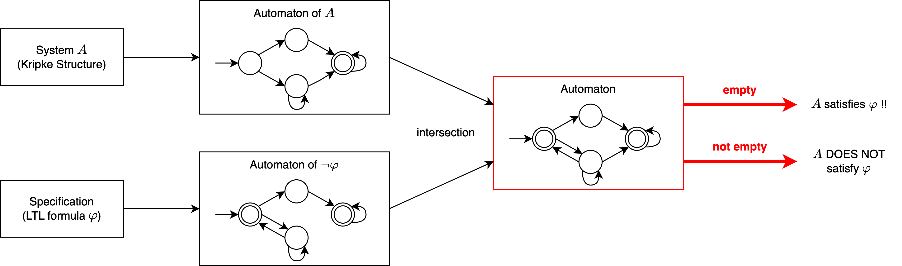

  - [7.5 節](#75-checking-emptiness) : オートマトンが空かどうかのチェック

<br/>

- クリプキ構造からオートマトンへの変換

  

  - [7.7 節](#77-automata-and-kripki-structures) : オートマトンとクリプキ構造

<br/>

- オートマトンを用いた LTL 式検査の概要

  

  - 7.8 節 : オートマトンを用いたモデル検査

<br/>

- LTL 式からオートマトンへの変換

  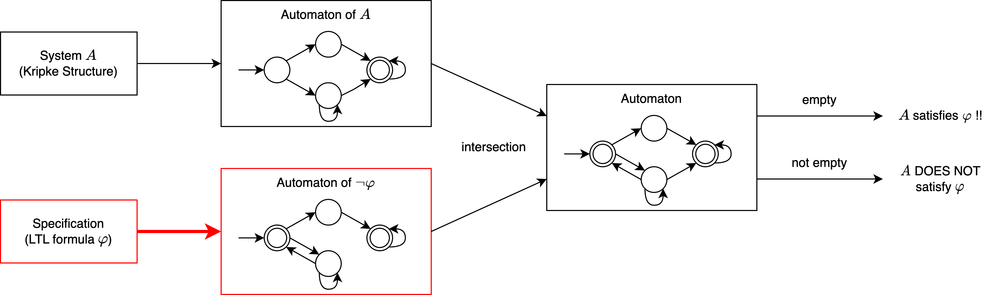

  - 7.9 節 : ナイーブな変換方法
  - 7.10 節 : 効率的な変換方法

<br/>

## 7.1 Finite Automata on Finite Words

- regular automata : **有限** の文字列を扱える有限オートマトン
- $\omega$-regular automata : **無限** の文字列を扱える有限オートマトン

有限の文字列を扱える有限オートマトン $\mathcal{A}$ : $(\Sigma, \mathcal{Q}, \Delta, \mathcal{Q}^0, F)$

- $\Sigma$ : 有限のアルファベット  
  - $\{a, b\}$

- $\mathcal{Q}$ : 状態の有限集合
  - $\{q_1, q_2\}$

- $\Delta \subseteq \mathcal{Q} \times \Sigma \times \mathcal{Q}$ : 遷移関係
  - $\{(q_1, a, q_1), (q_1, b, q_2), (q_2, a, q_1), (q_2, b, q_2)\}$

- $\mathcal{Q}^0 \subseteq \mathcal{Q}$ : 初期状態の集合

- $F \subseteq \mathcal{Q}$ : 受理状態 (accepting states) の集合

<details>
<summary><dev style="color: var(--main-color)">Example</dev></summary>
<div class="details-inner">

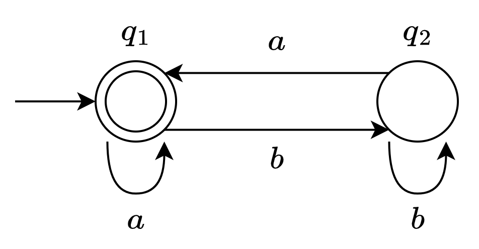

$(\Sigma, \mathcal{Q}, \Delta, \mathcal{Q}^0, F)$

- $\Sigma = \{a, b\}$

- $\mathcal{Q} = \{q_1, q_2\}$

- $\Delta = \{(q_1, a, q_1), (q_1, b, q_2), (q_2, a, q_1), (q_2, b, q_2)\}$

- $\mathcal{Q}^0 = \{ q_1 \}$

- $F = \{ q_1 \}$

</div>
</details>

<br/>

$v \in \Sigma^{*}$ : 文字列 (word, string, sequence)

$v$ を得るための $\mathcal{A}$ の実行 (run) $\rho$

$$\rho : \{ 1, \cdots, |v| + 1 \} \mapsto \mathcal{Q}$$

- $\rho(1) \in \mathcal{Q}^0$
- $v$ の $i$ 文字目を $v(i)$ としたとき, $\ 1 \leq i \leq |v|,\ (\rho(i), v(i), \rho(i + 1)) \in \Sigma$ (遷移関係)

$\rho(|v| + 1) \in F$ (最終状態) のとき実行 $\rho$ は **受理される** 

$\mathcal{A}$ が文字列 $v$ を **受理する** (**accept**) : $v$ を得られる実行 $\rho$ が受理される

(オートマトンを初期状態から遷移に沿って移動, 最後は受理状態のとき出来上がる文字列は受理される)

<br/>

<details>
<summary><dev style="color: var(--main-color)">Example</dev></summary>
<div class="details-inner">


文字列 $abba$ が得られる実行は？ : $q_1q_1q_2q_2q_1$

文字列 $baa$ が得られる実行は？
<details>
<summary>答え</summary>
<div class="details-inner">

$q_1q_2q_1q_1$

</div>
</details>

文字列 $bbaba$ は受理される？

<details>
<summary>答え</summary>
<div class="details-inner">

Yes

受理される実行 $q_1q_2q_2q_1q_2q_1$ が存在する

</div>
</details>

文字列 $aabab$ は受理される？

<details>
<summary>答え</summary>
<div class="details-inner">

No

受理される実行が存在しない

($aabab$ が得られる実行 $q_1q_1q_1q_2q_1q_2$ は最後の状態が受理状態 $F$ に含まれない)

</div>
</details>

</div>
</details>

<br/>

$\mathcal{A}$ の言語 (language) $\mathcal{L}(\mathcal{A}) \subseteq \Sigma^{*}$ : $\mathcal{A}$ によって受理されるすべての文字列

<br/>

<details>
<summary><dev style="color: var(--main-color)">Example</dev></summary>
<div class="details-inner">


$\mathcal{A}$ の言語 : $\varepsilon + (a + b)^{*}a$

</div>
</details>

<br/>

### 7.1.1 Determinization and Complementation

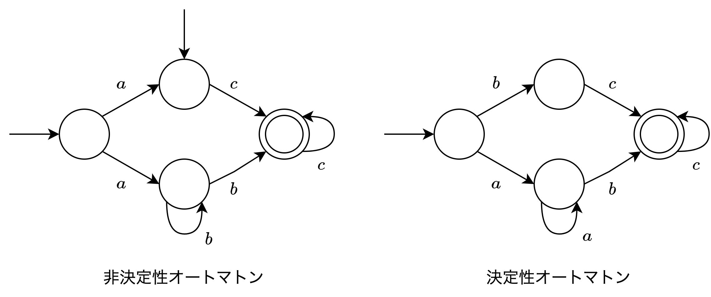

非決定性 (nondeterministic) オートマトン : ある状態から同じ文字でラベル付けされた複数の状態への遷移が存在する 

$$ (q, a, l), (q, a, l') \in \Delta , \text{where}\ l \neq l'$$

決定性 (deterministic) オートマトン : 上記の遷移が存在しない かつ 初期状態が一つ $|\mathcal{Q}^0| = 1$

非決定性 regular オートマトンは受理言語を変えずに決定性オートマトンに変換できる

<br/>

非決定性オートマトン : $\mathcal{A} = (\Sigma, \mathcal{Q}, \Delta, \mathcal{Q}^0, F)$ は以下の決定性オートマトンに変換可能

$$\mathcal{A}' = (\Sigma, \mathcal{P}(\mathcal{Q}), \Delta', \{\mathcal{Q}^0\}, F')$$

- 遷移関係 $\Delta' \subseteq \mathcal{P}(\mathcal{Q}) \times \Sigma \times \mathcal{P}(\mathcal{Q})$

  - $(\mathcal{Q}_1, a, \mathcal{Q}_2) \in \Delta'$ if

  $$\mathcal{Q} _ 2 = \displaystyle \bigcup_{q \in \mathcal{Q} _ 1} \{ q' \ | \ (q,a,q') \in \Delta \}$$

  - $\mathcal{A'}$ は決定性なので, $\Delta'$ は関数 $\mathcal{P}(\mathcal{Q}) \times \Sigma \to \mathcal{P}(\mathcal{Q})$ で表される

- 受理状態の集合 $F'$ : $\{ \mathcal{Q}'\ |\ \mathcal{Q}' \cap F \neq \emptyset \}$


<br/>

<details>
<summary><dev style="color: var(--main-color)">Example</dev></summary>
<div class="details-inner">

非決定性オートマトンから決定性オートマトンへの変換

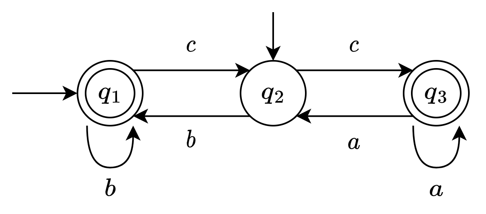

非決定性オートマトン $\mathcal{A}$ : $(\Sigma, \mathcal{Q}, \Delta, \mathcal{Q}^0, F)$

- $\Sigma = \{a, b, c\}$

- $\mathcal{Q} = \{q_1, q_2, q_3\}$

- $\Delta = \{(q_1, b, q_1), (q_1, c, q_2), (q_2, b, q_1), (q_2, c, q_3), (q_3, a, q_2), (q_3, a, q_3)\}$

- $\mathcal{Q}^0 = \{ q_1, q_2 \}$

- $F = \{ q_1, q_3 \}$

決定性オートマトン $\mathcal{A}' = (\Sigma, \mathcal{P}(\mathcal{Q}), \Delta', \{\mathcal{Q}^0\}, F')$ に変換する

- 初期状態 : $\{ \{ q_1, q_2 \} \}$

- 遷移関係 $\Delta'$ :


  |  | $a$ | $b$ | $c$ |
  | ---: | :---: | :---: | :---: |
  | $\emptyset$ | $\emptyset$ | $\emptyset$ | $\emptyset$ |
  | $\{ q_1 \}$ | $\emptyset$ | $\{ q_1 \}$ | $\{ q_2 \}$ |
  | $\{ q_2 \}$ | $\emptyset$ | $\{ q_1 \}$ | $\{ q_3 \}$ |
  | $\{ q_3 \}$ | $\{ q_2, q_3 \}$ | $\emptyset$ | $\emptyset$ |
  | $\{ q_1, q_2 \}$ | $\emptyset$ | $\{ q_1 \}$ | ? |
  | $\{ q_1, q_3 \}$ | $\{ q_2, q_3 \}$ | $\{ q_1 \}$ | $\{ q_2 \}$ |
  | $\{ q_2, q_3 \}$ | $\{ q_2, q_3 \}$ | $\{ q_1 \}$ | $\{ q_3 \}$ |
  | $\{ q_1, q_2, q_3 \}$ | $\{ q_2, q_3 \}$ | $\{ q_1 \}$ | $\{ q_2, q_3 \}$ |


    <details>
    <summary>答え</summary>
    <div class="details-inner">

    |  | $a$ | $b$ | $c$ |
    | ---: | :---: | :---: | :---: |
    | $\emptyset$ | $\emptyset$ | $\emptyset$ | $\emptyset$ |
    | $\{ q_1 \}$ | $\emptyset$ | $\{ q_1 \}$ | $\{ q_2 \}$ |
    | $\{ q_2 \}$ | $\emptyset$ | $\{ q_1 \}$ | $\{ q_3 \}$ |
    | $\{ q_3 \}$ | $\{ q_2, q_3 \}$ | $\emptyset$ | $\emptyset$ |
    | $\{ q_1, q_2 \}$ | $\emptyset$ | $\{ q_1 \}$ | $\{ q_2, q_3 \}$ |
    | $\{ q_1, q_3 \}$ | $\{ q_2, q_3 \}$ | $\{ q_1 \}$ | $\{ q_2 \}$ |
    | $\{ q_2, q_3 \}$ | $\{ q_2, q_3 \}$ | $\{ q_1 \}$ | $\{ q_3 \}$ |
    | $\{ q_1, q_2, q_3 \}$ | $\{ q_2, q_3 \}$ | $\{ q_1 \}$ | $\{ q_2, q_3 \}$ |
    
    </div>
    </details>

- 受理状態 $F'$ : $\{ \{ q_1 \}, \{ q_3 \}, \{ q_1, q_2 \}, \{ q_1, q_3 \}, \{ q_2, q_3 \}, \{ q_1, q_2, q_3 \} \}$


  <!-- - $( \{ q_1, q_2 \}, b, \{ q_1 \} )$
  - $( \{ q_1, q_2 \}, c, ? )$

    <details>
    <summary>答え</summary>
    <div class="details-inner">
    $( \{ q_1, q_2 \}, c, \{ q_2, q_3 \} )$
    </div>
    </details>

  - $( \{ q_1 \}, b, \{ q_1 \} )$
  - $( \{ q_1 \}, c, \{ q_2 \} )$
  - $( \{ q_2 \}, b, \{ q_1 \} )$
  - $( \{ q_2 \}, c, \{ q_3 \} )$
  - $( \{ q_3 \}, a, ? )$

    <details>
    <summary>答え</summary>
    <div class="details-inner">
    $( \{ q_3 \}, a, \{ q_2, q_3 \} )$
    </div>
    </details>

  - $( \{ q_2, q_3 \}, a, ? )$

    <details>
    <summary>答え</summary>
    <div class="details-inner">
    $( \{ q_2, q_3 \}, a, \{ q_2, q_3 \} )$
    </div>
    </details>

  - $( \{ q_2, q_3 \}, b, \{ q_1 \} )$
  - $( \{ q_2, q_3 \}, c, \{ q_3 \} )$

  - 受理状態 $F'$ : $\{ \{ q_1 \}, \{ q_3 \}, \{ q_1, q_2 \}, \{ q_2, q_3 \} \}$ -->


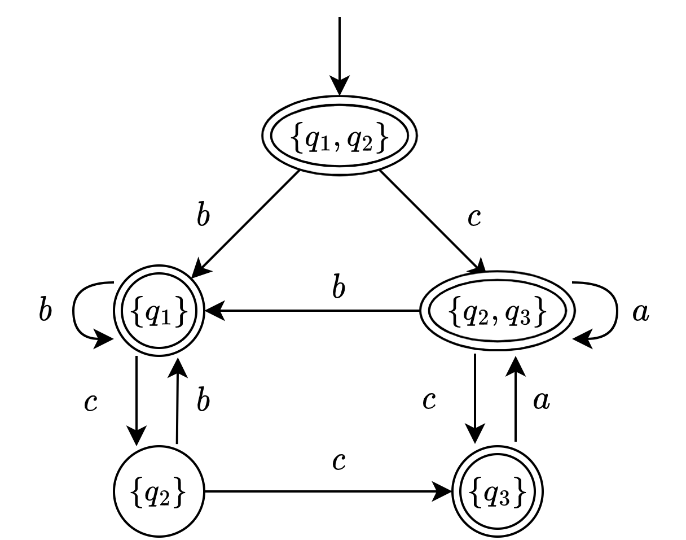

(空集合と初期状態から到達不可能な状態は除く)

</div>
</details>

<br/>

非決定性オートマトンの補 (Complementation) : $\overline{\mathcal{L}(\mathcal{A})} = \Sigma^* - \mathcal{L}(\mathcal{A})$

1. 非決定性オートマトンを決定性オートマトンに変換
2. 受理状態と非受理状態を入れ替える


## 7.2 Automata on Infinite Words

**無限**の文字列を扱える有限オートマトンを考える

  - Reactive system などを扱いたい

Büchi オートマトン : **無限**の文字列を扱える最も簡単な有限オートマトン

Regular オートマトンと構成要素は同じ : $(\Sigma, \mathcal{Q}, \Delta, \mathcal{Q}^0, F)$

ただし, 無限の文字列 $v \in \Sigma^{\omega}$ を扱える ($\omega$ は無限の繰り返しを表す)

<br/>

$inf(\rho)$ : 実行 $\rho$ で無限によく現れる状態 

  - 状態 $\mathcal{Q}$ は有限, 実行 $\rho$ は無限なので $inf(\rho)$ は空集合ではない

Büchi オートマトン $\mathcal{A}$ が実行 $\rho$ を**受理する** $\Leftrightarrow inf(\rho) \cap F \neq \emptyset$

- 受理状態 $F$ のどれかが実行 $\rho$ で無限によく現れる

$\mathcal{A}$ の**言語** (**language**) $\mathcal{L}(\mathcal{A}) \subseteq \Sigma^{\omega}$ : $\mathcal{A}$ によって受理されるすべての無限の文字列の集合 

<br/>

<details>
<summary><dev style="color: var(--main-color)">Example</dev></summary>
<div class="details-inner">


受理状態 $q_1$ が無限によく現れるとき, その実行は受理される

- $(ab)^{\omega}$ は受理される?

    <details>
    <summary>答え</summary>
    <div class="details-inner">

    Yes

    </div>
    </details>

- $a^*b^{\omega}$ は受理される?

    <details>
    <summary>答え</summary>
    <div class="details-inner">

    No

    受理状態 $q_1$ は有限回しか現れない

    </div>
    </details>

$\mathcal{L}(\mathcal{A})$ : $(b^*a)^{\omega}$

<br/>

ちなみに、このオートマトンはどんな LTL 式を変換したもの？

<details>
<summary>答え</summary>
<div class="details-inner">

$GF a$

</div>
</details>

</div>
</details>

## 7.3 Deterministic versus Nonderterministic Büchi Automata

表現力 :

有限文字列を扱うオートマトン : (決定性) = (非決定性)

Büchi オートマトン : (決定性) < (非決定性)

- **非決定性** Büchi オートマトンには等価な (同じ言語を受理する) **決定性** Büchi オートマトンに置き換えられないものが存在する

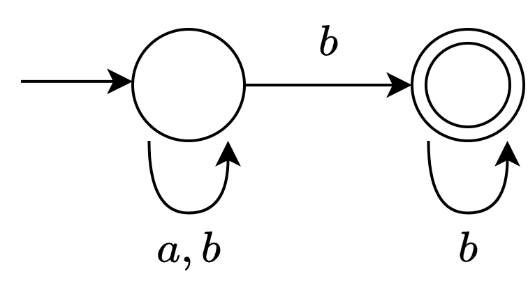

<u>**Lemma 7.1**</u>

<br/>

<u>**Theorem 7.2**</u>

表現力 : (決定性 Büchi オートマトン) < (非決定性 Büchi オートマトン)

つまり, 等価な決定性 Büchi オートマトンがない非決定性 Büchi オートマトンが存在する

<br/>

<details>
<summary><dev style="color: var(--main-color)">Proof</dev></summary>
<div class="details-inner">


上の非決定性 Büchi オートマトン $\mathcal{B}$ を考える.

受理言語は? (LTL 式?)

<details>
<summary>答え</summary>
<div class="details-inner">

$(a + b)^*b^{\omega}$

(LTL 式: $FG b$)

</div>
</details>

つまり, $a$ は有限回しか現れない. 

この言語を受理する決定性 Büchi オートマトンが存在しないことを背理法で示す.

この言語を受理する決定性 Büchi オートマトン $\mathcal{C}$ が存在すると仮定する ($\mathcal{L}(\mathcal{C}) = \mathcal{L}(\mathcal{B})$). 

$\mathcal{C}$ は $\sigma b^{\omega}$ ($\sigma$ は有限の文字列) を受理する.

<u>**ポイント**</u>

$\mathcal{C}$ は決定的なのである文字列に対する実行は一意に定まる.

- $b^{\omega} \in \mathcal{L}(\mathcal{C})$ より, $b^{n_1}$ の次に到達する受理状態 $q_1 \in F_{\mathcal{C}}$ が存在する. 

  (イメージ : $b^{\omega} = b^{n_1}b^{\omega}$)

  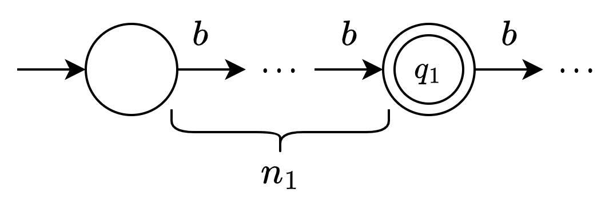


- $b^{n_1}ab^{\omega} \in \mathcal{L}(\mathcal{C})$ より, $b^{n_1}ab^{n_2}$ の次に到達する受理状態 $q_2 \in F_{\mathcal{C}}$ が存在する. 

  (イメージ : $b^{n_1}ab^{\omega} = b^{n_1}ab^{n_2}b^{\omega}$)

  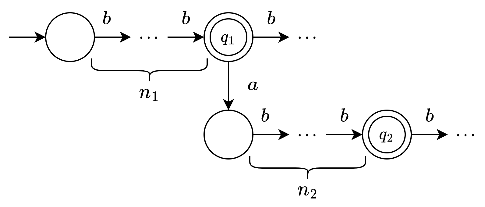

- $b^{n_1}ab^{n_2}ab^{\omega} \in \mathcal{L}(\mathcal{C})$ より, $b^{n_1}ab^{n_2}ab^{n_3}$ の次に到達する受理状態 $q_3 \in F_{\mathcal{C}}$ が存在する. 

  (イメージ : $b^{n_1}ab^{n_2}ab^{\omega} = b^{n_1}ab^{n_2}ab^{n_3}b^{\omega}$)

  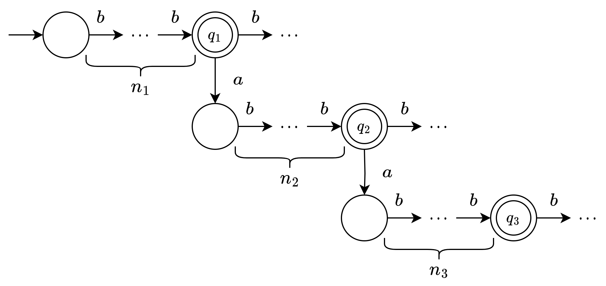

- すべての $k \geq 1$ について, $b^{n_1}ab^{n_2} \cdots ab^{n_k}$ の後に到達する, 受理状態 $q_k \in F_{\mathcal{C}}$ が存在する.

$\dots q_1 \dots q_2 \dots q_k$ の実行に対して, $F_{\mathcal{C}}$ は有限だから, $q_i = q_j$ となる $i, j (i < j)$ が存在する.

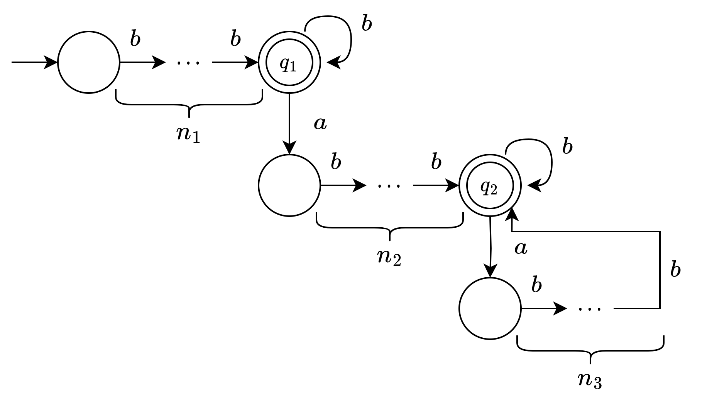

これは $\mathcal{C}$ が無限の $a$ を受理することを表す.

この文字列は $\mathcal{B}$ では受理されないため, $\mathcal{L}(\mathcal{C}) = \mathcal{L}(\mathcal{B})$ に矛盾する.

(有限個の $a$ を受理する決定性 Büchi オートマトンを構築しようとしても, 無限個の $a$ を受理してしまう)

</div>
</details>

<br/>

<u>**Lemma 7.3**</u>

決定性 Büchi オートマトンが受理する言語の集合は補に対して閉じていない

<br/>

<details>
<summary><dev style="color: var(--main-color)">Proof</dev></summary>
<div class="details-inner">

以下の決定性 Büchi オートマトンを考える.


このオートマトンは無限個の $a$ を含む文字列を受理する.

補は有限個の $a$ を含む文字列を受理する.

Theorem 7.2 より, 有限個の $a$ を含む文字列を受理する決定性 Büchi オートマトンは存在しない.

</div>
</details>

<br/>

非決定性 Büchi オートマトンが受理する言語の集合は補に対して閉じている

## 7.4 Intersection of Büchi Automata


2つの Büchi オートマトンの積を考える

- $\mathcal{L}(\mathcal{B}_1) \cap \mathcal{L}(\mathcal{B}_2)$ を受理するオートマトンを構築したい

まず単純にそれぞれのオートマトンの状態の組で考えてみる

→ **うまくいかない！**

<br/>

<details>
<summary><dev style="color: var(--main-color)">Example</dev></summary>
<div class="details-inner">

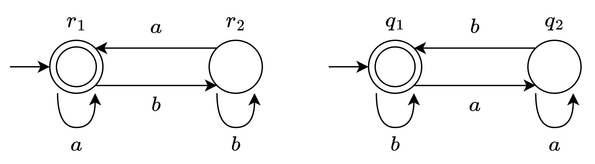

$\mathcal{B}_1 = (\Sigma, \{ r_1, r_2\}, \Delta_1, \{ r_1 \}, \{ r_1 \})$

$\mathcal{B}_2 = (\Sigma, \{ q_1, q_2\}, \Delta_2, \{ q_1 \}, \{ q_1 \})$

<br/>

単純に考えると...

$\mathcal{B}_1 \cap \mathcal{B}_2 = (\Sigma, \mathcal{Q}, \Delta, \mathcal{Q}^0, F)$

- $\mathcal{Q} = \mathcal{Q}_1 \times \mathcal{Q}_2 = \{ (r_1, q_1), (r_1, q_2), (r_2, q_1), (r_2, q_2) \}$

- $\mathcal{Q}^0 = \mathcal{Q}_1^0 \times \mathcal{Q}_2^0 = \{ (r_1, q_1) \}$

- $F = F_1 \times F_2 = \{ (r_1, q_1) \}$

- $\Delta = \{ ((q_i, r_j), a, (q_m, r_n))\ |\ (q_i, a, q_m) \in \Delta_1 \land (r_j, a, r_n) \in \Delta_2 \}$
| | $a$ | $b$ |
|:---:|:---:|:---:|
| $(r_1, q_1)$ | $(r_1, q_2)$ | $(r_2, q_1)$ |
| $(r_1, q_2)$ | $(r_1, q_2)$ | $(r_2, q_1)$ |
| $(r_2, q_1)$ | $(r_1, q_2)$ | $(r_2, q_1)$ |
| $(r_2, q_2)$ | $(r_1, q_2)$ | $(r_2, q_1)$ |

元々の Büchi オートマトン


どちらのオートマトンも $(ab)^{\omega}$ を受理する

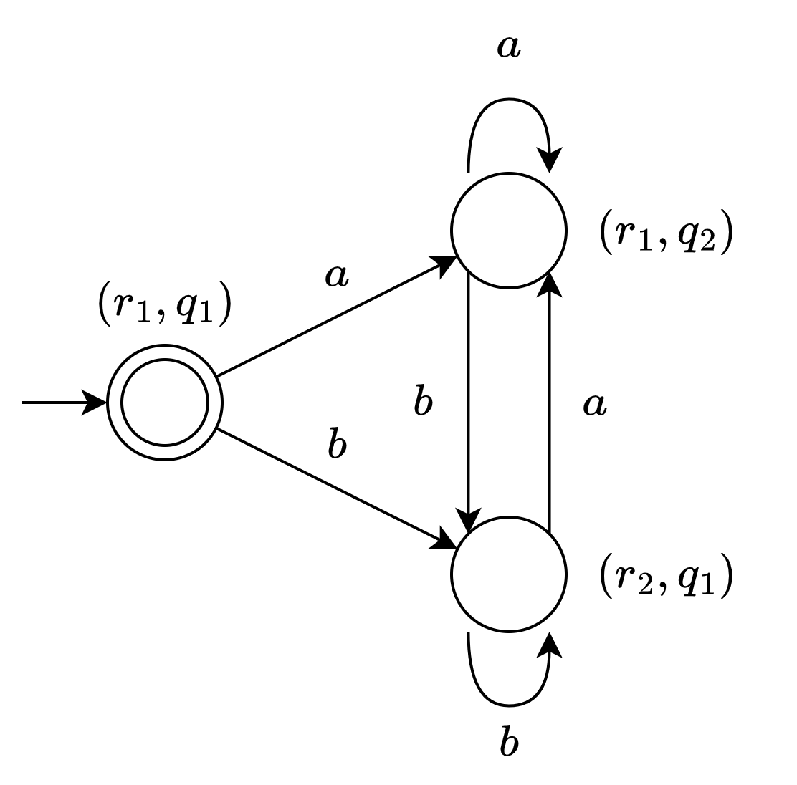

合成後のオートマトンは $(ab)^{\omega}$ を受理しない

→ 元々の 2つのオートマトンで受理していた文字列を受理しなくなった！

</div>
</details>

単純に $F = F_1 \times F_2$ とすると, $F_1$ と $F_2$ が **同時に** 無限にしばしば現れなければ受理されない

- $F_1$ と $F_2$ が別々に無限にしばしば現れる場合も考えたい

  - カウンタを使う

<br/>

#### 2つの Büchi オートマトンの積

2つのオートマトン 

- $\mathcal{B}_1 = (\Sigma, \mathcal{Q}_1, \Delta_1, \mathcal{Q}_1^0, F_1)$

- $\mathcal{B}_2 = (\Sigma, \mathcal{Q}_2, \Delta_2, \mathcal{Q}_2^0, F_2)$ 

について, $\mathcal{L}(\mathcal{B}_1) \cap \mathcal{L}(\mathcal{B}_2)$ を受理するオートマトン $\mathcal{B}_1 \cap \mathcal{B}_2$

$$ \mathcal{B}_1 \cap \mathcal{B}_2 = \{ \Sigma, \mathcal{Q}_1 \times \mathcal{Q}_2 \times \{0, 1, 2\}, \Delta, \mathcal{Q}_1^0 \times \mathcal{Q}_2^0 \times \{ 0 \}, \mathcal{Q}_1 \times \mathcal{Q}_2 \times \{ 2 \} \} $$

遷移関係 $\Delta$ について

$((r_i, q_j, x), a, (r_m, q_n, x')) \in \Delta$

- それそれのオートマトンで $a$ をラベルに持つ遷移がある
  
  - $(r_i, a, r_m) \in \Delta_1$ かつ $(q_j, a, q_n) \in \Delta_2$

- カウンタ変数はそれぞれのオートマトンの受理状態を通過したら $+1$ する

  - $x = 0$ のとき
    - $r_m \in F_1$ ならば $x' = 1$
  
  - $x = 1$ のとき
    - $q_n \in F_2$ ならば $x' = 2$

  - $x = 2$ のとき
    - $x' = 0$

$(r, q, 2)$ の状態が無限にしばしば現れる

→ $\mathcal{B}_1$ と $\mathcal{B}_2$ の受理状態を無限にしばしば通過する

<br/>

<details>
<summary><dev style="color: var(--main-color)"><a href="slides/intersection-example.pdf">Example</a></dev></summary>
</details>

<details>
<summary><dev style="color: var(--main-color)">Example2</dev></summary>
<div class="details-inner">

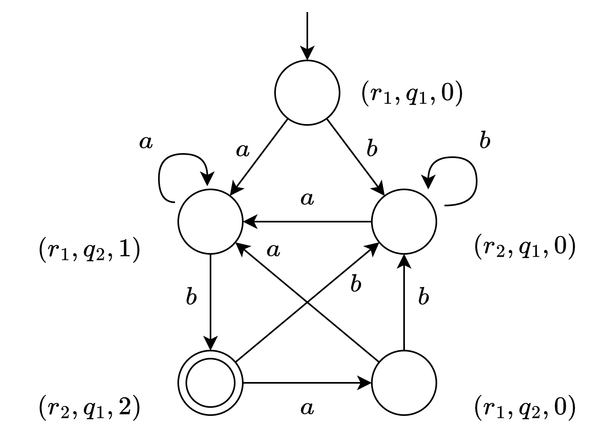

これは $(ab)^{\omega}$ を受理する？

<details>
<summary>答え</summary>
<div class="details-inner">

Yes

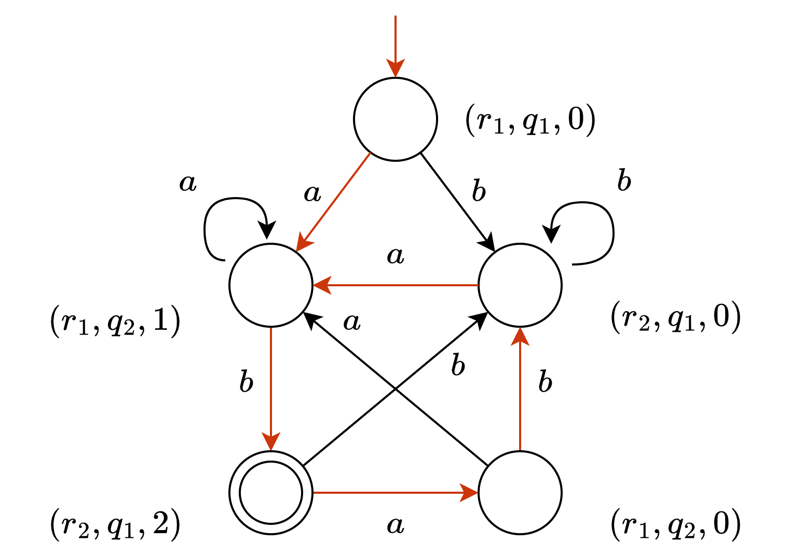

</div>
</details>

</div>
</details>

<br/>

合成する一方のオートマトンの受理状態がすべての状態のとき, オートマトンはより簡単に合成できる

$\mathcal{B}_1$ の受理状態が $F_1 = \mathcal{Q}_1$, $\mathcal{B}_2$ の受理状態が $F_2$ のとき

$$ \mathcal{B}_1 \cap \mathcal{B}_2 = \{ \Sigma, \mathcal{Q}_1 \times \mathcal{Q}_2, \Delta, \mathcal{Q}_1^0 \times \mathcal{Q}_2^0, \mathcal{Q}_1 \times F_2 \}$$

## 7.5 Checking Emptiness


Büchi オートマトンの言語が空かどうかを調べる $\mathcal{L}(\mathcal{B}) = \emptyset$

<br/>

<u>**Lemma 7.4**</u>

Büchi オートマトン $\mathcal{B} = (\Sigma, \mathcal{Q}, \Delta, \mathcal{Q}^0, F)$ について, 以下の条件は同値である

- $\mathcal{L}(\mathcal{B}) \neq \emptyset$
- $\mathcal{B}$ のグラフが 受理状態を含む nontrivial SCC $C$ を含む かつ $C$ が初期状態から到達可能
- $\mathcal{B}$ のグラフに 初期状態から受理状態 $t \in F$ までのパスが存在する かつ $t$ から $t$ 自身に戻るパスが存在する

<br/>

2つ目の条件

<details>
<summary>Nontrivial SCC</summary>
<div class="details-inner">

SCC (strongly connected component) $C$ : $C$ 内のすべてのノードが他のすべてのノードから到達可能

SCC が nontrivial :

- 2つ以上のノードを持つ or
  
- 自分自身への辺が存在する

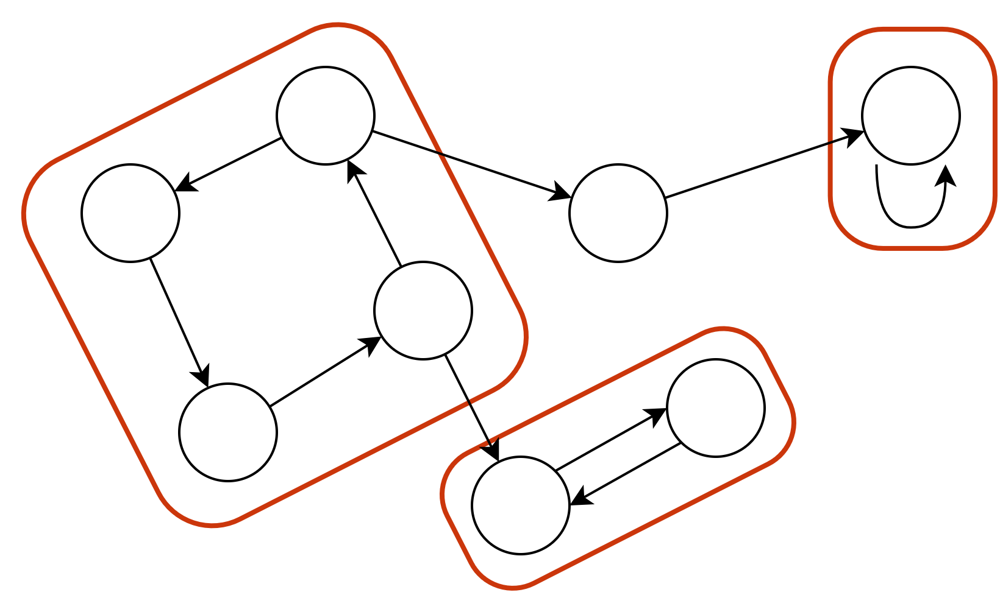

</div>
</details>

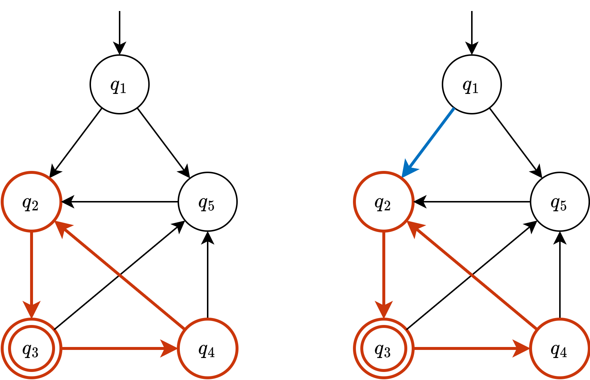

3つ目の条件

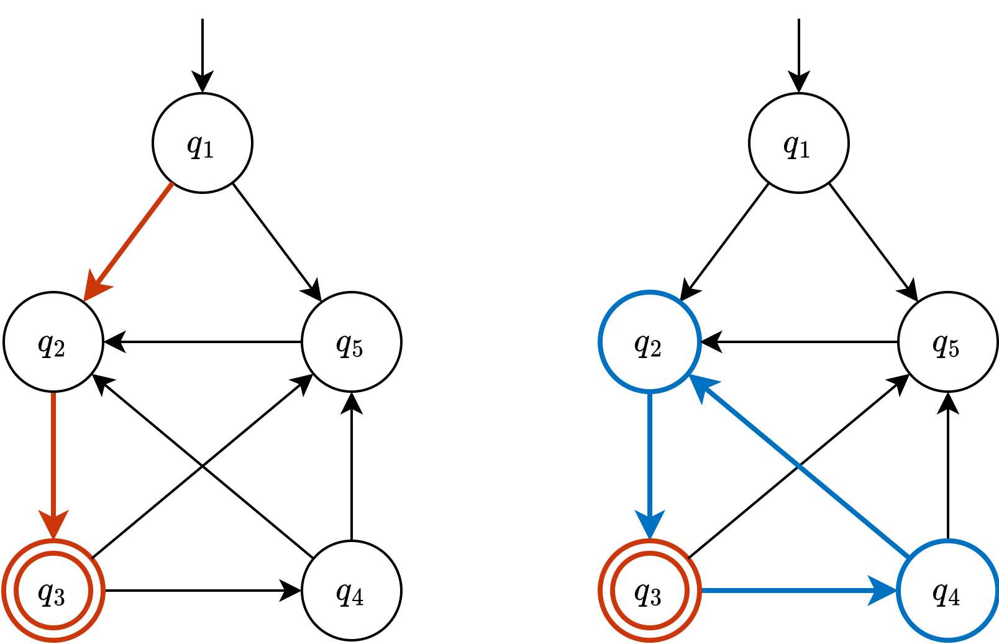

<br/>

2つ目の条件を用いたアルゴリズム

$\mathcal{B}$ のグラフが 受理状態を含む nontrivial SCC $C$ を含む かつ $C$ が初期状態から到達可能

- Tarjan's DFS アルゴリズム

  - SCC を見つけるアルゴリズム
  - $O(|S| + |R|)$ でオートマトンの空を判定できる

<br/>

3つ目の条件を用いたアルゴリズム

$\mathcal{B}$ のグラフに 初期状態から受理状態 $t \in F$ までのパスが存在する かつ $t$ から $t$ 自身に戻るパスが存在する

- Double DFS アルゴリズム

  - 最初に SCC を見つけるよりも効率的な場合が多い
  - 特に on-the-fly モデル検査で効果的
    - システムのオートマトンの構築途中で intersection を計算

### 7.5.1 Checking Emptiness with Double DFS

2つの DFS を使って到達可能な受理状態を見つけ, それ自身に戻るパスがあるかどうか判定する

- DFS 1: 初期状態から始めて, 到達可能な受理状態を見つける
  
- DFS 2: DFS 1 で見つけた受理状態から始めて, それ自身に戻るサイクルを見つける

DFS 2 は DFS 1 の途中から始める

条件を満たす受理状態のサイクルを見つけたら終わり

<br/>

<u>**アルゴリズム**</u>

- 初期状態から DFS1 を始める

    ```python=
    def emptiness():
        for q0 in Q0:
            dfs1(q0)
        terminate(false)
    ```

- DFS 1

  - 探索済み : hashed
  - 受理状態から出るノードがすべて探索済みのとき DFS2 を始める
  
  ```python=
  def dfs1(q):
      hash(q)
      for q_suc in successors(q):
          if not hashed(q_suc):
              dfs1(q_suc)

      if accept(q):
          dfs2(q)
  ```

- DFS 2

  - 探索済み : flagged 
  - 探索ノード $q\_suc$ が DFS 1 のスタック上にある
    - DFS 1 より, 初期状態 -> $q\_suc$ -> $q\_a$ (DFS 2 を始めた受理状態) のパスが存在
    - DFS 2 より, $q\_a$ -> $q\_suc$ のパスが存在
    - よって $q\_a$ を含むサイクルが存在

```python=
def dfs2(q):
    flag(q)
    for q_suc in successors(q):
        if on_dfs1_stack(q_suc):
            terminate(true)

        if not flagged(q_suc):
            dfs2(q_suc)
```

[**Example**](slides/double-dfs-example.pdf)

<br/>

<details>
<summary>コメント</summary>
<div class="details-inner">

DFS 1 で受理状態に到達したら DFS 2 を始めていいのでは？

```python=
def dfs1(q):
    hash(q)
    if accept(q):
        dfs2(q)

    for q_suc in successors(q):
        if not hashed(q_suc):
            dfs1(q_suc)
```

答えは No

DFS 2 の flag はアルゴリズム中引き継がれる

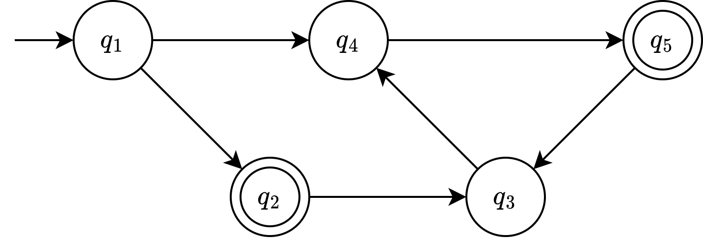

DFS 1: $q_1, q_2$

上のアルゴリズムで $q_2$ から DFS 2 をスタート

$q_2, q_3, q_4, q_5$ の flag が立つ

DFS 1 の stack 上に $q_3, q_4, q_5$ はないので $q_2$ を含むサイクルはなし

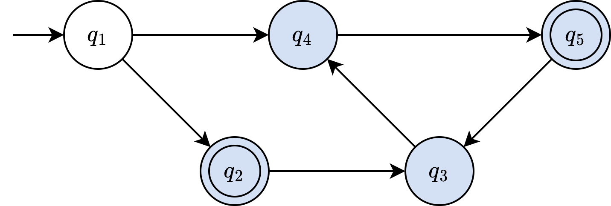

DFS 1 を進めて, 次に $q_5$ から DFS 2 がスタートするが, $q_5$ からのすべてのノードは flagged

本来このオートマトンの受理言語は空ではないが空と判定

</div>
</details>

### 7.5.2 Correctness of the Double DFS Algorithm

Double DFS アルゴリズムが正しいことを証明する

<br/>

<u>**Lemma 7.7**</u>

$q$ をどのサイクルにも含まれない状態とする

$q$ からバックトラックするのは, $q$ から到達可能な状態すべてを探索し, バックトラックしてきた後である

<br/>

<u>**Theorem 7.8**</u>

$\mathcal{L}(\mathcal{B})$ が空でない

$\ \ \Longleftrightarrow$ Double DFS アルゴリズムは $\mathcal{B}$ の空に対する反例を出す

<br/>

<details>
<summary><dev style="color: var(--main-color)">Proof</dev></summary>
<div class="details-inner">

( $\Longleftarrow$ ) : 

空に対する反例があるので明らか.

<br/>

( $\Longrightarrow$ ) : 

アルゴリズムが空と判定したとき, $\mathcal{L}(\mathcal{B})$ は本当に空？

以下の状況を考える.

- $q$ から DFS 2 を始める.

- $q$ から DFS 1 のスタック上にある状態 $p$ へのパスが存在する.

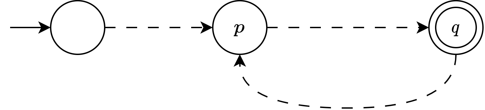

このとき, 以下の2つの状況が考えられる.

1. $q$ から $p$ へのパスで unflagged なノードのみで構成されるパスが存在する

    - このとき DFS 2 は $q$ を含むサイクルを見つけることができる

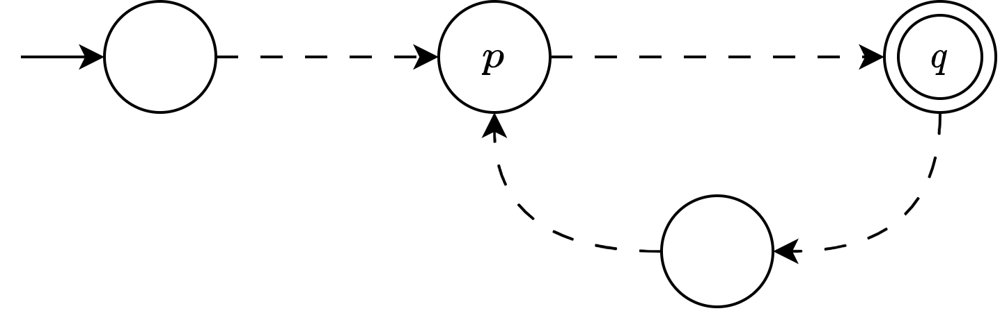

2. $q$ から $p$ へのすべてのパス上に flagged なノードが存在する

    - このとき DFS 2 は $q$ を含むサイクルを見つけられない

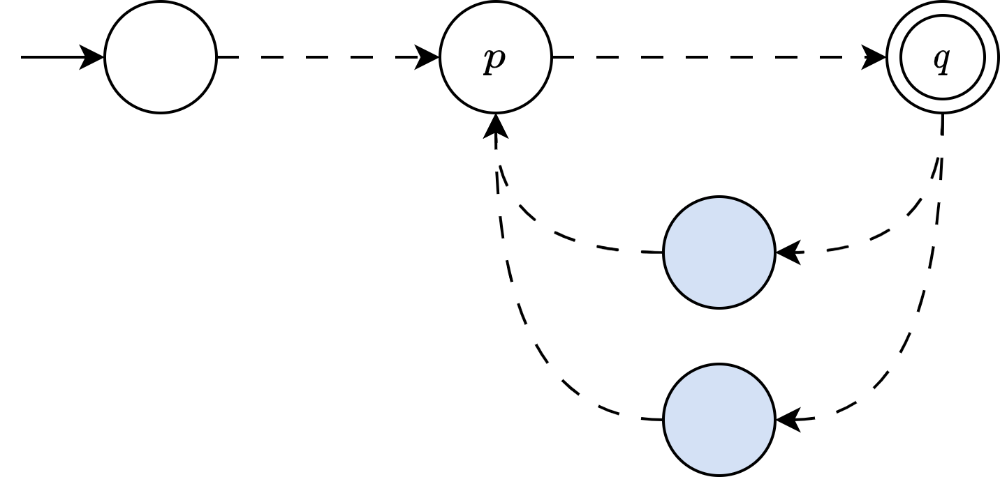


この 2 の状況がないことを背理法で証明する.

<details>
<summary><dev style="color: var(--main-color)">Proof</dev></summary>
<div class="details-inner">

状態を以下のように仮定する.

$q$ : 

- DFS 2 の起点となる受理状態
- $q$ を含むサイクルが存在する
- アルゴリズムがサイクルの発見に失敗するような **最初の** 状態

$r$ : 

- $q$ を含むサイクル上にある
- $q$ から到達する最初の flagged な状態

$q'$ :

- $r$ を flagged にした DFS 2 の起点となる受理状態

この仮定から $q'$ を起点とする DFS 2 は $q$ を起点とする DFS 2 の前に実行される.

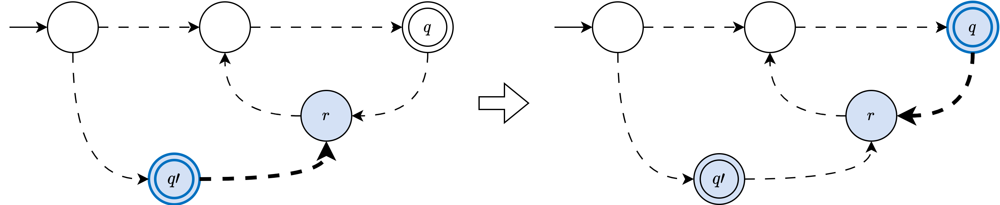

このとき, 以下の2つの状況が考えられる

1. $q'$ が $q$ から到達可能なとき

   $q' \to \dots \to r \to \dots \to q \to \dots \to q'$ となるサイクルが存在.

   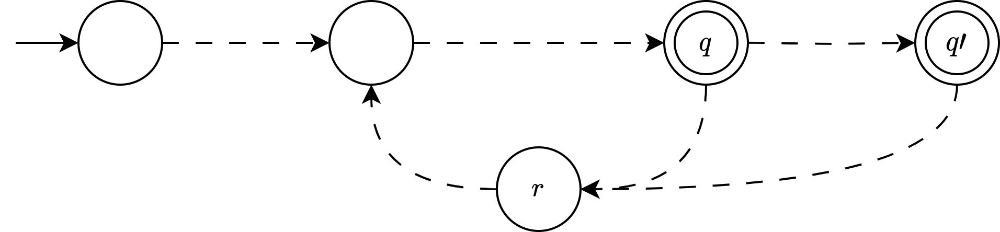

    アルゴリズムは終了していないので, $q'$ から始まる DFS 2 はこのサイクルの発見に失敗した.

    これは, $q$ がサイクルの発見に失敗する最初の状態という仮定に矛盾.

<br/>

2. $q'$ が $q$ から到達不可能なとき

    - $q'$ がサイクルに含まれるとき
  
      $q$ がサイクルの発見に失敗する最初の状態という仮定に矛盾.

    - $q'$ がサイクルに含まれないとき
  
      $q' \to \dots \to r \to \dots \to q$ というパスが存在.

      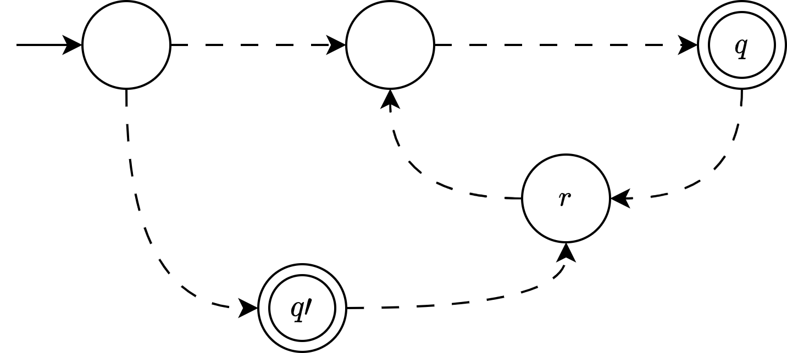

      $q'$ から $q$ に到達可能. 
      
      Lemma 7.7 より, $q$ を起点とする DFS 2 が $q'$ を起点とする DFS 2 の前に実行. 


      <details>
      <summary>Lemma 7.7</summary>
      <div class="details-inner">

      $q$ をどのサイクルにも含まれない状態とする

      $q$ からバックトラックするのは, $q$ から到達可能な状態すべてを探索し, バックトラックしてきた後である

      </div>
      </details>
      
      これは $q'$ を起点とする DFS 2 は $q$ を起点とする DFS 2 の前に実行される という仮定に矛盾.

</div>
</details>

よってこの 2 の状況はないので, 受理状態を含むサイクルが存在する ($\mathcal{L}(\mathcal{B}) \neq \emptyset$) ならば アルゴリズムは必ずそのサイクル (空に対する反例) を見つけることができる

</div>
</details>

## 7.6 Generalized Büchi Automata

Generalized Büchi オートマトン

- 複数の受理状態の集合を持つ

  - $F \subseteq \mathcal{P}(\mathcal{Q})$

    $F = \{ P_1, \dots, P_k \},\ P_i \subseteq Q$ 

- すべての $P_i \in F$ について, $inf(\rho) \cap P_i \neq \emptyset$ のとき実行 $\rho$ は受理される

  - $F$ の各要素のうちどれか一つは無限にしばしば通る
  - $F$ が空集合のとき $\Sigma^{\omega}$ のすべてを受理する

- Non-generalized Büchi オートマトン と受理できる言語は同じ

- LTL 式から generalized Büchi オートマトンに変換する方法を示す (7.9節)

- クリプキ構造の複数の fairness 制約と generalized Büchi オートマトンの受理状態集合は一致する

<details>
<summary><dev style="color: var(--main-color)">Example</dev></summary>
<div class="details-inner">

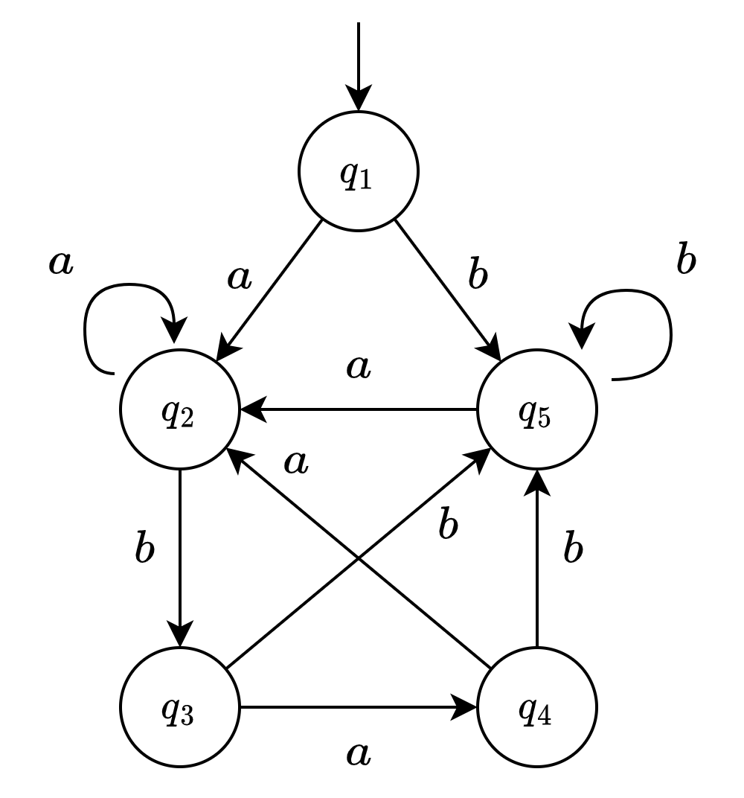

$F = \{ \{ q_2, q_4\}, \{ q_5 \} \}$ のとき

<br/>

$(aab)^{\omega}$ は受理される？

<details>
<summary>答え</summary>
<div class="details-inner">

No

$q_5$ は有限回しか通らない

</div>
</details>

$(abb)^{\omega}$ は受理される？

<details>
<summary>答え</summary>
<div class="details-inner">

Yes

$q_2, q_5$ は無限にしばしば通る

</div>
</details>

$a^*b^{\omega}$ は受理される？

<details>
<summary>答え</summary>
<div class="details-inner">

問題がおかしい

決定性 Büchi オートマトンの表現力では扱えない

</div>
</details>

</div>
</details>

#### Generalized Büchi オートマトン から Büchi オートマトンへの変換

Generalized Büchi オートマトン 

$\mathcal{B} = (\Sigma, \mathcal{Q}, \Delta, \mathcal{Q}^0, F)$

$F = \{ P_1, \dots, P_k \}$

は以下のように変換できる

$$\mathcal{B}' = (\Sigma, \mathcal{Q} \times \{ 0, \dots, k \}, \Delta', \mathcal{Q}^0 \times \{ 0 \}, \mathcal{Q} \times \{k\})$$

- 直感的には, 状態 $(q, i)$ に到達したとき, $P_1, \dots, P_i$ の状態に到達していることを表す

遷移関係 $\Delta'$ について

$((q, x), a, (q', x')) \in \Delta'$

- $(q, a, q') \in \Delta$

- カウンタ変数

  - $q' \in P_{i + 1}, x = i$ のとき
    - $x' = i + 1$
  
  - $x = k$ のとき
    - $x' = 0$

この変換はオートマトンのサイズを $k + 1$ 倍する

## 7.7 Automata and Kripki Structures


オートマトンを用いる利点: システムと性質を同じ形式で表せる

#### クリプキ構造から Büchi オートマトンへの変換


- クリプキ構造上の状態のラベルをそれに向かう辺のラベルに

- システムの状態遷移から得られるラベルの列がオートマトンの受理言語

  - $s_0s_1s_0s_1s_2s_0\dots$ : $\{p,q\}\{p\}\{p,q\}\{p\}\{q\}\{p,q\}\dots$

<br/>

クリプキ構造 $M = (S, S_0, R, AP, L)$ は以下のオートマトンに変換できる

$$\mathcal{A}_{M} = (\Sigma, S \cup \{ \iota \}, \Delta, \{ \iota \}, S \cup \{ \iota \})$$

- $\Sigma = \mathcal{P}(AP)$

- 遷移関係 $\Delta$

  - $(s, \alpha, s') \in \Delta,\ s, s' \in S$
    - $(s, s') \in R$
    - $\alpha = L(s')$

  - $(\iota, \alpha, s) \in \Delta$
    - $s \in S_0$
    - $\alpha = L(s)$

- 受理状態集合 $F$

  - Fairness 制約がないとき
    - すべての状態が受理状態

  - Fairness 制約があるとき
    - Fairness 制約をそのまま受理状態集合に