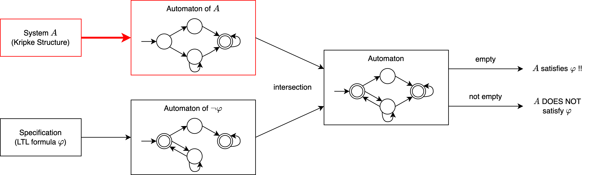

# Model Checking

### Ch.7 : Automata on Infinite Words and LTL Model Checking

## 概要

- 6章 : タブローを用いた LTL 式の検査

- 7章 : オートマトンを用いた LTL 式の検査

  - システムも性質もオートマトンで表す
  - automaton : 単数形, automata : 複数形

### オートマトンを用いた LTL 式検査の概要

1. システムのオートマトンを構築
2. 満たしたくない性質 (LTL 式の否定) のオートマトンを構築
3. 1 と 2 のオートマトンを合成
4. 3 のオートマトンの受理言語をチェック
   - 受理言語が空: システムは LTL 式を満たす (満たしたくない性質の実行が存在しない)
   - 受理言語が空でない: システムは LTL 式を満たさない (満たしたくない性質の実行が存在する)

### クリプキ構造 ・ LTL 式とオートマトンの関係

#### クリプキ構造

- クリプキ構造上の状態のラベルをそれに向かう辺のラベルに

- システムの状態遷移から得られるラベルの列がオートマトンの受理言語

  - $s_0s_1s_0s_1s_2s_0$ : $\{p,q\}\{p\}\{p,q\}\{p\}\{q\}\{p,q\}$

#### LTL 式

[**Slide**](slides/ltl-automaton.pdf)

- オートマトンの状態はパスのある状態からの性質を表す

- LTL 式のオートマトンが受理する言語はある LTL パスの状態のラベルの列

  - $\{ p \}\{ p \}\{ q \}...$

### 考えること

- オートマトンについて

  - [7.1 節](#71-finite-automata-on-finite-words) : 有限の文字列を扱える有限オートマトン
  - [7.2 節](#72-automata-on-infinite-words) : 無限の文字列を扱える有限オートマトン (Büchi オートマトン)
  - [7.3 節](#73-deterministic-versus-nonderterministic-büchi-automata) : 決定性・非決定性 Büchi オートマトン
  - 7.6 節 : 一般的な Büchi オートマトン について

- オートマトンの合成について

  

  - [7.4 節](#74-intersection-of-büchi-automata) : Büchi オートマトンの積

 

- オートマトンが空かどうかのチェック

  

  - 7.5 節 : オートマトンが空かどうかのチェック

 

- クリプキ構造からオートマトンへの変換

  

  - 7.7 節 : オートマトンとクリプキ構造

 

- オートマトンを用いた LTL 式検査の概要

  

  - 7.8 節 : オートマトンを用いたモデル検査

 

- LTL 式からオートマトンへの変換

  

  - 7.9 節 : ナイーブな変換方法
  - 7.10 節 : 効率的な変換方法

 

## 7.1 Finite Automata on Finite Words

- regular automata : **有限** の文字列を扱える有限オートマトン
- $\omega$-regular automata : **無限** の文字列を扱える有限オートマトン

有限の文字列を扱える有限オートマトン $\mathcal{A}$ : $(\Sigma, \mathcal{Q}, \Delta, \mathcal{Q}^0, F)$

- $\Sigma$ : 有限のアルファベット  
  - $\{a, b\}$

- $\mathcal{Q}$ : 状態の有限集合
  - $\{q_1, q_2\}$

- $\Delta \subseteq \mathcal{Q} \times \Sigma \times \mathcal{Q}$ : 遷移関係
  - $\{(q_1, a, q_1), (q_1, b, q_2), (q_2, a, q_1), (q_2, b, q_2)\}$

- $\mathcal{Q}^0 \subseteq \mathcal{Q}$ : 初期状態の集合

- $F \subseteq \mathcal{Q}$ : 受理状態 (accepting states) の集合

<dev style="color: var(--main-color)">Example</dev>

$(\Sigma, \mathcal{Q}, \Delta, \mathcal{Q}^0, F)$

- $\Sigma = \{a, b\}$

- $\mathcal{Q} = \{q_1, q_2\}$

- $\Delta = \{(q_1, a, q_1), (q_1, b, q_2), (q_2, a, q_1), (q_2, b, q_2)\}$

- $\mathcal{Q}^0 = \{ q_1 \}$

- $F = \{ q_1 \}$

 

$v \in \Sigma^{*}$ : 文字列 (word, string, sequence)

$v$ を得るための $\mathcal{A}$ の実行 (run) $\rho$

$$\rho : \{ 1, \cdots, |v| + 1 \} \mapsto \mathcal{Q}$$

- $\rho(1) \in \mathcal{Q}^0$
- $v$ の $i$ 文字目を $v(i)$ としたとき, $\ 1 \leq i \leq |v|,\ (\rho(i), v(i), \rho(i + 1)) \in \Sigma$ (遷移関係)

$\rho(|v| + 1) \in F$ (最終状態) のとき実行 $\rho$ は **受理される** 

$\mathcal{A}$ が文字列 $v$ を **受理する** (**accept**) : $v$ を得られる実行 $\rho$ が受理される

(オートマトンを初期状態から遷移に沿って移動, 最後は受理状態のとき出来上がる文字列は受理される)

 

<dev style="color: var(--main-color)">Example</dev>

文字列 $abba$ が得られる実行は？ : $q_1q_1q_2q_2q_1$

文字列 $baa$ が得られる実行は？

答え

$q_1q_2q_1q_1$

文字列 $bbaba$ は受理される？

答え

Yes

受理される実行 $q_1q_2q_2q_1q_2q_1$ が存在する

文字列 $aabab$ は受理される？

答え

No

受理される実行が存在しない

($aabab$ が得られる実行 $q_1q_1q_1q_2q_1q_2$ は最後の状態が受理状態 $F$ に含まれない)

 

$\mathcal{A}$ の言語 (language) $\mathcal{L}(\mathcal{A}) \subseteq \Sigma^{*}$ : $\mathcal{A}$ によって受理されるすべての文字列

 

<dev style="color: var(--main-color)">Example</dev>

$\mathcal{A}$ の言語 : $\varepsilon + (a + b)^{*}a$

 

### 7.1.1 Determinization and Complementation

非決定性 (nondeterministic) オートマトン : ある状態から同じ文字でラベル付けされた複数の状態への遷移が存在する 

$$ (q, a, l), (q, a, l') \in \Delta , \text{where}\ l \neq l'$$

決定性 (deterministic) オートマトン : 上記の遷移が存在しない かつ 初期状態が一つ $|\mathcal{Q}^0| = 1$

非決定性 regular オートマトンは受理言語を変えずに決定性オートマトンに変換できる

 

非決定性オートマトン : $\mathcal{A} = (\Sigma, \mathcal{Q}, \Delta, \mathcal{Q}^0, F)$ は以下の決定性オートマトンに変換可能

$$\mathcal{A}' = (\Sigma, \mathcal{P}(\mathcal{Q}), \Delta', \{\mathcal{Q}^0\}, F')$$

- 遷移関係 $\Delta' \subseteq \mathcal{P}(\mathcal{Q}) \times \Sigma \times \mathcal{P}(\mathcal{Q})$

  - $(\mathcal{Q}_1, a, \mathcal{Q}_2) \in \Delta'$ if

  $$\mathcal{Q} _ 2 = \displaystyle \bigcup_{q \in \mathcal{Q} _ 1} \{ q' \ | \ (q,a,q') \in \Delta \}$$

  - $\mathcal{A'}$ は決定性なので, $\Delta'$ は関数 $\mathcal{P}(\mathcal{Q}) \times \Sigma \to \mathcal{P}(\mathcal{Q})$ で表される

- 受理状態の集合 $F'$ : $\{ \mathcal{Q}'\ |\ \mathcal{Q}' \cap F \neq \emptyset \}$

 

<dev style="color: var(--main-color)">Example</dev>

非決定性オートマトンから決定性オートマトンへの変換

非決定性オートマトン $\mathcal{A}$ : $(\Sigma, \mathcal{Q}, \Delta, \mathcal{Q}^0, F)$

- $\Sigma = \{a, b, c\}$

- $\mathcal{Q} = \{q_1, q_2, q_3\}$

- $\Delta = \{(q_1, b, q_1), (q_1, c, q_2), (q_2, b, q_1), (q_2, c, q_3), (q_3, a, q_2), (q_3, a, q_3)\}$

- $\mathcal{Q}^0 = \{ q_1, q_2 \}$

- $F = \{ q_1, q_3 \}$

決定性オートマトン $\mathcal{A}' = (\Sigma, \mathcal{P}(\mathcal{Q}), \Delta', \{\mathcal{Q}^0\}, F')$ に変換する

- 初期状態 : $\{ \{ q_1, q_2 \} \}$

- 遷移関係 $\Delta'$ :

  |  | $a$ | $b$ | $c$ |
  | ---: | :---: | :---: | :---: |
  | $\emptyset$ | $\emptyset$ | $\emptyset$ | $\emptyset$ |
  | $\{ q_1 \}$ | $\emptyset$ | $\{ q_1 \}$ | $\{ q_2 \}$ |
  | $\{ q_2 \}$ | $\emptyset$ | $\{ q_1 \}$ | $\{ q_3 \}$ |
  | $\{ q_3 \}$ | $\{ q_2, q_3 \}$ | $\emptyset$ | $\emptyset$ |
  | $\{ q_1, q_2 \}$ | $\emptyset$ | $\{ q_1 \}$ | ? |
  | $\{ q_1, q_3 \}$ | $\{ q_2, q_3 \}$ | $\{ q_1 \}$ | $\{ q_2 \}$ |
  | $\{ q_2, q_3 \}$ | $\{ q_2, q_3 \}$ | $\{ q_1 \}$ | $\{ q_3 \}$ |
  | $\{ q_1, q_2, q_3 \}$ | $\{ q_2, q_3 \}$ | $\{ q_1 \}$ | $\{ q_2, q_3 \}$ |

    

    
答え

    

    |  | $a$ | $b$ | $c$ |
    | ---: | :---: | :---: | :---: |
    | $\emptyset$ | $\emptyset$ | $\emptyset$ | $\emptyset$ |
    | $\{ q_1 \}$ | $\emptyset$ | $\{ q_1 \}$ | $\{ q_2 \}$ |
    | $\{ q_2 \}$ | $\emptyset$ | $\{ q_1 \}$ | $\{ q_3 \}$ |
    | $\{ q_3 \}$ | $\{ q_2, q_3 \}$ | $\emptyset$ | $\emptyset$ |
    | $\{ q_1, q_2 \}$ | $\emptyset$ | $\{ q_1 \}$ | $\{ q_2, q_3 \}$ |
    | $\{ q_1, q_3 \}$ | $\{ q_2, q_3 \}$ | $\{ q_1 \}$ | $\{ q_2 \}$ |
    | $\{ q_2, q_3 \}$ | $\{ q_2, q_3 \}$ | $\{ q_1 \}$ | $\{ q_3 \}$ |
    | $\{ q_1, q_2, q_3 \}$ | $\{ q_2, q_3 \}$ | $\{ q_1 \}$ | $\{ q_2, q_3 \}$ |
    
    

    

- 受理状態 $F'$ : $\{ \{ q_1 \}, \{ q_3 \}, \{ q_1, q_2 \}, \{ q_1, q_3 \}, \{ q_2, q_3 \}, \{ q_1, q_2, q_3 \} \}$

  <!-- - $( \{ q_1, q_2 \}, b, \{ q_1 \} )$
  - $( \{ q_1, q_2 \}, c, ? )$

    

    
答え

    

    $( \{ q_1, q_2 \}, c, \{ q_2, q_3 \} )$
    

    

  - $( \{ q_1 \}, b, \{ q_1 \} )$
  - $( \{ q_1 \}, c, \{ q_2 \} )$
  - $( \{ q_2 \}, b, \{ q_1 \} )$
  - $( \{ q_2 \}, c, \{ q_3 \} )$
  - $( \{ q_3 \}, a, ? )$

    

    
答え

    

    $( \{ q_3 \}, a, \{ q_2, q_3 \} )$
    

    

  - $( \{ q_2, q_3 \}, a, ? )$

    

    
答え

    

    $( \{ q_2, q_3 \}, a, \{ q_2, q_3 \} )$
    

    

  - $( \{ q_2, q_3 \}, b, \{ q_1 \} )$
  - $( \{ q_2, q_3 \}, c, \{ q_3 \} )$

  - 受理状態 $F'$ : $\{ \{ q_1 \}, \{ q_3 \}, \{ q_1, q_2 \}, \{ q_2, q_3 \} \}$ -->

(空集合と初期状態から到達不可能な状態は除く)

 

非決定性オートマトンの補 (Complementation) : $\overline{\mathcal{L}(\mathcal{A})} = \Sigma^* - \mathcal{L}(\mathcal{A})$

1. 非決定性オートマトンを決定性オートマトンに変換
2. 受理状態と非受理状態を入れ替える

## 7.2 Automata on Infinite Words

**無限**の文字列を扱える有限オートマトンを考える

  - Reactive system などを扱いたい

Büchi オートマトン : **無限**の文字列を扱える最も簡単な有限オートマトン

Regular オートマトンと構成要素は同じ : $(\Sigma, \mathcal{Q}, \Delta, \mathcal{Q}^0, F)$

ただし, 無限の文字列 $v \in \Sigma^{\omega}$ を扱える ($\omega$ は無限の繰り返しを表す)

 

$inf(\rho)$ : 実行 $\rho$ で無限によく現れる状態 

  - 状態 $\mathcal{Q}$ は有限, 実行 $\rho$ は無限なので $inf(\rho)$ は空集合ではない

Büchi オートマトン $\mathcal{A}$ が実行 $\rho$ を**受理する** $\Leftrightarrow inf(\rho) \cap F \neq \emptyset$

- 受理状態 $F$ のどれかが実行 $\rho$ で無限によく現れる

$\mathcal{A}$ の**言語** (**language**) $\mathcal{L}(\mathcal{A}) \subseteq \Sigma^{\omega}$ : $\mathcal{A}$ によって受理されるすべての無限の文字列の集合 

 

<dev style="color: var(--main-color)">Example</dev>

受理状態 $q_1$ が無限によく現れるとき, その実行は受理される

- $(ab)^{\omega}$ は受理される?

    

    
答え

    

    Yes

    

    

- $a^*b^{\omega}$ は受理される?

    

    
答え

    

    No

    受理状態 $q_1$ は有限回しか現れない

    

    

$\mathcal{L}(\mathcal{A})$ : $(b^*a)^{\omega}$

 

ちなみに、このオートマトンはどんな LTL 式を変換したもの？

答え

$GF a$

## 7.3 Deterministic versus Nonderterministic Büchi Automata

表現力 :

有限文字列を扱うオートマトン : (決定性) = (非決定性)

Büchi オートマトン : (決定性) < (非決定性)

- **非決定性** Büchi オートマトンには等価な (同じ言語を受理する) **決定性** Büchi オートマトンに置き換えられないものが存在する

<u>**Lemma 7.1**</u>

 

<u>**Theorem 7.2**</u>

表現力 : (決定性 Büchi オートマトン) < (非決定性 Büchi オートマトン)

つまり, 等価な決定性 Büchi オートマトンがない非決定性 Büchi オートマトンが存在する

 

<dev style="color: var(--main-color)">Proof</dev>

上の非決定性 Büchi オートマトン $\mathcal{B}$ を考える.

受理言語は? (LTL 式?)

答え

$(a + b)^*b^{\omega}$

(LTL 式: $FG b$)

つまり, $a$ は有限回しか現れない. 

この言語を受理する決定性 Büchi オートマトンが存在しないことを背理法で示す.

この言語を受理する決定性 Büchi オートマトン $\mathcal{C}$ が存在すると仮定する ($\mathcal{L}(\mathcal{C}) = \mathcal{L}(\mathcal{B})$). 

$\mathcal{C}$ は $\sigma b^{\omega}$ ($\sigma$ は有限の文字列) を受理する.

<u>**ポイント**</u>

$\mathcal{C}$ は決定的なのである文字列に対する実行は一意に定まる.

- $b^{\omega} \in \mathcal{L}(\mathcal{C})$ より, $b^{n_1}$ の次に到達する受理状態 $q_1 \in F_{\mathcal{C}}$ が存在する. 

  (イメージ : $b^{\omega} = b^{n_1}b^{\omega}$)

  

- $b^{n_1}ab^{\omega} \in \mathcal{L}(\mathcal{C})$ より, $b^{n_1}ab^{n_2}$ の次に到達する受理状態 $q_2 \in F_{\mathcal{C}}$ が存在する. 

  (イメージ : $b^{n_1}ab^{\omega} = b^{n_1}ab^{n_2}b^{\omega}$)

  

- $b^{n_1}ab^{n_2}ab^{\omega} \in \mathcal{L}(\mathcal{C})$ より, $b^{n_1}ab^{n_2}ab^{n_3}$ の次に到達する受理状態 $q_3 \in F_{\mathcal{C}}$ が存在する. 

  (イメージ : $b^{n_1}ab^{n_2}ab^{\omega} = b^{n_1}ab^{n_2}ab^{n_3}b^{\omega}$)

  

- すべての $k \geq 1$ について, $b^{n_1}ab^{n_2} \cdots ab^{n_k}$ の後に到達する, 受理状態 $q_k \in F_{\mathcal{C}}$ が存在する.

$\dots q_1 \dots q_2 \dots q_k$ の実行に対して, $F_{\mathcal{C}}$ は有限だから, $q_i = q_j$ となる $i, j (i < j)$ が存在する.

これは $\mathcal{C}$ が無限の $a$ を受理することを表す.

この文字列は $\mathcal{B}$ では受理されないため, $\mathcal{L}(\mathcal{C}) = \mathcal{L}(\mathcal{B})$ に矛盾する.

(有限個の $a$ を受理する決定性 Büchi オートマトンを構築しようとしても, 無限個の $a$ を受理してしまう)

 

<u>**Lemma 7.3**</u>

決定性 Büchi オートマトンが受理する言語の集合は補に対して閉じていない

 

<dev style="color: var(--main-color)">Proof</dev>

以下の決定性 Büchi オートマトンを考える.

このオートマトンは無限個の $a$ を含む文字列を受理する.

補は有限個の $a$ を含む文字列を受理する.

Theorem 7.2 より, 有限個の $a$ を含む文字列を受理する決定性 Büchi オートマトンは存在しない.

 

非決定性 Büchi オートマトンが受理する言語の集合は補に対して閉じている

## 7.4 Intersection of Büchi Automata

2つの Büchi オートマトンの積を考える

- $\mathcal{L}(\mathcal{B}_1) \cap \mathcal{L}(\mathcal{B}_2)$ を受理するオートマトンを構築したい

まず単純にそれぞれのオートマトンの状態の組で考えてみる

→ **うまくいかない！**

 

<dev style="color: var(--main-color)">Example</dev>

$\mathcal{B}_1 = (\Sigma, \{ r_1, r_2\}, \Delta_1, \{ r_1 \}, \{ r_1 \})$

$\mathcal{B}_2 = (\Sigma, \{ q_1, q_2\}, \Delta_2, \{ q_1 \}, \{ q_1 \})$

 

単純に考えると...

$\mathcal{B}_1 \cap \mathcal{B}_2 = (\Sigma, \mathcal{Q}, \Delta, \mathcal{Q}^0, F)$

- $\mathcal{Q} = \mathcal{Q}_1 \times \mathcal{Q}_2 = \{ (r_1, q_1), (r_1, q_2), (r_2, q_1), (r_2, q_2) \}$

- $\mathcal{Q}^0 = \mathcal{Q}_1^0 \times \mathcal{Q}_2^0 = \{ (r_1, q_1) \}$

- $F = F_1 \times F_2 = \{ (r_1, q_1) \}$

- $\Delta = \{ ((q_i, r_j), a, (q_m, r_n))\ |\ (q_i, a, q_m) \in \Delta_1 \land (r_j, a, r_n) \in \Delta_2 \}$
| | $a$ | $b$ |
|:---:|:---:|:---:|
| $(r_1, q_1)$ | $(r_1, q_2)$ | $(r_2, q_1)$ |
| $(r_1, q_2)$ | $(r_1, q_2)$ | $(r_2, q_1)$ |
| $(r_2, q_1)$ | $(r_1, q_2)$ | $(r_2, q_1)$ |
| $(r_2, q_2)$ | $(r_1, q_2)$ | $(r_2, q_1)$ |

元々の Büchi オートマトン

どちらのオートマトンも $(ab)^{\omega}$ を受理する

合成後のオートマトンは $(ab)^{\omega}$ を受理しない

→ 元々の 2つのオートマトンで受理していた文字列を受理しなくなった！

単純に $F = F_1 \times F_2$ とすると, $F_1$ と $F_2$ が **同時に** 無限にしばしば現れなければ受理されない

- $F_1$ と $F_2$ が別々に無限にしばしば現れる場合も考えたい

  - カウンタを使う

 

#### 2つの Büchi オートマトンの積

2つのオートマトン 

- $\mathcal{B}_1 = (\Sigma, \mathcal{Q}_1, \Delta_1, \mathcal{Q}_1^0, F_1)$

- $\mathcal{B}_2 = (\Sigma, \mathcal{Q}_2, \Delta_2, \mathcal{Q}_2^0, F_2)$ 

について, $\mathcal{L}(\mathcal{B}_1) \cap \mathcal{L}(\mathcal{B}_2)$ を受理するオートマトン $\mathcal{B}_1 \cap \mathcal{B}_2$

$$ \mathcal{L}(\mathcal{B}_1) \cap \mathcal{L}(\mathcal{B}_2) = \{ \Sigma, \mathcal{Q}_1 \times \mathcal{Q}_2 \times \{0, 1, 2\}, \Delta, \mathcal{Q}_1^0 \times \mathcal{Q}_2^0 \times \{ 0 \}, \mathcal{Q}_1 \times \mathcal{Q}_2 \times \{ 2 \} \} $$

遷移関係 $\Delta$ について

$((r_i, q_j, x), a, (r_m, q_n, y)) \in \Delta$

- それそれのオートマトンで $a$ をラベルに持つ遷移がある
  
  - $(r_i, a, r_m) \in \Delta_1$ かつ $(q_j, a, q_n) \in \Delta_2$

- カウンタ変数はそれぞれのオートマトンの受理状態を通過したら $+1$ する

  - $x = 0$ のとき
    - $r_m \in F_1$ ならば $y = 1$
  
  - $x = 1$ のとき
    - $q_n \in F_2$ ならば $y = 2$

  - $x = 2$ のとき
    - $y = 0$

$(r, q, 2)$ の状態が無限にしばしば現れる

→ $\mathcal{B}_1$ と $\mathcal{B}_2$ の受理状態を無限にしばしば通過する

