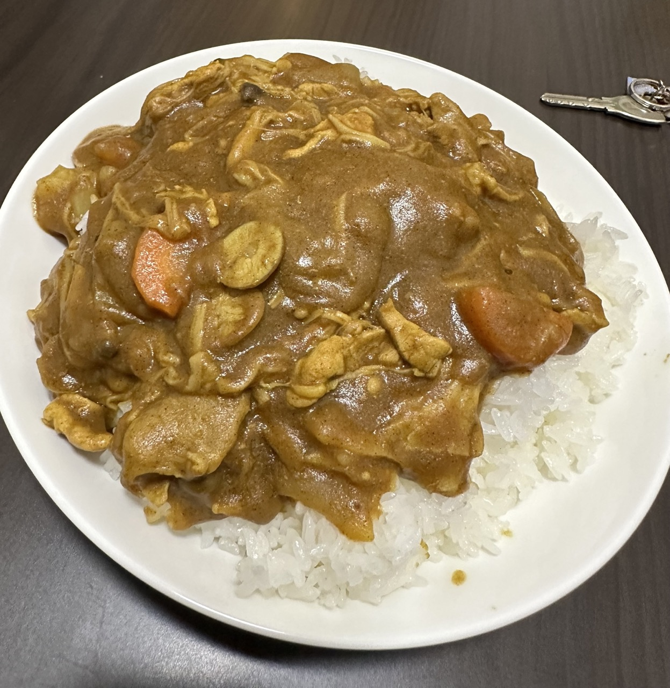
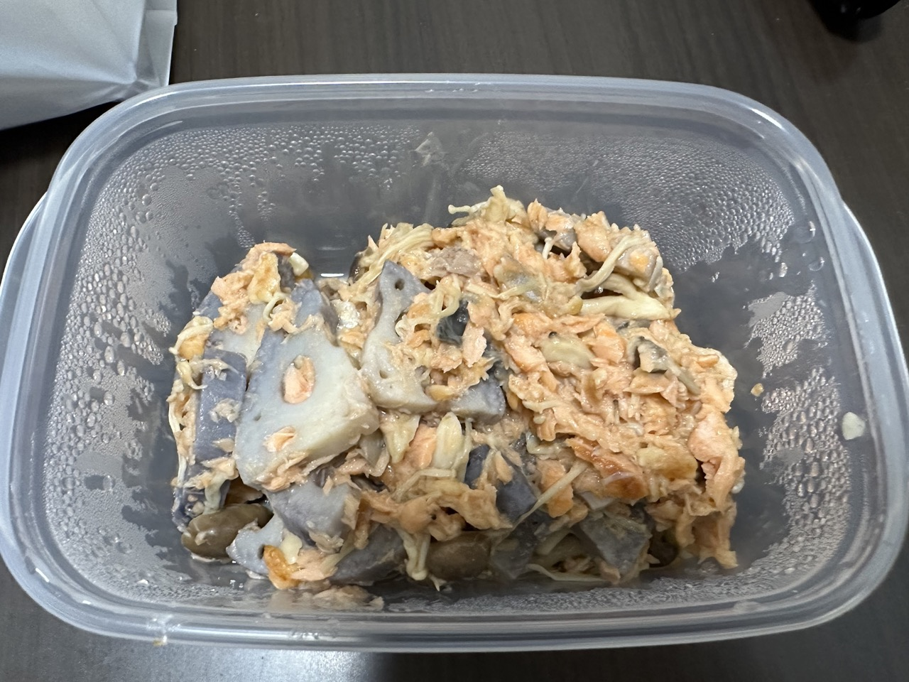

# 初めての魚料理で失敗した話

## 背景

最近は自炊している (節約のため)

一応名誉のため、美味しくできた時の写真

## 問題提起

今回は初めて魚料理を作ってみた

作りたかったのは「**鮭とれんこんのさっぱり炒め**」

https://www.kurashiru.com/recipes/8c0bf094-bbb9-4fcb-9458-49efa77af7d9

## 実装

- スーパーで買った鮭は骨付きのまま売られていると知らなかった

  骨をすべて取り除くのが難しかったので少し残ってしまった

- うろこ付きで売られているとは知らなかった

  鮭を切った後にうろこがついていることに気づいたので取るのが大変だった

- 炒めると鮭がボロボロになった

- 結果、見た目が酷くなった

閲覧注意

## 実験

見た目が酷くても味が美味しければ良い

しかしあまり美味しくなかった

鮭の生臭さ？が若干残っている

## まとめ

たぶん一生魚料理は作りません

美味しい魚料理の作り方を知っている人がいたら教えてください