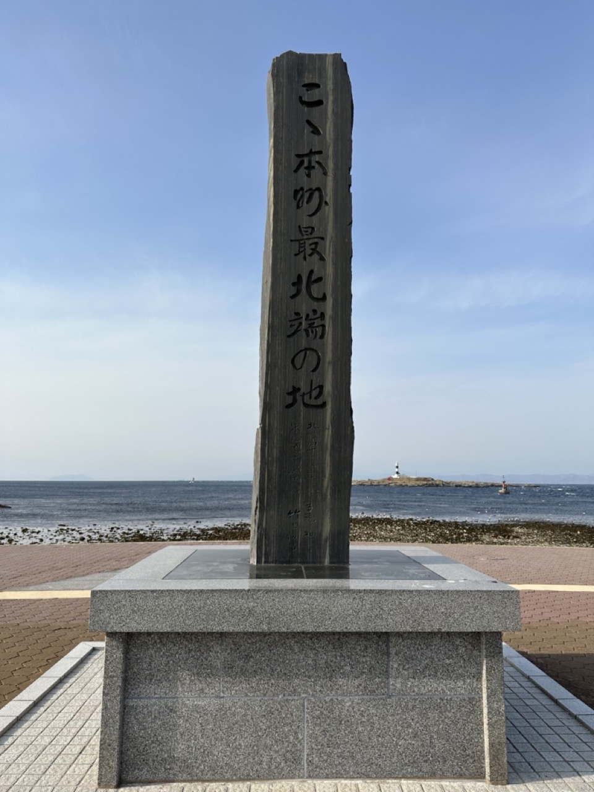
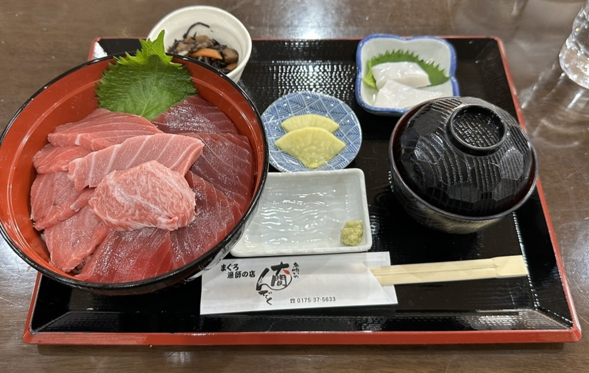
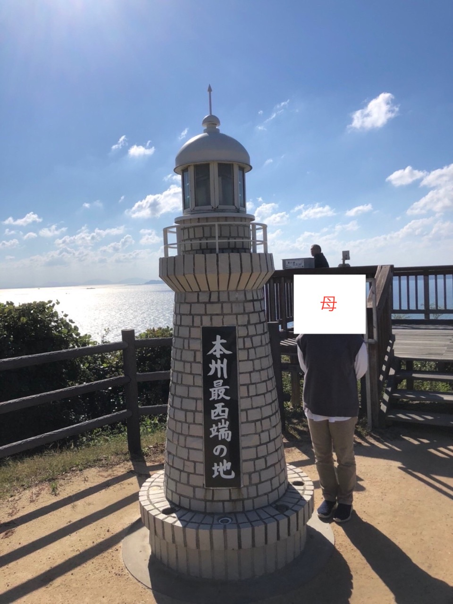

# 本州最北端に行ってきた (ただのブログ)

春休みに本州最北端、大間崎に行った

公共交通機関だけで大間崎に行くのはめちゃんこ大変

朝は早く起きたくないので青森駅前のホテルを9時に出発

一つでも乗り遅れると当日中に東京に帰れない

 

**実際の日程**

**青森** 9:24 --- 電車 --> 10:08 **野辺地**

**野辺地** 10:22 --- 電車 --> 11:07 **下北**

**下北** 11:15 --- バス --> 13:01 **大間崎**

**大間崎** 16:18 --- バス --> 17:55 **下北**

**下北** 18:17 --- 電車 --> 19:59 **八戸**

**八戸** 20:12 --- 新幹線 --> 23:04 **東京**

 

まぐろがおいしかった

 

ちなみに、本州最西端は山口県にあります

「**毘沙ノ鼻**」 という所

母に LINE で大間崎に行ったことを伝えた所この写真が送られてきた

