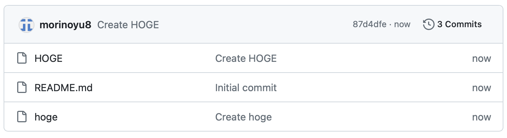
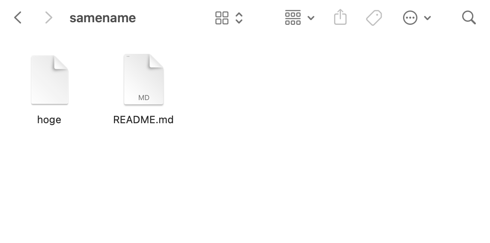

# 大文字小文字問題

このページを作っていたら, ローカル環境では表示されるのに, GitHub Pages 上では表示されない問題が発生

→ URL の大文字小文字の違いが原因だった

- フォルダ名: HOGE
- ローカル環境: URL の大文字小文字を **区別しない**
  - http://localhost:5500/hoge
- GitHub Pages: URL の大文字小文字を **区別する**
  - https://morinoyu8.github.io/hoge

## ファイルシステム

- case-insensitive: 大文字小文字を **区別しない**
  - APFS (Mac のファイルシステム)
- case-sensitive: 大文字小文字を **区別する**
  - XFS, ext (Linux のファイルシステム)

## Mac と GitHub

- Mac のファイルシステムは **case-insensitive**
- GitHub は **case-sensitive**

このリポジトリを Mac 上にクローンすると...？

 
 
 
 
 
 
 
 
 
 
 
 
 
 
 
 
 
 
 
 
 
 
 
 

HOGE が **消滅**

## まとめ

大文字小文字問題、意外と奥深い