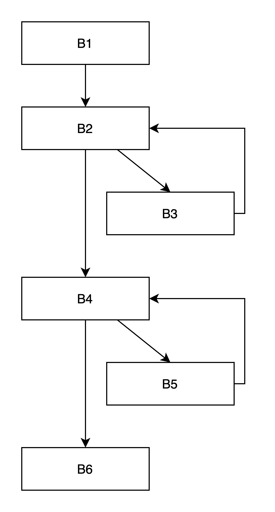
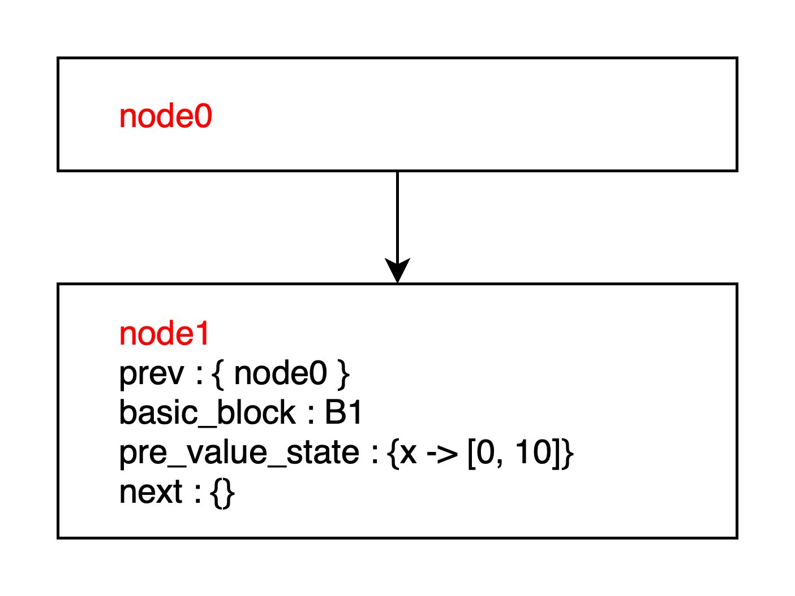

# 進捗報告 2022-12-26

$\displaystyle \frac{3}{4}$

$$\sqrt{3} + \frac{1}{2} \{3\}$$

https://morinoyu8.github.io/glab/

## 方向性

- <p>使われなくなったオブジェクトをより早く解放したい</p>

example

```c=
#include <ggg.h>

\\

// main
int main(void) {
    char *str = (char *)xmalloc(sizeof(char));  
    int input;
    int flag = 0;  //@@(background-color: #aaaaff;)@@
    while (true) {
        scanf("%d", &input);
        if (input < 0)
            break;  

        if (input == 0) {
            flag = 1;
        }
        printf("hello: %d", x);
        int y = x + 1;

        if (flag == 0)
            use(str);
    }
    free(str);
    return 0;
}
```

```diff_c=
int main(void) {
    char *str = (char *)xmalloc(sizeof(char));

    int input;
    int flag = 0;
    while (1) {
+       scanf("%d", &input);
        if (input < 0)
            break;
        
        if (input == 0) {
+           free(str);
+           str = NULL;
-           str = NULL;
            flag = 1;
        }
        x = x + 1;

        if (flag == 0)
            use(str);
    }
    free(str);
    return 0;
}
```

## 先週のお話

### 提案手法

- Step1. heap 解析

- Step2. 実行不可能な辺を削除した control flow graph の作成

- Step3. それ以降すべてのパスで use されない頂点を見つける (モデル検査)

- Step4. heap 解析による free の挿入

<p>目標は "確実に" free を早められるものだけを抽出し, "安全に" free する</p>


## 今週のお話

### 提案手法の制限

- free を早めたいオブジェクトはユーザに指定させる

卒論提出までの1ヶ月間 (実質2週間くらい) で実装できなさそうなので以下の条件を持たせたい (原理上できないことではないはずなので卒論後にやる)

- 変数は整数型かポインタ型 (解析ではこの2つの型しか見ない)

- 条件式は整数の変数同士の比較または変数と定数の比較のみ

- 関数呼び出しがない (input くらいは入れたい)

- ループはネストしない

- scalability の向上は目指さない (スライシング, グラフのマージなど)

### Step1 : heap 解析

input: プログラム

output: 各プログラムポイントごとのポインタ解析の結果

### Step2 : 実行不可能な辺辺を削除した control flow graph の作成

プログラムの分岐数を \\(n\\) としたとき, このアルゴリズムの計算量は $O(2^n)$

アルゴリズムの疑似コード化

- input: Control Flow Glaph

- output: 分岐を展開し, 実行不可能な辺を削除した Control Flow Glaph

各 basic block に 1つ以上の node (頂点) がある
各頂点は以下の情報を持つ

```c=
node {
    node prev
    bb *basic_block
    map pre_value_state
    node next
}
```

- prev : 前の node の集合
  
- basic_block : 各 basic_block を判別できるもの (basic block のポインタ or ユニークな ID)
  
- pre_value_state : この basic block に入る前のメモリの抽象化
  
- next : 次の node の集合


#### CFG 上のループ検出

```python
loop_id = search_loop(C)
```

- 1つのループにつきユニークな ID を割り振る

- 各 basic block について, それが属するループの ID を引けるようにする

- ループはネストしないという条件で各 basic block に割り当てられるループ ID は1つ以下

- ループに含まれない basic block の ID は 0 としている (ループに含まれないことが分かれば何でも良い)

**Example**

<p></p>

```diff_python
  loop_id[B1] = 0
+ loop_id[B2] = 1
  loop_id[B3] = 1
  loop_id[B4] = 2
- loop_id[B5] = 2
  loop_id[B6] = 0
```


#### 初期設定

```python
loop_id = search_loop(C)
entry = create_entry_node()
bb_analysis(entry_basic_block, entry, {})
```


#### ループの要素ではないときの解析

```python
# ループなし basic block の解析
def bb_analysis(basic_block, prev, pre_value_state):
    # 新しいノードを作る
    new = create_node(basic_block, prev, pre_value_state)
    # 次のノードを作る
    next_bb_analysis(new)
```

```python=
def next_bb_analysis(new):
    # もしこの basic block がループの要素だったときループ解析を始める
    if loop_id[new.basic_block] != 0:
        loop_analysis(new)

    # 前のノードの ISA 的な sound な抽象解析の結果対して
    # この basic block のプログラムを適用したときの結果
    post_value_state = analyze_value_state(new.pre_value_state)

    next_basic_block = new.basic_block.next() # 次の basic block の集合
    if len(next_basic_block) == 0:
        # 次の basic block がなければ終わり
        return
    elif len(next_basic_block) == 1:
        # 次の basic block が 1つなら
        bb_analysis(next_basic_block, new, post_value_state)  # @@(background-color:#ffaaaa)@@
    else:
        # 次の basic block が 2つのとき必ず通らないパスは除外する
        # それぞれの条件を満たす value_state のフィルタをかける
        if (post_value_state が 分岐条件を満たすかもしれないとき):
            true_value_state = true_filter(post_value_state)
            bb_analysis(next_true_basic_block, new, true_value_state)
        if (post_value_state が 分岐条件を満たさないかもしれないとき):
            false_value_state = false_filter(post_value_state)
            bb_analysis(next_false_basic_block, new, false_value_state)
```

<details>
<summary>create_node()</summary>

```python
def create_node(basic_block, prev, pre_value_state):
    new = create_node()  # 新しいノードを作る
    prev.add_next(new)  # 前のノードに新しいノードを繋げる
    new.add_prev(prev)  # 新しいノードに前のノードを繋げる
    new.set_bb(basic_block)　　# どの basic block を表すノードか
    new.set_pre_value_state(pre_value_state)  # pre_value_state を入れる
    return new
```

</details>

次の basic block が2つのとき

sound な静的解析によって確実に通らないパスを除外できる.

ex) post_value_state = $\{ x \mapsto [-5, 10] \}$

- `if (x < 0)` : どちらの分岐も実行する

```python
bb_analysis(next_true_basic_block, ...)
bb_analysis(next_false_basic_block, ...)
```

- `if (x > -10)` : true の分岐だけ実行する

```python
bb_analysis(next_true_basic_block, ...)
# bb_analysis(next_false_basic_block, ...) は実行しない
```


<details>
<summary>ループの要素でない時の例</summary>

`bb_analysis()` によって 1つの node を作ってから新しい node を作るまでの流れ

```c
// basic block B1
x = x + 1;
if (x < 6)
    jmp B2;
else
    jmp B3;
```

- `create_node()` を実行したとき

<p></p>

- `next_bb_analysis()`
  - basic block B2, B3 はどちらもループの要素でないとする
  - post_value_state : $\{ x \mapsto [1, 11] \}$
  - post_value_state は条件文のどちらのパスも通り得る
  - `bb_analysis(B2, node1, {x -> [1, 5]})` と `bb_analysis(B3, node1, {x -> [6, 11]})` が呼ばれ, 新しい node が作られる

<p></p>

</details>


<br/>
<br/>

#### ループ解析

ループもすべて展開するが, あるループ1回とその次のループ1回のグラフの形が等しいときは, 1回目のループの終わりの node から初めの node に辺を張る

<p></p>

<p></p>

<br/>

ループが始まるときにそのループの実行で起こり得るすべてのメモリの状態を抽象化する

```c
for (int i = 0; i < 100; i++)
    ...
```

であればループの解析前に $\{ i \mapsto [0, 100] \}$ としたい

このモチベーションはグラフの形が等しいことを見るときにこのメモリの抽象化を見なくて良い + 収束が早くなる


```python
not_loop = []  # このループを抜けたノードを保持する

def loop_analysis(first):
    # ループ全体の sound な抽象解析の結果を計算
    first_value_state = loop_value_analysis(first.pre_value_state)
    first.set_pre_value_state(first_value_state)

    # 1回ループを実行したときのグラフを作る
    # 返ってくるのは 2回目のループの1番最初の node の集合
    first_iter_last_node = next_loop_node_analysis(first, first)

    # 2回目のループの1番最初の node の集合から始めて
    # 2回目以降のループのグラフを作る
    for second in first_iter_last_node:
        loop_top_analysis(first, second)
    
    # ループから抜けるノードの解析
    for node in not_loop:
        next_bb_analysis(node)
```

**Example**

```c
int main (void) {
    char *p = (char *)malloc(sizeof(char));
    for (int i = 0; i < 100; i++) {
        if (i < 5)
            *p = 10;
    }
    free(p);
    return 0;
}
```

Control flow graph

<p></p>

10行目の解析によって 1周目のループを実行した時のグラフができる

ここで返ってくる値 (`first_iter_last_node`) は node2-2 と node2-3

<p></p>

この 2つの node に対して `loop_top_analysis(node2-1, node2-2)`, `loop_top_analysis(node2-1, node2-3)` を実行する

```python
def loop_top_analysis(first, second):
    # ループ全体の sound な抽象解析の結果を計算
    second_value_state = loop_value_analysis(second.pre_value_state)
    second.set_pre_value_state(second_value_state)

    # second を起点として, 1回ループを実行したときのグラフを作る
    # 返ってくるのは1回のループの後の
    second_iter_last_node = next_loop_bb_analysis(second, second)

    if compare_graph(first, second):
        # first を起点として 1回ループを回した時のグラフと
        # second を起点として 1回ループを回した時のグラフが
        # 等しい時は second の1つ前の node (1回目のループの最後の node) を
        # first に繋げる
        second.prev.delete_next(second)
        second.prev.add_next(first)
        first.add_prev(second.prev)
    else:
        # グラフが等しくない時はもう1度ループを回す
        for third in second_iter_last_node:
            loop_top_analysis(second, third)
```

グラフが等しいの定義

- node の basic block を見た時に node 間の関係性が等しい
  
- pre_value_state の値は見ない

**Example**

上の例の続き

Control flow graph

<p></p>

1周目まで

<p></p>

`loop_top_analysis(node2-1, node2-2)` を実行する

<p></p>

1周目の形と違うのでもう1周繰り返す. `second_iter_last_node` に入っているのは node2-4 なので `loop_top_analysis(node2-2, node2-4)` を実行する

<p></p>

これは 2周目と形が同じなので node6-3 から node2-2 への辺が張れる

同様に1周目から `loop_top_analysis(node2-1, node2-3)` を実行する

<p></p>

これは 1周目のグラフと等しいので node6-1 から node2-1 への辺が張れる

以上の結果

<p></p>


```python
def loop_bb_analysis(basic_block, prev, pre_value_state, top):
    # 新しいノードを作る
    new = create_node(basic_block, prev, pre_value_state)
    # ループから抜けたとき
    if loop_id[basic_block] != id:
        not_loop.append(new)
        return {}
    # このノードが loop_top に等しいとき
    if basic_block == top.basic_block:
        return new
    # 次のノードを作る
    return next_loop_bb_analysis(new)
```

```python
def next_loop_bb_analysis(new, top):
    # 前のノードの ISA 的な sound な抽象解析の結果対して
    # この basic block のプログラムを適用したときの結果
    post_value_state = analyze_value_state(new.pre_value_state)

    next_basic_block = new.basic_block.next() # 次の basic block の集合
    if len(next_basic_block) == 0:
        # 次の basic block がなければ終わり
        return {}
    elif len(next_basic_block) == 1:
        # 次の basic block が 1つなら
        return loop_bb_analysis(next_basic_block, new, post_value_state, top)
    else:
        # 次の basic block が 2つのとき必ず通らないパスは除外する
        # それぞれの条件を満たす value_state のフィルタをかける
        if (post_value_state が 分岐条件を満たすかもしれないとき):
            true_value_state = true_filter(post_value_state)
            A = loop_bb_analysis(next_true_basic_block, new, true_value_state, top)
        if (post_value_state が 分岐条件を満たさないかもしれないとき):
            false_value_state = false_filter(post_value_state)
            B = loop_bb_analysis(next_false_basic_block, new, false_value_state, top)
        return union(A, B)
```