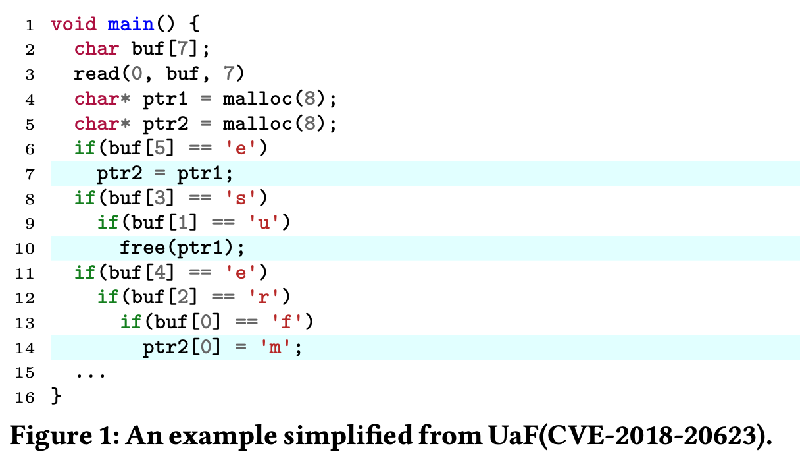

# Typestate-Guided Fuzzer for Discovering Use-after-Free Vulnerabilities [ICSE'20]

## Abstract

- 既存のカバレッジベースのファザーは CFG のエッジカバレッジを使用してガイドする
- use-after-free のような脆弱性はこのカバレッジは効果的ではない
  - UAF を発見するためには特定の順序でプログラムを実行する必要あり
- UAF を typestate property としてモデル化し, 性質に違反する脆弱性を発見するためのファザー (UAFL) を開発
- typestate property が与えられると, 
  1. 静的な typestate 解析を行い, 性質に違反する可能性のあるシーケンスを見つける
  2. このシーケンスを基に, プロパティ違反を引き起こすプログラムを生成するファジングを行う
- ファジングプロセス効率化のために情報フロー (information flow) も導入

 

## 1. Introduction

- UAF 脆弱性はかなり悪用される (UAF)
 

- UAF は一連の操作を特定の順序で行う必要があり, 検出が難しい
  - コード内では同じ場所にないかも

 

- 静的解析による UAF の検知は false positive が多い
  - スケーラブルで正確な inter-procedural なエイリアス解析が困難
- エイリアス解析の不正確な結果は実行時検出メカニズムの有効性にも影響するかも
  - [FreeSentry](https://www.talosintelligence.com/freesentry), [DangNULL](https://wenke.gtisc.gatech.edu/papers/dangnull.pdf)

 

- 動的な手法 (グレーボックスファジングなど) は誤検出が少ない
  - しかし既存の手法は UAF の検出に効果的ではない
- 既存のカバレッジファザー (AFL など) は CFG のエッジカバレッジを使用する
  - しかし UAF 脆弱性をトリガーするには CFG エッジをカバーするだけでなく, 特定の順序で実行する必要あり
  - 最先端のグレーボックスファザー ([MOpt](https://www.usenix.org/conference/usenixsecurity19/presentation/lyu), [ProFuzzer](https://ieeexplore.ieee.org/document/8835384)) は UAF をほとんど発見できない

 

- 特定の typestate プロパティに違反する脆弱性を発見するための typestate-guided fuzzer (UAFL) を提案
- 多くの一般的な脆弱性は特定の typestate プロパティの違反として見ることができる
  - UAF : $malloc \to free \to use$
  - Null pointer dereference : $nullify \to dereference$
- 色んな typestate 違反に対応できるが, 論文内では UAF に焦点を当てる

- 流れ
  1. typestate 解析を行い, プロパティに違反する可能性のある操作シーケンスを特定
  2. 操作シーケンスのカバレッジをターゲットプログラムに計装
- 計装から収集した情報に基づいて, ファザーの有効性を向上させる2つの戦略
  1. 操作シーケンスカバレッジをフィードバックとして使用する
  2. テスト入力がプログラム状態にどのような影響を与えるか推測するために情報フロー解析を導入し, 不要な変異を避ける

 

## 2. Motivating Example

- 図1 は 4,7,10,14行目が実行されると UAF になる
  - つまり $\mathtt{buf = "furseen"}$ 

### 2.1 Exising Coverage-based Fuzzers

- AFL では CFG エッジカバレッジを利用する
- プログラムが与えられると
  - 各基本ブロックに対してランダムな ID を生成
  - 2つの基本ブロックに基づいて CFG エッジ ID を計算
- 例: エッジ $A \to B$ について
  - $ID_{A \to B } = (ID_A >> 1) \oplus ID_B$ (排他的論理和)
  - $A \to B$ と $B \to A$ を区別するためにシフト演算を行う

 

- 共有メモリ $shared\_ mem$ はエッジのヒット回数をカウントするために使用される
  - $shared\_ mem[ID_{A \to B}]++$ は $A \to B$ のヒット回数が 1回増えることを表す
  - ヒット回数は 1, 2, 3, 4-7, 8-15, 16-31, 32-127, 128-255回に分類される
- AFL はテストケースを変異させ, 以下のどちらかを満たす場合に, 更なる変異のためテストプールに追加される
  - 前のテストケースで発見されなかったエッジをカバーしている
  - エッジの新しいバケットに触れる
- 全体として, [エッジ $\times$ 8] のバケット の情報を管理しているってことと思う
 

### 2.2 Limitations of Coverage-based Fuzzers

- 既存のカバレッジベースのファザーは CFG エッジのカバレッジを個別に考慮する
  - $A \to B \to C$ のパスに関して, $A \to B, B \to C$ を個別にカウントする
  - このパスのヒット数はカウントできない
- よって時間的メモリ安全性違反を検出することは困難

- 図1 のコードでは $4 \to 7 \to 10 \to 14$ 行目がこの順で実行されると UAF が発生する
- 図2(b) のように初期シードが [aaaaaa] で, AFL が 3つの変異体 [aaaseen], [aurseaa], [faraeaa] を生成するとする
- 4つのプログラムはすべての CFG エッジをカバーできるが, UAF をトリガーすることはできない
- それらに続く変異体は新たな CFG エッジをカバーできず, 破棄される
 

- $4 \to 7 \to 10 \to 14$ をカバーできるテストケースを生成するのは非常に困難