# When Threads Meet Interrupts: Effective Static Detection of Interrupt-Based Deadlocks in Linux [SEC'24]

## Abstract

- デッドロックはスレッドがロックを保持したまま, 他のスレッドがすでに保持している他のロックを取得しようとするときに発生するソフトウェアの応答不能状態のことで, 循環的なロック依存関係が発生する
- 割り込みベースのデッドロックは, 割り込みによってカーネル内で発生するデッドロックの一種
  - システム機能, パフォーマンス, セキュリティに重大なリスクをもたらす
- 既存の静的解析ツールは割り込みを特徴づけることなく, リソースベースのデッドロックに焦点を当てる
- Archerfish は Linux カーネルにおける割り込みベースのデッドロックを効果的に特定する静的解析アプローチ
- Archerfish は割り込み認識ロックグラフ (Interrupt-Aware Lock Graph: ILG) を利用して, 通常のロック依存性と割り込みロック依存性の両方を捕える
  - デッドロックの検出問題をグラフサイクルの発見と絞り込みに軽減する
- さらに, ILG の構築とデッドロックサイクルの絞り込みのために4つの解析コンポーネントを組み込む
- 以下の3つの課題に対処
  - 広範囲の割り込みに関連する並行空間
  - 潜在的な割り込みハンドラの特定
  - デッドロックサイクルの実現可能性の検証
- 実験結果は Archerfish が Linux カーネル (19.8 MLoC) を約1時間で正確に解析できる
- 未知のデッドロックを76個発見
- 発見されたデッドロックの潜伏期間が平均9.9年間である

 

## 1. Introduction

- デッドロックは各スレッドがロックを保持しながら, 他のスレッドがすでに保持されている別のロックを取得しようとする, 循環的なロック依存関係によって引き起こされる応答不能状態
- カーネルでは割り込みによって, すでにロックを獲得している割り込まれたスレッドが, 割り込み処理の中で追加の処理を獲得しようとする時, 更なるロック依存性が発生する可能性がある [[参考](https://github.com/torvalds/linux/commit/8d61f926d42045961e6b65191c09e3678d86a9cf)]
- このようなことを割り込みベースのデッドロックと呼ぶ

 

- デッドロックはシステム機能性, パフォーマンス, セキュリティを著しく損なう可能性がある
- 割り込みベースのデッドロックは, 割り込みコンテキスト内で発生するため, さらに深刻な危険をもたらす可能性があり, CPU コア全体が応答しなくなり, システム全体が破壊される可能性も
- 割り込みベースのデッドロックの発見は静的・動的にも既存手法では限界がある

 

- 既存の静的アプローチは主にスレッドのインターリーブによって引き起こされるリソースベースのデッドロック検出に焦点を当てる
- 割り込みベースのデッドロックを見落としている
- 割り込みをスレッドとして直接扱うことで伝統的なスレッドインターリーブモデルを使用している
  - つまり, 同じスレッドで割り込みがあったときのデッドロックを見ていないということ?

 

- 動的なアプローチはカバレッジが低く, 外部デバイスなどの実行環境に依存することが多い
- 動的ファジングは, Linux カーネル内蔵のロック検証ツールである Lockdep の支援によりデッドロックを検出できる
- これらは実行を欠陥のあるパスに導くために高品質のシード入力を可能にする
- さらに, 割り込み preemption は動的並行実行の探索空間を大幅に拡大し, 有効性を低下させる
- 割り込みの動的トリガーはハードウェアデバイスが生成する信号に大きく依存する
  - これは時に適切に実行・利用することが難しい

 

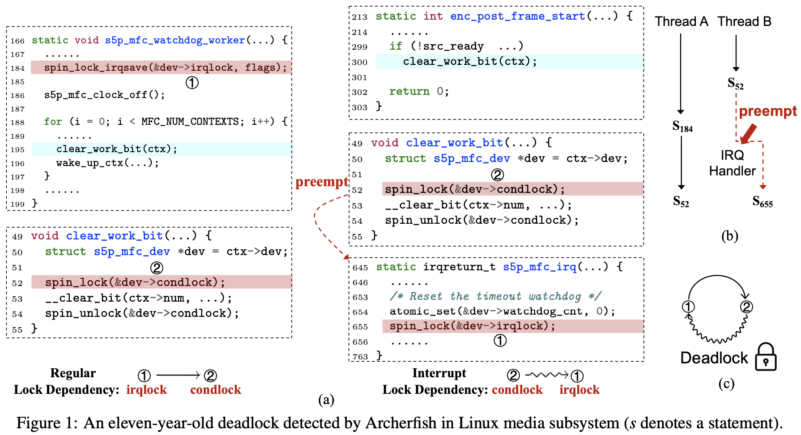

- 図1(a) の例はスレッドA とスレッドB の2つのスレッド間の循環ロック依存関係によって引き起こされる割り込みベースのデッドロックを示す
- スレッドA は184行目で &dev->irqlock を取得し, 195行目で関数 clear_work_bit() を呼び出し, 52行目で &dev->condlock を取得している
  - これによって &dev->irqlock から &dev->condlock へのロック依存関係が確立される
- スレッドB はコールバック関数 enc_post_frame_start() の中で, 300行目で clear_work_bit() 関数を呼び出し, &dev->irqlock を取得
- このとき, 割り込みハンドラ s5p_mfs_irq() は無効化されていないため, 52 から 54行目の間に, 割り込みハンドラが入る可能性がある
- この割り込みハンドラ内で &dev->irqlock を取得すると &dev->condlock から &dev->irqlock への割り込みロック依存関係が形成される
- この割り込みロック依存性は既存の静的メソッドでは取得できない
- 特定の並行スケジューリングでは図1(b) に示すような割り込みベースのデッドロックが発生し, システムが停止する可能性がある

 

#### Our Approach

- 本論文は Linux カーネルにおける割り込みベースのデッドロックを検出するために, 割り込みの preemption を特徴づける初の静的アプローチ Archerfish を紹介する
- Archerfish は割り込み考慮ロックグラフ (Interrupt-Aware Lock Graph: ILG) を使う
  - ILG : スレッドの通常の実行フローと割り込み preemption によってそれぞれ引き起こされる, 通常のロック依存性と割り込みロック依存性の2つのロック依存性をキャプチャする
- ILG を効果的に構築することで割り込みベースのデッドロック検出を, 依存サイクルの発見と検証に減らすことができる
  - 例えば, 図1(a) のデッドロックは図1(c) のサイクルを見つけることで検出できる

 

- しかし, Linux カーネルを効果的に解析してロックの依存関係を特定し, デッドロックサイクルを正確に作ることは3つの課題がある

  1. 割り込みサービスルーチン (ISR) (= 割り込みハンドラ?) の特定は, Linux カーネル内の異なるサブシステムが ISR を登録するために独自の API とコールバックインターフェースを持っていることが多いため, ドメイン固有の知識がないと困難
  2. 割り込みの preemption は静的解析の並行性推論空間を拡大する
     - 割り込みが有効な各プログラムは割り込みの可能性があるため, 各ステートメントすべてで割り込みを考慮する必要があるかも
  3. 割り込みとプログラムパスの両方の実現可能性を考慮して, 実現可能なロック依存関係を特定することが極めて重要
     - 例えば SMT を使って多数のロック依存関係のパスを直接検証することは効率が悪い

 

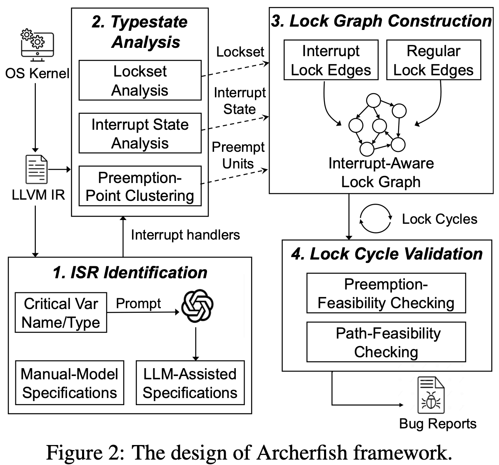

- この3つの課題に対処するため, 図2に示すような4つのステージを設計

 

- 1つ目は, 1つ目の課題を解決するために, LLM の力を利用して, 割り込みを識別するために手動でモデル化したものを補完する割り込み仕様を生成する
- LLM は Linux カーネルに対する情報を含む膨大な量のオンラインテキストデータでトレーニングされているため

 

- 2つ目は, ロックセットと関連するステートメントでの割り込みの有効/無効の状態を計算するために, サマリベースのデータフロー解析を採用する
- 割り込みの preemption が膨大な空間であるという課題に取り組むために, preemption unit という概念を導入し, クリティカルセクション内のすべてのステートメントをクラスタリングする
- 重要なアイデアは, クリティカルセクションが同じロックセットを共有し, その領域内で発生する割り込みが同じロックセットを保持すること
- ロックセット解析の際に, 領域内の個々のプログラムポイントを個別に計算する必要はない

 

- 3つ目は, 計算されたデータフローの事実を使用して, ILG を構築し, 両方のロック依存関係をグラフエッジとしてキャプチャする
- ILG 内の依存サイクルを特定し, 割り込みベースのデッドロックを表す

 

- 4つ目は, 高価なデッドロックの実現可能性チェックという課題の克服
- 重要なアイデアはすべてのロック依存性がデッドロック検出に関連しているわけではない
- ILG 構築中に各エッジを早期に検証する代わりに, 発見されたサイクルごとにコストのかかる検証を延期し, 割り込みとパスの両方の実現可能性を遅延的にチェックする

 

- Archerfish は LLVM フレームワーク上で実装され, Linux v6.4 で評価した
- Linux カーネル (19.8 MLoC) を約1時間で比較的低い正解率 (49.7%) で解析することができる
- Linux カーネルの新しい, 長期にわたって存在する割り込みベースのデッドロックを発見した

 

## 2. Background

### 2.1 Interrupts in Linux kernel

#### Interrupt Handling

- Linux カーネルにおける割り込みは, プログラムの通常の実行フローを変更する特別なイベント
  - このような動作を割り込み preemption と呼ぶ
- 対して, あるスレッドが別のスレッドに切り替える動作をスレッド preemption と呼ぶ
- 主な違いは, 割り込みはより優先度が高く, 割り込みの実行が終わるまで preempted な実行フローに切り替えることができない
- よって, 割り込みの preempted は新たなロック依存性を導入し, デッドロックを引き起こす可能性がある [[これ](https://github.com/torvalds/linux/commit/10af303192bc5490bb39b29541ecb0ead2eff1ce)]

 

#### Interrupt Priority

- Linux カーネルにおける割り込みはハードウェア割り込みとソフトウェア割り込みがある
- ハードウェア割り込みは, ハードウェアデバイスからの割り込み信号によってトリガーされ, hardirq コンテキストと呼ばれるコンテキストで実行される
- 最近の Linux カーネルは hardirg コンテキストの内部では割り込みがデフォルトで無効になっているため, hardirq は最高の優先度で実行され, 他の実行によって割り込まれることはない

 

- hardirq はハードウェア信号に対して素早く実行される必要があるため, 時間のかかるタスクは softirq に先送りされる
- softirq は hardirq よりも優先順位が低く, hardirq に先取りされるかも
- しかし, どちらも割り込みなので通常のカーネルスレッドよりも高い優先度を持つ
- これらの関係は Linux カーネル特有の並行実行モデルにつながる
- よって, 割り込みを考慮する静的解析はこれらの関係を考慮する必要がある

 

#### Interrupt Service Routine (ISR) Registration

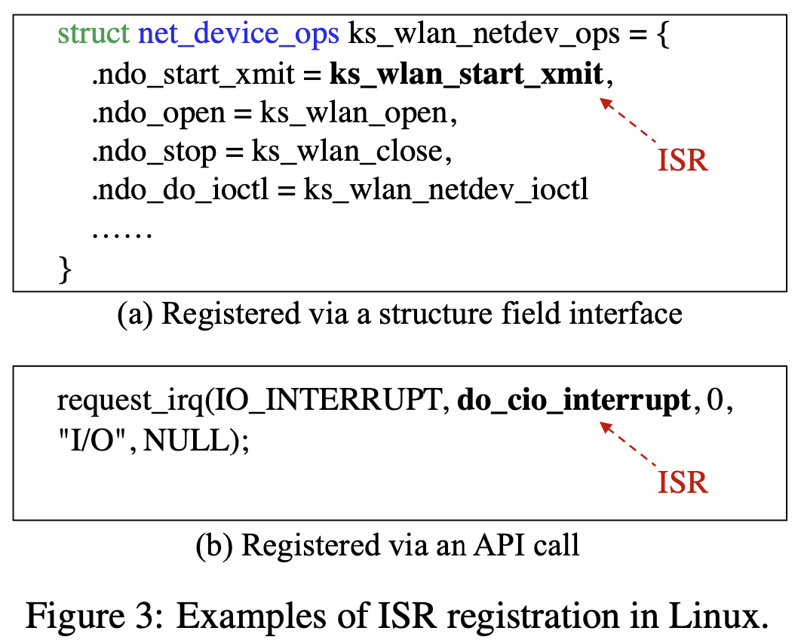

- ISR (割り込みハンドラ?) はハードウェアデバイスからの割り込み信号やソフトウェア割り込みに応答する機能
- Linux カーネルでは, 通常 ISR は2つの方法で登録される
- 1つ目は構造体フィールドに割り当てられて登録される
  - 図3(a) では関数 ks_wlan_start_xmit() が, ネットワークパケット送信の処理を担当するコールバックインターフェースである net_device_ops.ndo_start_xmit 構造体フィールドに割り当てられることで softirq ISR として登録される
- 2つ目は特定の API 呼び出しの引数として渡されることで, ISR を登録することができる
  - 図3(b) のように関数 do_cio_interrupt() は標準 API の request_irq() を使用して, 割り込みライン IO_INTERRUPT に対する hardirq ISR として登録される
- Linux カーネルの大規模なコードベースには多様なサブシステムが含まれており, それぞれが ISR 登録のための独自のインターフェースや API を持っている
- これは ISR を特定し, 静的デッドロック解析で preemption を捕捉する上で困難になる

 

### 2.2 Interrupt-Based Deadlocks

- 割り込みベースのデッドロックの他との違いは, 割り込み preemption によってもたらされるロック依存性の存在
- 先取りされたスレッドは ISR が完了するまで待機する必要がある
- その結果, 割り込まれたスレッドが保持するロックは ISR が完了するまで解放されない
- ISR 自身がロックを取得しようとすると, ロックの依存関係が生じ, ロックの取得が周期的になる可能性がある

 

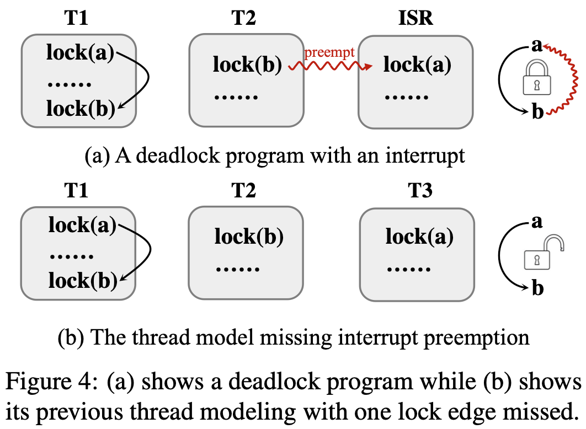

- 例えば図4(a) ではロック $b$ がスレッド $T2$ によって保持されており, このスレッドは別のロック $a$ を取得する ISR に割り込まれる
- このシナリオでは ISR が終了するまで $T2$ がロック $b$ を解放できないため, 割り込みロック依存関係 $b \rightsquigarrow a$ が現れる
- $T1$ によって導入された通常のロック依存関係 $a \to b$ を考えると, 特定のスレッドと割り込みインターリーブの下で割り込みベースのデッドロックが発生するかも

 

- スレッドの切り替えは割り込み preemption としてロック依存性 (例えば $b \rightsquigarrow a$) を導入できないことに注意
- これはあるスレッドがロックを保持しているときにスレッド切り替えが行われた場合, 取得したロックを解放するためにいつでもスレッド切り替えを戻すことができるため
- 割り込み preemmption によって生じるロック依存関係を割り込みロック依存関係と呼ぶ
- 割り込みロック依存関係を含むデッドロックを割り込みベースデッドロックと呼ぶ

 

### 2.3 Limitations of Existing Static Detectors

- 既存の静的ロック検出技術は割り込みロックの依存関係を考慮せず, 割り込みをスレッドと同じようにモデル化する
- その結果割り込みベースのデッドロックを検出できない
- 図4(a) の割り込みは, 既存のデッドロック検出器では図4(b) のように, スレッド $T3$ としてモデル化され, 割り込み preemption がロック依存関係 $b \rightsquigarrow a$ を特定できない

 

## Archerfish in a Nutshell

### 3.1 Problem Formulation and Challenges

- 割り込みベースのデッドロックは割り込み preemption によって発生する周期的なロック依存関係である
- このようなデッドロックを特定し対処するために, 従来のロックグラフを拡張して ILG を導入し, 割り込みロック依存と通常のロック依存の両方をロックエッジとして組み込む
- 割り込みに基づくデッドロック検出の問題は, ILG の構築とグラフ内の実現可能なデッドロックサイクルの発見として定式化される
- 3つの問題が正確で効率的な ILG の構築とデッドロックサイクルの検証を妨げる

 

#### C1: Lack of ISR Registration Specifications

- 多くのサブシステムを含む複雑なカーネル Linux は, 割り込みハンドラを登録するために様々な方法が存在する
- 図3(a) に示すようにドメイン固有の知識がなければ, net_device_ops.ndo_start_xmit が softirq コンテキストで実行されるコールバックインターフェースであることを識別することは難しい
- しかし, 割り込みコンテキストで実行される関数を特定することは, 割り込み preemption と割り込みロック依存関係を把握するための前提条件
- よって, ISR 登録に関するドメイン固有の知識がないことは, 割り込みベースのデッドロック検出に大きな課題となる

 

#### C2: Large Interrupt-Involving Reasoning Space

- スレッドインターリーブの並行推論空間は, ステートメント数によって指数関数的に増大する
- この複雑さは割り込みによってさらに増大する
- 特に各ステートメントでの割り込みの有効/無効状態を考慮する場合, 効率的かつ正確にロック依存性を捕捉するのは困難
- 異なる呼び出しコンテキストで状態が変化する可能性があるため, 高価なコンテキスト依存の解析が必要になる
  - 例えば図1(a) では, clear_work_bit() は enc_post_frame_start() から呼び出された場合には ISA s5p_mfs_irq() によって割り込まれる可能性がある
  - しかし, s5p_mfc_watchlog_worker() によって呼び出された場合には, 184行目の spin_lock_irqsave() によってすでに hardirq が無効化され, 割り込みは発生しない

 

#### C3: Validation of Feasible Lock Dependencies

- すべてのロック依存関係が実行時に実現可能とは限らない
- 1つ目に, 対応する ISR が登録される前に先取りをすることができないため, いくつかのロック依存関係につながる割り込みは実行不可能である可能性がある
- 2つ目に, 特定のロック依存関係のパス条件も実行不可能である可能性がある
- しかし, 検証すべきロック依存関係の数が多く, 実現可能性チェックのオーバーヘッド (SMTソルバなど) が大きいため, 効率的な検証は困難

 

### 3.2 Four Core Stages in Archerfish

#### S1: Interrupt Service Routine Identification

- ChatGPT-4.0 のような LLM は Linux カーネルを含む膨大なオンラインテキストデータで訓練されている
- よって, LLM からサブシステムの ISR 登録に関するドメイン固有の知識を抽出することができる
- LLM によって生成されたサブシステム仕様は, 人間によってモデル化された標準的な ISR 登録仕様のセットを補完する

 

#### S2: Lockset and Interrupt-State Analysis

- 割り込みを効果的に推論し, 割り込みロックの依存性を捕捉するために, 基本的な考え方は同じクリティカルセクション内のステートメントは同じロックセットを共有するということ
- 各プログラム位置での割り込みの可能性を列挙する代わりに, クリティカルセクション内のすべてのステートメントを preemption unit として扱い, そのユニットの割り込みの統一状態を計算し, 推論空間を削減する
- さらに, ロックセットと割り込み状態を計算するために, 構成的で要約ベースのデータフロー解析を提案する

 

#### S3: ILG Construction

- 計算されたデータフローファクトを検査することで, 割り込みロックエッジ (ILE) と通常ロックエッジ (RLE) の両方を捕捉し ILG を構築する
- 対象となるステートメントのロックセットを検査することで RLE を捕捉し, 割り込まれたスレッドと ISR について事前に計算された複数のサマリをペアごとにチェックすることで ILE を捕捉する
- ILG を構築した後, 標準的なサイクル検出アルゴリズムによって, 潜在的なデッドロックサイクルを特定する

 

#### S4: Deadlock Cycle Validation

- 特定された各ロック依存エッジに対して実行可能性チェックを行うのではなく, デッドロックサイクルを形成しているエッジに対してのみ実行可能性チェックを行うことで, 解析を遅延させる
- Archerfish は ISR 登録に関する happens-before 解析を実行し, デッドロックにつながる可能性のある各依存エッジの先取り実行可能性とパス実行可能性を調べる
- 最後に検証された割り込みベースのデッドロックサイクルについて, デッドロックレポートが出力される

 

## 4. Preliminary

- この論文で出てくる定義

#### Abstract Domain

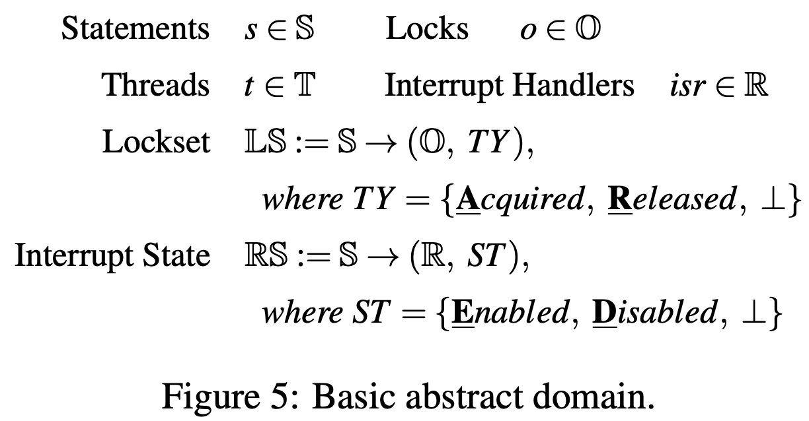

- ロック $o \in \mathbb{0}$ は各ロックオブジェクトを表す
  - これらの循環的な依存関係がデッドロックを導く
- $t \in \mathbb{T}$ はプロセスコンテキストで実行されるカーネルスレッドを表す
- $isr \in \mathbb{R}$ は割り込みコンテキストで実行される割り込みハンドラ

 

- $\mathbb{LS}$ は特定のステートメントで, 特定のロック $o$ が (Acquired (獲得), Released (解放), $\bot$ (不明)) かを保持する
- 割り込み状態 $\mathbb{RS}$ は特定のステートメントで, 特定の割り込みハンドラ $isr$ が (Enabled (有効), Disabled (無効), $\bot$ (不明)) を保持する
  - flow-sensitivity を達成する
- 例えば, 図1(a) の 186行目
  - $\mathbb{LS} = (irqlock, A)$
  - $\mathbb{RS} = (s5p_mfc_irq, D)$

 

#### Definition 1

- Interrupt-Aware Lock Graph (ILG) は $G = (N, E_S, E_I)$ の3つのタプルで構成される
  - $N$ は ILG の頂点を表し, 各頂点は一意のロックオブジェクト $o$ を表す
  - $E_S$ はスレッドまたは ISR の実行中に $o_1$ が保持された状態で $o_2$ が取得される可能性があることを示す
    - $o_1 \to o_2$ の通常のロックエッジを表す
  - $E_I$ は特定のプログラムポイントでロック $o_1$ が保持されている間に ISR が先取りし, $o_2$ を取得することを示す
    - $o_1 \rightsquigarrow o_2$ の割り込みロックエッジを表す
- 割り込みロックエッジは, 先取り (されたもの?) の unit と ISR 内部でのロック取得のサマリのペアワイズマッチングによって取得される

 

#### Definition 2

- 割り込みベースロックサイクル (ILC) は, ILG 上のサイクルで, サイクル上のエッジの少なくとも1つが $EI$ に属し, 割り込みによってもたらされる, 潜在的なデッドロックを表す
- ILC は必ずしも実際の割り込みベースのデッドロックを表す訳ではないので, 誤検出を減らすためにさらなる検証が必要

 

## 5. The Approach of Archerfish

### 5.1 ISR Identifications

- LLM から Linux サブシステムの ISR 登録仕様を自動的に抽出できる

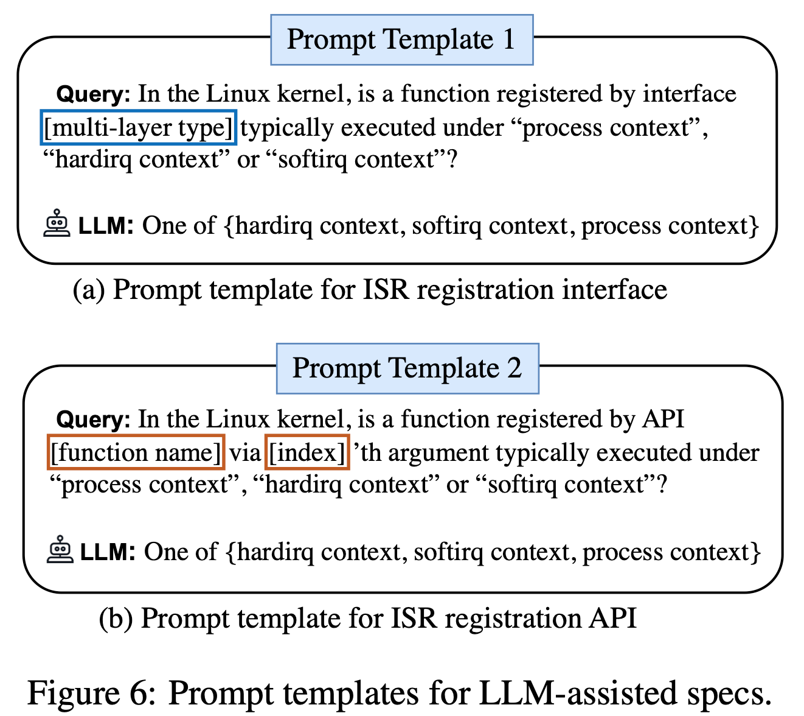

- LLM に渡すクエリを構築するために, Archerfish は2つのケースに到達するまで, 各関数をその def-use chain に沿ってトレースする, 静的解析を実行する

1. Registration Interface:
   
   - 関数ポインタ $fptr$ が $*p = fptr$ として使用されている場合, $p$ の構造体の型を潜在的な ISR 登録インターフェースとみなす
   - これを図6(a) のようなテンプレートでクエリを構築し, どのコンテキストでインターフェースが実行されるか決定する

2. Registration API:
   
   - 関数ポインタ $fptr$ が $call bar(\dots, fptr, \dots)$ として使用される場合, callee 関数名とその引数インデックスを抽出し, 潜在的な ISR 登録 API として扱う
   - これを図6(b) のテンプレートを介してクエリを構築する

 

- LLM は紹介された API やインターフェースの実行コンテキストの分類機として機能する
- このような仕様があれば, ある関数がこれらの API やインターフェースに渡されているかどうかを調べることで, ISR なのかカーネルスレッドなのかを識別することができる
- 関数が hardirq, softirq に分類されれば $isr$ に分類し, そうでなければ $t$ として分類する

 

- 図3(a) の関数 ks_wlan_start_xmit() が ISR かスレッドかを判断するために, Archerfish はその def-use chain をトレースし, 構造体フィールド net_device_ops.ndo_start_xmit に到達する
- この構造体のフィールドは NET_TY_SOFTIRQ softirq 登録のために一般的に使用するインターフェース
- LLM はこれを softirq コンテキストで実行されることを正しく認識する

 

### 5.2 Lockset and Interrupt-State Analysis

- ロックセットと割り込み状態を計算するために flow- context-sensitive な typestate 解析を実行する
- Archerfish はコールグラフの逆トポロジー順で各関数の順データフロー解析を実行し, 関数サマリを計算する
- これらのサマリを呼び出し元がインライン化することで, 効率的な手続き間コンテキスト依存解析を実現する

 

#### 5.2.1 Intra-Procedural Data-Flow Analysis

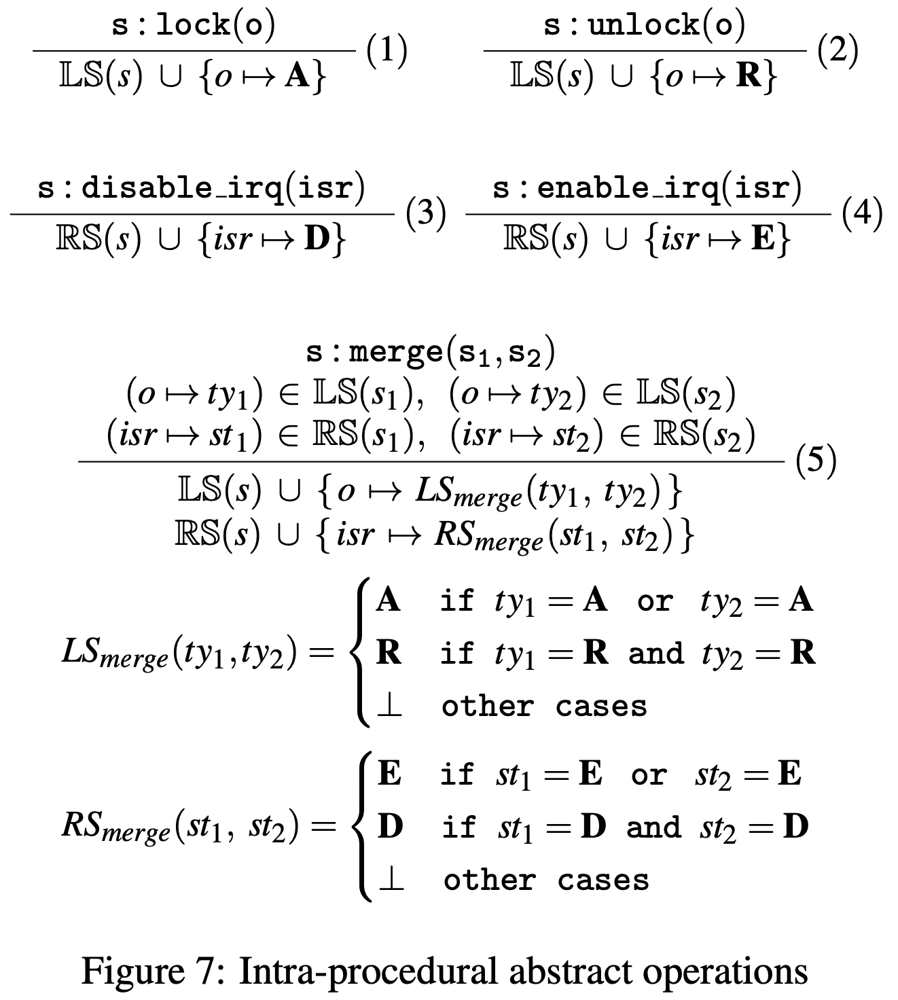

- 関数の解析の開始時, 各ロック $o$ と $isr$ の状態は $\bot$ として初期化される
- Archerfish は制御フローに沿って進み, 関数が戻るまで各命令を順次解析する
- 各命令の状態は, その前の命令の状態のマージとして初期化され, 図7の抽象演算が使用される
- 保守的に抽象状態をマージする

 

#### 5.2.2 Function Summary Construction

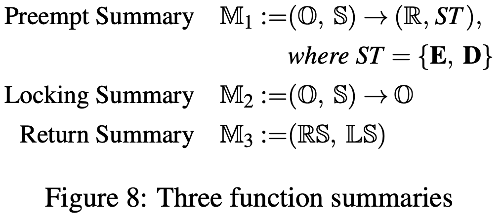

- 図8はデータフロー解析によって構築された3つの機能サマリの定義

1. Preemption Unit Summery ($\mathbb{M}_1$)
   
   - このサマリは割り込み先取りの unit を形成する
   - item はロックオブジェクトとロック文 ($o$, $s$) で示されるクリティカルセクションを表す
   - item は, このクリティカルセクションを先取りする可能性のある ISR のセットを表す, 保守的な割り込みステートの集合を保持する
     - そのために各 ISR の状態を記録する

2. Lock Acquisition Summary ($\mathbb{M}_2$)

   - このサマリは関数内部でのロック取得内容を表す
   - item はロックオブジェクトロックステートメント ($o$, $s$) で表される
   - $\mathbb{M}_1$ と違い, $\mathbb{M}_2$ は, このロックの取得前に Release されていなければならないロックの集合が記録される

3. Return State Summary ($\mathbb{M}_3$)

   - このサマリは関数終了時のロックセットと割り込み状態をキャッシュし, 呼び出し元関数でインライン化することで, 呼び出し元で typestate を更新することができる

 

##### Summary Construction

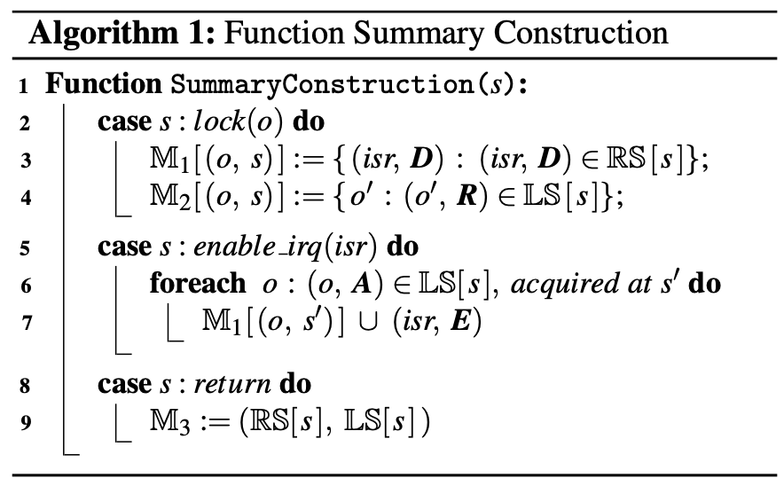

- アルゴリズム1は, 3つのサマリを構築する方法
- まず, $lock(o)$ に遭遇するごとに, $\mathbb{M}_1$ の新しい item を構築し, Disabled でなければならず, 現在のクリティカルセクションを先取りできない ISR の集合を記録する (3行目)
- 同様に, $\mathbb{M}_2$ の新しい item を作成し, ロック $o$ が取得される前に解放されていなければならないロックの集合を記録する (4行目)
- 次に ISR を有効にする各 API 呼び出し $enable\_irq(isr)$ に対して, $s$ をガードするロックの集合 $(o, s')$ を取得し, isr がクリティカルセクション内で Enabled になる可能性があることを示すために $\mathbb{M}_1$ の対応する項目を更新する (5-7行目)
- 最後に関数のリターン時に, $\mathbb{LS}$ と $\mathbb{RS}$ は $\mathbb{M}_3$ としてキャッシュされ, 呼び出し側で typestate を更新するために使用される (8-9行目)

 

#### 5.2.3 Function Summary Inlining

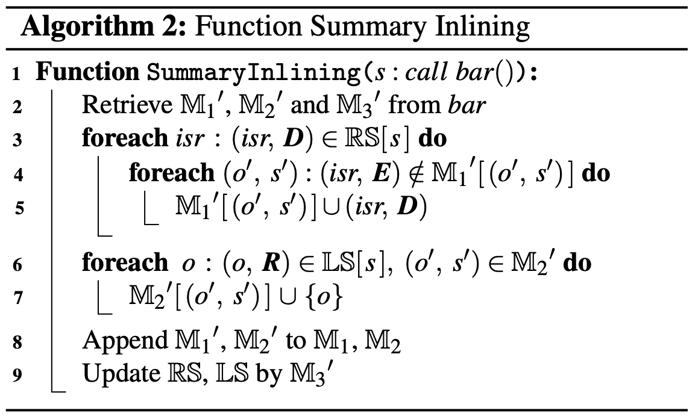

- すでに解析された関数の呼び出しにおいて, 呼び出し側関数内部で構築された要約は, 呼び出し側によってインライン化され, context-sensitive inter-procedural 解析を行うことができる
- callee 関数で構築された3つのサマリ $\mathbb{M}_1', \mathbb{M}_2', \mathbb{M}_3'$ を取得する (2行目)
- インライン化を行う前に 2つの操作を行う
- 1つ目は, 呼び出し元ですでに無効化された ISR があり, callee 側の unit で有効かされていない場合, $\mathbb{M}_1'$ のサマリを更新し, Disable とマークする (3-5行目)
- 2つ目は, ロックは関数の呼び出し前に解放されているものもあるため, これらの解放されたロックを callee 側の $\mathbb{M}_2'$ の各項目に挿入する (6-7行目)
- その後, callee の $\mathbb{M}_1', \mathbb{M}_2'$ がインライン化され, $\mathbb{M}_3'$ によって現在のロックセットと割り込み状態が更新される (8-9行目)

##### Example

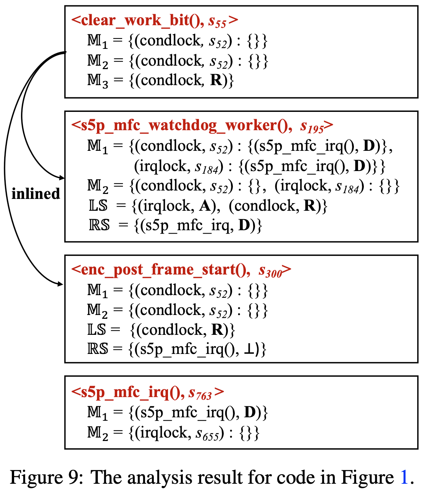

- 図9は図1の部分的な解析結果
- clear_work_bit() が解析されると, $\mathbb{M}_1$ には $\{(condlock, s52) : \{ \} \}$ が含まれ, クリティカルセクション $(condlock, s52)$ が明示的に有効化・無効化された ISR では実行されない
- 次に2つの caller 関数によってサマリがインライン化される
- s5p_mfc_watchdog_worker() では ISR s5p_mfc_irq() が 184行目で無効になっているため, $\mathbb{M}_1$ は  $\{(condlock, s52) : \{ s5p\_mfc\_irq(), D\} \}$ に更新され, クリティカルセクション内のすべてのステートメントが s5p_mfc_irq() によって先取りされないことを示す
- 逆に, enc_post_frame_start() では ISR が明示的に無効化も有効化もされていないので, サマリは更新されずにインライン化される 