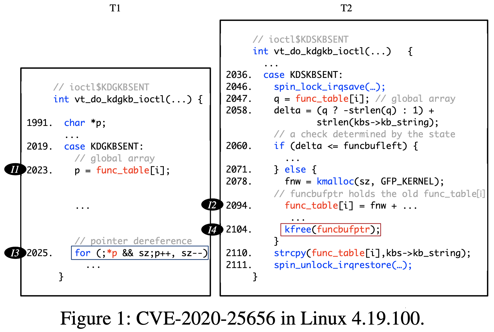
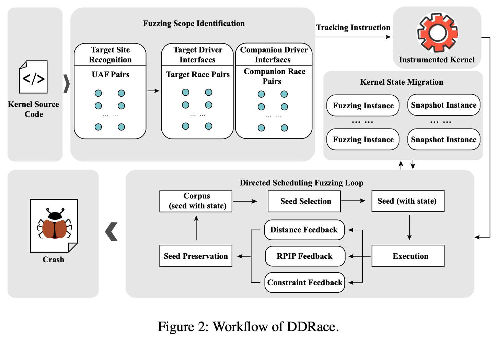
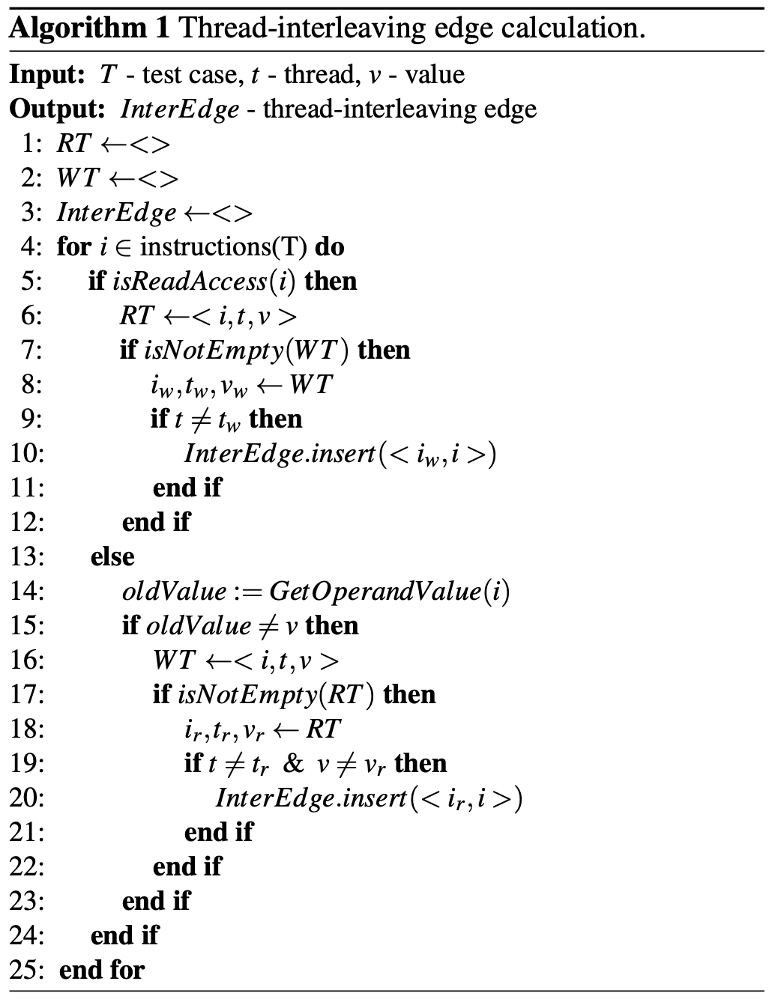
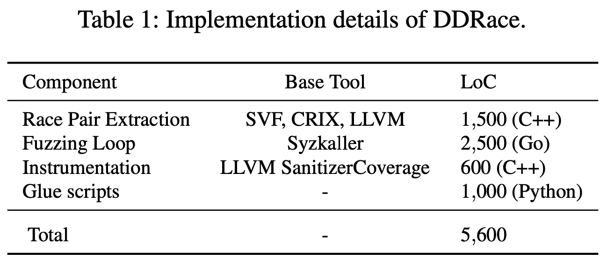

# DDRace: Finding Concurrency UAF Vulnerabilities in Linux Drivers with Directed Fuzzing [SEC'23]

## Abstract

- Linux ドライバにおける UAF 脆弱性の大部分は, 並行処理 UAF 脆弱性
- 本論文では, Linux ドライバにおける並行 UAF 脆弱性を効率的に発見するために, 並行 directed ファジング DDRace を提案
  1. ターゲットサイトとして UAF の候補となる場所を特定し, 関連する並行性要素を抽出し, directed ファジングの探索空間を削減
  2. UAF 脆弱性とスレッドのインターリーブをよく探索するようにファザーを誘導するために, 脆弱性に関連した新しい距離メトリクス (vulnerability-related distance metric) とインターリービング優先度スキーム (interleaving priority scheme) を設計
  3. テストケースの再現性を高めるために, 継続的にファジングを支援する適応的なカーネル状態移行スキーム (adaptive kernel state migration scheme) を設計
- DDRace を Linux カーネルドライバで評価すると並行 UAF を発見するのに効果的だった
  - 4つの未知の脆弱性と8つの既知の脆弱性を発見

 

## 1. Introduction

- データレース, アトミック違反, デッドロックなど様々な並行性バグがある
- 並行性バグの中には, メモリ破壊, 情報リーク, 権限昇格など脆弱性につながるものもある (DirtyCow 脆弱性など)
- 特に並行性バグはイベントの時間的順序を変更し, UAF 脆弱性のような時間的メモリ安全性違反を引き起こしやすい
- Linux ドライバにおける UAF 脆弱性の大部分は並行性を含む [根拠](https://www.usenix.org/conference/atc19/presentation/bai)

 

- 静的解析では happens-before 解析やロックセット解析を行い, レースペア候補 (happens-before 関係やロック同期を持たないメモリアクセスのペア) を特定する
- このようなレースペアは, 実行時に異なる順序を持つ可能性があり, 潜在的な並行性バグにつながる
- しかし, このような解決策は一つのレースペアしか考慮していないが, 並行 UAF の脆弱性は一般的に2つ以上のペアを含む
- 他にも DCUAF, UFO, ConVul などは happens-before 解析やロックセット解析を利用して, 並行 UAF を発見する
  - false-positive を除去するために多くの手作業が必要

 

- もう一つの解決法はファジング
- データレースバグを発見するためにスレッドのインターリーブ空間も探索する
  - 積極的なスレッドスケジューリング機構
  - スレッドインターリーブフィードバック
- これらは並行 UAF 脆弱性よりもデータレースバグに焦点を当てている
- 有害なレースと無害なレースを区別することがほとんどできない
- さらに, スレッドのインターリーブ空間はファザーが探索するには広すぎる

 

- これらを解決するために, Linux デバイスドライバの並行 UAF 脆弱性を発見するための並行 directed ファジング DDRace を提案する
- ファジングの探索空間を大幅に狭め, ターゲットサイトに迅速に到達することができる, いくつかの directed ファジングは過去にも提案された
- しかし, それらはテスト中にターゲットサイトまでの制御フロー距離またはデータ制約距離を考慮するだけであり, スレッドのインターリーブは考慮しない
  - 同じデータでスレッドのインターリーブが異なるテストケースは無視される
- DDRace は DGF を拡張してスレッドのインターリーブを考慮し, 以下の3つの課題を解決することで並行 UAF 脆弱性を効率的に発見する

 

**C1: 無限の探索空間**

- DGF は一般的なファジングよりも探索空間が小さいが, 並行 UAF 脆弱性を発見するために必要なスレッドインターリーブ空間を探索していない
- しかし, これでは DGF の探索空間が再び拡大し, 脆弱性の発見効率が低下する

解決策

- 有向ファジングの対象を絞り込み, 候補となるスレッドのインターリーブ数を絞る
- 実行トレースを解析し, 実行時に同じオブジェクトにアクセスするが, 脆弱な順序となる可能性のある free と use の命令の場所を見つけ, 有向ファジングのターゲット候補としてマークする
- さらに, ターゲットとなる free, use に到達可能なすべてのドライバインターフェース (システムコール) を抽出し, 関連するドライバインターフェースの各ペアからデータレースペア (同じオブジェクトにアクセスするメモリ操作) を抽出
- これらのデータレースペアのインターリーブのみが DDRace によって探索される

 

**C2: 並行 DGF の収束速度**

- 既存の DGF はファザーがターゲットを探索するように導くために制御フロー距離を使用する
  - スレッドのインターリーブやターゲットからアクセスされるオブジェクトは見ていない
- データレースファジング (KRACE など) は一つのレースペアの順序は取るが, 複数のレースペアの順序は無視する
- 並行 UAF 脆弱性を引き起こすには, ターゲットとなる free, use 命令を実行するだけでなく, 正しいインターリーブで同じオブジェクトにアクセスする必要がある
- さらに, これらのファザーはランダムなスレッドのインターリーブ探索を行い, 効果のないスレッドインターリーブを繰り返す可能性がある

解決策

- 脆弱性に関連した距離メトリクスとインターリーブ優先メカニズムを導入する
- 従来の制御フロー距離の改良に加え, ターゲットサイトで使用される複数のレースペアと値の順序の変化を追跡し, テストケースが UAF 脆弱性の制約をどの程度満たしているかを反映する新しい距離を計算する
- ファザーがシードを選択する際に, スレッドのインターリーブがあまり探索されていないシードテストケースを優先する

 

**C3: テストケースの再現性**

- ほとんどのカーネルファザーは高いテストスループットのため, テスト対象のカーネルを再起動せずにテストケースを実行する
- syzkaller はクラッシュが報告されるかタイムアウトした後にのみ VM インスタンスを再起動する
- しかし, 持続的なファジングはカーネルの内部状態に継続的に影響を及ぼす
- カーネルを望ましい状態に設定するテストケースが選択された場合, カーネルが同じ状態に設定されない場合がある
- これでは PoC が再現できなくなる
- さらに, カーネルの状態によってターゲットサイトまでの距離が異なることがあり, 距離誘導ファジング戦略が不安定になる

解決策

- 適応的なカーネル状態スキームを採用
- QEMU のスナップショット機能を利用して, 適切なタイミングでカーネル状態のスナップショットを取得し, 復元されたスナップショット上でテストケースを再生することで, テストケースの再現性を確保する

 

- DDRace を6つのデバイスドライバで評価した
- DDRace は素晴らしい

 

## 2. Background and Motiivation

### 2.1 Linux Drivers

- Linux カーネルはドライバを通じてハードウェアデバイスと相互作用する
- Linux デバイスドライバはカーネルドライバインターフェースのような特定のドライバインターフェースを実装する必要あり
- インターフェースを実装する関数はインターフェース関数と呼ばれ, ドライバのエントリポイントを形成する
- ドライバ内の全ての機能はドライバインターフェース関数から初期化される

 

- ドライバの並行性はドライバインターフェースの並行実行によって決定される
- 並行実行の問題を発見しようとする場合, どのドライバインターフェースを並行実行できるか特定することが重要

 

### 2.2 Concurrency UAF Vulnerabilities

- UAF はダングリングポインタに不正にアクセスする脆弱性
- 並行 UAF は UAF の特殊な種類で, マルチスレッドによって意図しないメモリ解放やアクセスが発生する
- このような脆弱性は Linux カーネルに多く深刻
- UAF 脆弱性の悪用 ( [これ](https://www.usenix.org/conference/usenixsecurity20/presentation/chen-hongxu) や [これ](https://dl.acm.org/doi/10.1145/2810103.2813637) )

 

### 2.3 Gray-box Fuzzing

#### Directed Gray-box Fuzzing

- 有向ファジングの本質は指定されたプログラム位置 (ターゲットサイト) の集合に向かって集中的にファジングすること
- 既存の有向ファジングは, 入力がターゲットサイトにどれだけ近いかを測定する距離メトリクスを設計し, ターゲットサイトに到達する可能性の高い入力を優先する
- CAFL はターゲットサイトに順番に到達すべきと指摘し, 制約ベースの距離メトリクスを提案している
  - しかし, これはシーケンシャルな UAF だけに適用でき, 並行 UAF には適用できない
- 既存の DGF の研究では, マルチスレッドのインターリーブを考慮したものはなく, 到達可能性に対するスレッドインターリーブの影響を測るものもない

 

#### Thread Scheduling

- スレッドスケジューリングは並行 UAF ファジングに不可欠
- 伝統的なコードカバレッジフィードバックに基づいて, スレッドを特定の順序で実行するように配置する研究もある ( [Razzer](https://ieeexplore.ieee.org/document/8835326), [Framework](https://dl.acm.org/doi/10.1145/3274694.3274718) )
- 最近の研究では新しい並行カバレッジをフィードバックとして用いて, スレッドインターリーブの探索空間の広い探索を目指す
- 並行カバレッジの指標としては, エイリアス命令のペア [Krace](https://ieeexplore.ieee.org/document/9152693), スレッドコンテキスト (ロック, アンロック, join コールサイトなど) [MUZZ](https://www.usenix.org/conference/usenixsecurity20/presentation/chen-hongxu) などがある

 

- しかし, これらには限界がある
- 複数の興味深いペア間のスケジューリングを扱うことができず, 正確なスレッドインターリーブフィードバックを得ることを困難にしている
- また, 実行中に読み書き命令によるメモリ値の変更も無視される

 

### 2.4 Motivating Example

#### A Real-World UAF Vulnerability

- 図1はハードウェア端末への接続を管理するストリームドライバである, tty ドライバにおける並行 UAF 脆弱性 (CVE-2020-25656)
- 2つのスレッドがそれぞれシステムコール (ドライバインターフェース) $\mathtt{ioctl\$KDGKBSENT}$ と $\mathtt{ioctl\$KDSKBSENT}$ を実行し, 同時に実行できる
- スレッド1は 2023行目でグローバル配列 $\mathtt{func\_table}$ からポインタをフェッチし, 2025行目でそれをデリファレンスする
- スレッド2は 2078 行目で新しいヒープメモリを確保し, 2094行目で対応するポインタ $\mathtt{fnw}$ を $\mathtt{func\_table[i]}$ に格納し, 2104 行目でポインタ $\mathtt{funcbufptr}$ を通して, 前のヒープメモリを解放しようとする
- スレッド2が解放した後に, スレッド1が $\mathtt{func\_table}$ を介して解放されたメモリを使用する可能性があるため, 並行 UAF が発生する可能性がある

 

#### Challenges to Find the UAF

- この UAF をトリガーするには, まずスレッド2の 2060行目で $\mathtt{else}$ ブランチを通る必要がある
- 次に I1, I2, I4, I3 の順で実行されると UAF が引き起こされる

 

- しかし, このような並行 UAF をファジングで発見することは非常に難しい
- 3つの本質的な課題がある
- 一つ目はファジングが自動で行われるため, スレッドインターリーブを探索し, 脆弱性を誘発する適切なものを見つけるためにコードスニペットを何千回も際実行する必要がある
- しかし, Linux の膨大なコードベースと複雑性を考えると, ファザーがすべてのコードのスレッドインターリーブを探索しようとすると, 探索空間は無限に広がってしまう

 

- 第2に, ファザーが1つの潜在的な脆弱性とその関連するコードスニペットだけに注目しても, ファザーが脆弱性をトリガーするための全ての制約を満たすことは困難
  - 制御フロー制約 (脆弱なコードの前に条件文があること)
  - データフロー制約 (free と use は同じメモリ位置を操作すること)
  - スレッドのインターリーブ
- 闇雲にファジングするのではなく, 実行情報から指針を得る必要あり
  - 例えば, 図1の UAF を見つけるために, ガイダンスのないファザーは無駄なスレッドインターリーブを繰り返す可能性あり
- 既存の研究では, 基本ブロックのコードカバレッジと入力距離をガイダンスとして使用し, カバレッジを増加させるか, 入力距離を短縮することを目指す
- しかし, それらはスレッドのインターリーブを考慮していない

 

- 第3に, カーネルを頻繁にリブートする膨大なオーバーヘッドのため, ほとんどのカーネルファザーはテストケースを継続的に実行する
- その結果の課題は, カーネルの内部状態が蓄積され, 時間と共に変化することにある
- 状態の経年劣化の問題は, シードの再現性を低下させるため, ファザーの性能を低下させる
- 例えば図1では, 解放のターゲット (2104行目) に到達するには $\mathtt{delta} > \mathtt{funcbufleft}$ の条件で $\mathtt{else}$ の方に入る必要がある
- しかし, $\mathtt{func\_table}$ のようなグローバル変数は, ファジングの試行中に変化する
  - 例えば, 2110 行目のコードは文字列 $\mathtt{func\_table[i]}$ を変更することができ, 次のファジングでの $\mathtt{delta}$ の値を変更する
- その結果, 以前に成功した入力が 2104行目に到達すると, 永続的なカーネルのファジングで状態が変化するため, 後で失敗する可能性が高くなる

 

## 3. DDRace

### 3.1 Overview

- Linux ドライバの並行 UAF を効果的に発見するための, 新しい有向ファザー DDRace
- 図2は2つの段階からなるワークフロー
- 第一段階では軽量トレース解析を利用してターゲットサイト (潜在的な並行 UAF に関連するメモリアクセス命令 (USE) と解放命令 (FREE)) を特定する
- 次に DDRace はターゲットサイトに関連するドライバインターフェースを特定し, レースペアも特定する
- 第二段階では, ターゲットサイト周辺の並行 UAF を発見するために, レースペアでの計装から新しいガイダンスを使用して, スレッドインターリーブを探索する, 新しい並行有向グレーボックスファジングを実行する
- ファジングの間, DDRace は状態移行スキーム (state migration scheme) によって, 保存されたシードが期待されるカーネル状態と一致することを保証する

 

#### Fuzzing Scope Identification (3.2)

- Linux カーネルの膨大なコードベースと複雑さを考えると, カーネル全体を徹底的にファジングすることは不可能
- 潜在的に脆弱性を誘発する可能性があるのはドライバインターフェースのごく一部
- したがって, DDRace はファジングの範囲を絞り込み, UAF をトリガーする確率の高いコードに焦点を当てる
- DDRace はまず, ファジングのターゲットサイト (UAF ペア) を取得し, コールグラフからターゲットサイトに到達できるドライバインターフェースを特定する
- 探索空間をさらに絞り込むために, DDRace は特定されたドライバインターフェース上で point-to 解析を行い, ターゲットに関連するレースペア (同じオブジェクトにアクセスするメモリオペレーションのペア)
- DDRace はファジングの段階で, データレースペアに関するインターリーブのみ探索する

 

#### Directed Scheduling Fuzzing (3.3)

- 並行 UAF のための有向ファザーは, ターゲットサイトに到達するだけでなく, スレッドの実行順序など, 特定のスレッドスケジューリング要件も満たす必要がある
- コードカバレッジフィードバックしか持たない素朴なファザーはスレッドのインターリーブを見ない
- そのため, スレッドのインターリーブを十分に探索することができず, 並行 UAF を見つけることが難しくなる
- ファザーがスレッドのインターリーブを認識できるように, シード保存, シード選択, シード変異で新しい並行実行フィードバックを設計し, 制御フローとデータフローの両方でスレッドのインターリーブを探索できるように DDRace を誘導する
- さらに, ターゲットサイトに向けるために, DDRace は動的にキー変数の値を監視し, 特定のデータ制約を満たし, 脆弱性を誘発するために適切な値を選択する

 

#### Adaptive State Migration (3.4)

- ほとんどのカーネルファザーは, カーネルを頻繁に再起動させるオーバーヘッド回避のため, 継続的に実行する
- カーネルの内部状態はファジング中に蓄積され, 変化する
- その結果, 同じテストケースであっても, 状態が変化すると挙動が異なる (カバレッジや距離が異なる) 可能性がある
- 状態の老化問題は並行有向ファジングを効果的にしない
- 以前は成功したテストケースが異なる状態や時間で実行されるとターゲットサイトに到達できないかも
- DDRace は状態スナップショットによってこの問題を解決する
- DDRace はファジング中のカーネル状態のスナップショットを保存する
- テストケースを特定の状態で実行する必要がある場合, DDRace は対応するスナップショットを復元し, テストケースを実行する
- カーネル状態とテストケースの一貫性を保つことは有向カーネルファジングの効率を向上させる

 

### 3.2 Fuzzing Scope Identification

#### 3.2.1 Target Site Recognition

- DDRace は UAF 脆弱性のターゲットの集合にファジングを集中させる
- ターゲットサイトは軽量トレース解析で特定する
- 各ドライバについて, メモリアクセス命令と解放命令  (kfree のような *free関数) を呼び出す命令を計装し, 潜在的な USE, FREE 命令を監視する
- 次にカーネルファザー (Syzkaller など) で一定時間実行する
- 各テストケースについて, 計装された命令のオペランド値をダンプし, 実行トレースを取得する
- トレースを分析し, オペランドとして同じメモリオブジェクトを持つ USE と FREE のペアを認識し, 潜在的な UAF ターゲットとしてマークする
- ターゲットの範囲を絞るために以下のフィルタリングを行う
  - スタック変数の操作を除外する
  - あるドライバインターフェースの引数が別のドライバインターフェースの戻り値に依存するような, 明示的な依存関係を除外する (通常それらは同時に実行されない)

 

#### 3.2.2 Target Race Pair Extraction

- ターゲットサイトを認識した後, DDRace は静的解析を行い, ターゲットドライバインターフェースを特定し, ターゲットレースペアを抽出する
- DDRace は Linux カーネルのソースコードを解析し, 制御フローグラフとコールグラフを構築する
- 有向ファジングにおけるスケジューリングの範囲を狭めるため, DDRace はスケジューリングで最も広く使用されている共有メモリの read/write 命令のインターリーブに焦点を当てる
- DDRace はまず, コールグラフからターゲットサイトに到達できるドライバのインターフェースを特定する
  - これをターゲットドライバインターフェースと呼ぶ
- ターゲットレースペアはターゲットドライバインターフェースからターゲットサイトへの制御フローパスに位置するレースペアであり, DDRace はこれも認識する
- 例えば図1では, $\mathtt{ioctl\$KDGKBSENT}$ と $\mathtt{ioctl\$KDSKBSENT}$ をターゲットドライバインターフェースとして認識し, I1/I2 をターゲットレースペアとして認識する

 

#### 3.2.3 Companion Race Pair Extraction

- ターゲットドライバインターフェースに含まれるメモリアクセスに加えて, 他のドライバインターフェースもスレッドインターリーブに影響を与える可能性がある
- しかし, Linux ドライバサブシステムは巨大なため, 全てのコードを十分に調査することは不可能
- 2つの観察に基づいて範囲を絞り込む
  1. 並行スレッド実行は通常, 同じドライバのドライバインターフェースで発生する
  2. 他のドライバインターフェースは通常, ターゲットドライバと同じ共有メモリ上で read/write 命令を行う
- 解析範囲を並行実行によってターゲットドライバインターフェースの制御/データフローに影響を与える可能性のあるメモリアクセスに縮小する
- 具体的には対象のドライバインターフェースで読み出し操作に関与する共有変数を見つけ, point-to 解析により他のドライバインターフェースで同じ共有変数への書き込み操作を見つける
- ターゲットドライバインターフェースと並行実行関連性を持つこれらのドライバインターフェースを並行コンパニオンドライバインターフェース (concurrency companion driver interfaces) と呼び, これを起点とする制御フローパスに位置するレースペアをコンパニオンレースペアと呼ぶ

 

### 3.3 Directed Scheduling Fuzzing

- ターゲットだドライバインターフェースとレースペアを特定した後, DDRace は並行 UAF 脆弱性を見つけるために, 並行 directed グレーボックスファジングを実行する
- DDRace はターゲットに対して有向的に並行スレッドのインターリーブを探索することを可能にする, 並行脆弱性フィードバックメカニズムを設計 (3.3.1)
- フィードバックに基づき, 新しいシード保存と選択ポリシー (3.3.2), シード変異技術 (3.3.3) を開発する

 

#### 3.3.1 Distance Metrics and Feedback Mechanisms

- DDRace がターゲットサイトに接近するのを導くために, いくつかの新しい脆弱性に関連した距離メトリックを提案する
- DDRace は制御フロー, データ制約, スレッドインターリーブの条件をそれぞれ, ドミネータ深さ距離 (dominator depth distance), 脆弱性モデル制約距離 (vulnerability model constraint distance), レースペアインターリービングパスフィードバック (race pair interleaving path feedback) を用いてモデル化する

 

##### Dominator Depth Distance

- 先行研究ではテストケースが基本ブロックレベルでターゲットサイトにどれだけ近いかを測定する距離メトリックを定義している
- しかし, コールグラフからの距離が最短のテストケースを貪欲に優先するが, 制御/データフローの条件は考慮しない
- 距離が短いテストケースは, ターゲットサイトに到達するための制御フローの前提条件を満たすことができないなど, 役に立たない可能性もある

 

- ターゲットサイトまでの現在の実行距離をよりよく測定するために, DDRace は基本ブロック距離の代わりにドミネータツリーの深さを使用する
- DDRace は現在の実行がどのパスを取るべきかではなく, ターゲットサイトに到達できるかどうかだけを気にする
- 距離の計算式は AFLGo の調和平均に基づく
- 同様に和の値が小さいほど目標地点までの距離が近いことを意味する

 

##### Vulnerability Model Constraint Distance

- 並行 UAF 脆弱性をよりよく発見するために, 脆弱性モデルのフィードバックメカニズムを導入する
- ターゲットサイトまでの制御フロー距離に加えて, 脆弱性制約を満たす確率を測定するデータフロー距離も計算する

 

- UAF モデルは以下の3つの制約
  1. 解放操作と使用操作がある
  2. この2つの操作の対象が同じメモリ
  3. use 操作は free 操作の後に行われる
- 1つの制約が満たされると, それに応じて距離が縮まり, 脆弱性を誘発する難易度が下がることを示す
- 全ての制約が満たされると制約距離は0になる
- 制約のフィードバックはスレッドスケジューリングのガイダンスとして使用することができる

 

##### Race Pair Interleaving Path Feedback

- 従来のファザーはカバレッジフィードバックを使用し, 新しいカバレッジをトリガーするテストケースを好む
- このようなカバレッジのフィードバックだけではスレッド間のインターリーブを見れない
- そのため, テストケースに十分な優先順位をつけて, スレッド間の相互関係の次元を探索することができない

 

- 理想のファザーはスレッド間のインターリーブを徹底的に探索することが期待される
- 並行 UAF 脆弱性は複数のスレッドが特定のメモリに不正にアクセスすることで発生する
- ファジング中のインターリーブ探索を支援するために, 新しいフィードバック指標 Race Pair Interleaving Path coverage (RPIP) を提案する
- これは共有変数のメモリアクセスパターンがスレッド間のインターリーブ状況を示すという直感に基づく
- 共有変数の異なるメモリアクセスパターンは異なるスレッドインターリーブを示唆する
- 3.2 節でレースペアの集合を特定し, スレッド間のレースペアのアクセス順序をスレッドインターリーブエッジとして使用する
- ファジング一回におけるスレッドインターリーブエッジの集合をスレッドインターリーブパスと呼ぶ
- DDRace は新しいスレッドインターリーブパスをトリガーするテストケースを優先する (3.3.2)
- KRace の "alias coverage" とは異なり, RPIP はスレッド間エッジを推測するために共有変数の値と相互作用の順序を追跡する

 

- アルゴリズム1は DDRace における RPIP の詳細を示す
- ファジング試行では, 3.2 で得られたレースペアの各共有変数について, DDRace は最後の読み取り, 書き込みアクセスに関する情報を格納する read タプル $RT$ と write タプル $WT$ を記録する (1-2行目)
- タプルは $<ID_{instruction}, ID_{thread}, Value_{shared\ variable}>$ の形式
- ファジング中 DDRace は各命令について, 以下の基準に基づいて $RT$ と $WT$ を適宜更新する (4行目)

 

- 1番目
  - メモリ read 命令の場合, まず $RT$ を更新する (6行目)
  - $WT$ のスレッドが read 命令のスレッドと異なる場合 (9行目), write-to-read スレッド間エッジが存在し, DDRace は $<i_w, i>$ を InterEdge に挿入する (10行目)

 

- 2番目
  - 共有変数の値を更新するメモリ書き込み命令の場合, $WT$ を更新する (14-16行目)
  - $RT$ の読み出し操作のスレッドと値が最後の書き込み命令のものと異なる場合 (17-19行目), read-to-write スレッドインターリーブエッジが存在し, $<i_r, i>$ を InterEdge に挿入する (20行目)

 

- InterEdge を得た後, それらをスレッド間パスとして統合し, パスのハッシュを計算する (これが RPIP)
- DDRace はシードの保存と選択に RPIP を使用する
- これもパス爆発の困難に直面する
- そのため, DDRace はレースペアの各グローバル変数について, 全てのグローバル変数を一緒にするのではなく, 個別に RPIP を計算する
- これにより, DDRace は過剰なオーバーヘッドを防げる

 

#### 3.3.2 Seed Preservation and Selection

- テストケースの最終的な距離をドミネータ深さ距離と脆弱性モデル制約距離の和として定義する
- 2つの次元でテストケースを興味深いものとみなし, シードとして保存する
- 1番目の次元では, テストケースは最短距離でなくても, これまでにない新しい距離値が観測されたら保存する
  - 特定のスレッドスケジューリングに依存して到達できないターゲットサイトがあることを考慮すると, テストケースはある実行で最短距離を得られないかもしれないが, スケジューリングの変更でターゲットに到達できるので, それを保存する

 

- 第2の次元では, RPIP を活用する
- シードの保存の段階でフィードバックを最適化し, パスの爆発を抑える
- テストケースが未発見のスレッドインターリーブエッジにヒットした場合, DDRace はそのテストケースを保存する
- さらに, DDRace は CollAFL に似たパスの優先順位計算式を採用する
  - 未発見の近いエッジの数に基づいてパスの重みを計算する
- パス $p$ の未発見の近いスレッド間エッジの重みを数式1のように計算する
- $e$ はパス $p$ のスレッド間エッジを表し, $NE$ はすべての近傍エッジの集合を表す
- 近傍スレッド間エッジは各ファジングの試行中に得られる
- テストケースの重みが平均重み値を超えた場合のみ, そのテストケースを保存する

 

- DDRace のシード選択は2つの構造
- 1つ目は, DDRace は距離の短いシードを優先する
  - 距離が短いほどそのシードが脆弱性のトリガーに有利である場合が多いため
- 2つ目は, DDRace は稀なスレッドインターリーブパスを示すシードを優先する
  - 稀なパスや分岐を利用することで脆弱性を発見しやすくなる
  - 稀なパスとは?

 

#### 3.3.3 Seed Mutation

- DDRace は選択されたシードに対して, 2段階の変異メカニズムを採用する
- スレッドスケジューリングをアレンジするために, スケジューリング擬似システムコール $setdelay$ を設計する
- $setdelay$ は配列ポインタの引数を受け取り, どのレースペアをスケジューリングし, 与えられた時間を遅延させるかを決定する
- 変異の最初の段階 (ターゲットサイトに到達する前の初期段階) では DDRace は syzkaller と同じ戦略を採用する
  - システムコールの追加や削除, システムコールパラメータの変異など
- 第2段階 (ターゲットサイトに到達した後) では, DDRace はスレッドスケジューリングの変異に重点を置く
  - ドライバインターフェースと $setdelay$ に付随する変異確率を増加させる
  - DDRace はシステムコールのシーケンスで $setdelay$ の存在を保証し, そのパラメータを変更する

 

### 3.4 Adaptive State Migration

- 最近の Linux カーネルファザーはカーネルを再起動したり, 状態をリセットすることなくテストケースを連続的に実行する
- そのため, ファジング中にカーネルの状態が常に変化し, テストケースの再現性が低くなる
- 保存されたシードは異なる状態で異なる動作をする可能性があるため, 再現性の低さは距離誘導ファジングの戦略を不安定にする

 

- この問題を解決するため, スナップショットを利用してカーネル状態を保存する
- そして, 必要な時に適切な状態を復元し, テストケースを適用する
- しかし, すべての状態を保存することは膨大なオーバーヘッドのため困難
- 精度とオーバーヘッドのトレードオフを可能にする新しい適応的状態移行アプローチを提案する
- 核となる考え方はスナップショットをオンデマンドで作成・復元すること
- 具体的には, 実行されたテストケースをクリーンなカーネルで順次再実行し, ファザーによってトリガーされた過去のすべての状態をトラバースし, 再現に必要な状態のスナップショットを作成する
- そして, スナップショットを復元することで, 必要な状態に入ることができる

 

- 1番目のステップ
  - ファジングインスタンスが起動されると, 同じスナップショットインスタンスも起動され, 同じ設定で実行される
  - ファジングインスタンスは起動後にファジングループを開始し, 初期状態のスナップショット $S_0$ を作成し, 入力を待つ

 

- 2番目のステップ
  - ファジングインスタンスに非常に価値があるが再現性のないテストケース $p_i$ がある場合, それをキュー $snapWorkQueue$ に追加する
  - テストケースはターゲットサイトに到達したか最短距離を得た場合に価値があると判定する
  - 繰り返しテストで同じ効果を得られない場合は再現性がないとする

 

- 3番目のステップ
  - スナップショットインスタンスは最初に初期状態 $S_0$ に復元してからテストケース $p_i$ を実行する
  - 実行のフィードバックが期待通りであった場合 (例えばターゲットサイトに到達できた場合), テストケースはスナップショット ID $S_0$ でマークされ, コーパスに保存される
  - そうでない場合はステップ4に進む

 

- 4番目のステップ
  - カーネルの初期状態が $p_i$ の要求する条件を満たさないとき, DDRaec はスナップショットインスタンスをファザーインスタンスと同期させたい
  - スナップショットインスタンスはファザーインスタンスが起動してからの $p_i$ までのすべてのテストケースを再実行し, スナップショット $S_i$ を作成する
  - そしてこの状態でテストケース $p_i$ を実行する
  - 実行結果が期待通りであれば, スナップショット ID $S_i$ でマークされた $p_i$ をコーパスに保存する
  - そうでない場合は, $p_i$ が割り込みや外部入力など他の要因で妨害された可能性が高いと考え, テストケースを破棄する

 

## 4. Implementation

- 表1は DDRace の構成要素

 

#### Race Pair Extraction

- まず, 静的解析によって正確なコールグラフを構築する CRIX に基づいて, 制御フローグラフとコールグラフを構築する
- 次に LLVM パスによって, 生成されたグラフからターゲットのドライバインターフェースを特定する
- つぎに SVF を利用して point-to 解析を行い, 共有変数にアクセスする命令を収集し, それらをレースペアとして特定する
  - point-to 解析では対応するドライバインターフェースからターゲットサイトへのパス上に位置する命令のみに着目する
  - 一般的な point-to 解析は大規模なコードベースを持つ複雑なプログラムには対応できない
  - Linux カーネルは高度にモジュール化されているため, 各サブモジュールに対して point-to 解析を実行する
  - これは先行研究 ( [Razzer](https://ieeexplore.ieee.org/document/8835326), [これ](https://www.usenix.org/conference/usenixsecurity19/presentation/lu) ) でよく用いられている方法

 

#### Directed Scheduling Fuzzing Loop

- Syzkaller に基づいて DDRace のファジングコンポーネントを実装する
- 入力の優先順位付けのために, 距離と RPIP フィードバックを受け取るように syzkaller を修正する
- syzkaller は各システムコールに対してランダムにスレッドを選択するため, 並行に実行されるべき2つのシステムコールがシーケンシャルに実行されるかも
- この問題を解決するために, コーパスにシードが保存されている場合は, 各システムコールのスレッド ID もシードに付録として保存する

 

#### Snapshot and Instrumentation

- 状態移行スキームは QEMU のスナップショット機能を使って実装される
- DDRace は LLVM SanitizerCoverage を利用して, フィードバック情報を認識するために Linux カーネルを計装する
- また, スケジューリングのためにシステムコール $setdelay$ を追加する
- レースペア命令の前に計装を行い, スケジューリングのために $mdelay$ を呼び出す
- 遅延時間は $setdelay$ のパラメータによって決定される
- DDRave は $setdelay$ を他のシステムコールと同様にパラメータを変異させる
- つまり, $setdelay$ のための特定のテンプレートを設計し, テンプレートに従ってパラメータを変異させる
- フィードバックに基づいて $setdelay$ の変異が好ましいかどうか判断する

 

## 5. Evaluation

- [実験以降の章](https://morinoyu8.github.io/glab/intro-thesis/ddrace/ddrace.pdf)