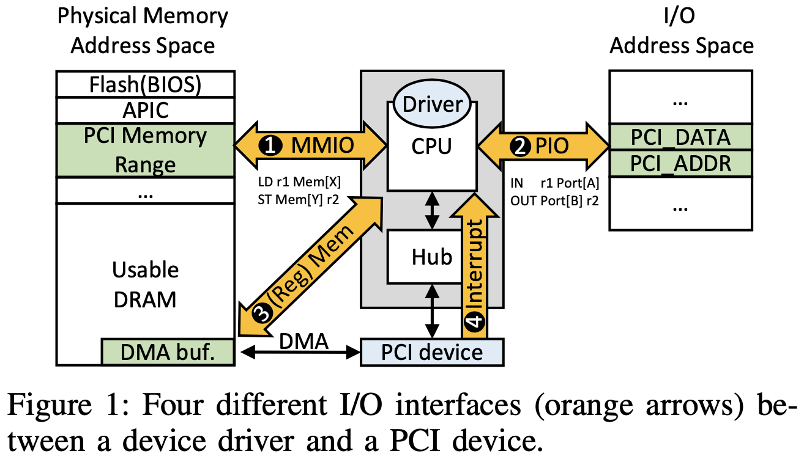

# DevFuzz: Automatic Device Model-Guided Device Driver Fuzzing [SP'24]

## Abstract

- デバイスドライバのセキュリティは OS 全体の信頼性にとって極めて重要
- しかし, デバドラがハードウェアからの悪意のある入力を適切に処理できるか検証することは困難
- 既存のシンボリック実行のソリューションは拡張性がない
- ファジングでは, 実デバイスや手動のデバイスモデルを必要とするため, テスト不足

 

- 本論文では物理デバイスを必要としない, 新しいモデルガイドデバドラファジングの DevFuzz を紹介
- DevFuzz はテスト対象のドライバを適切に初期化するようにファザーをガイドするプローブモデルを自動的に生成するために, シンボリック実行を使用する
- DevFuzz はまた, MMIO, PIO, DMA デバイスモデルを構築するために, 静的・動的解析の両方を活用し, ファジングの効果をさらに向上させる
- DevFuzz は異なる OS の様々なバスタイプ (PCI, USB, RapidIO, I2C) の 191のドライバのテストに成功し, 72個のバグを検出

 

## 1. Introduction

- デバイスドライバのセキュリティは OS 全体のセキュリティにとって極めて重要
- 最近の OS には様々なハードウェアデバイスとの互換性を提供するために, 多くのデバイスドライバが含まれる
  - 例えば, Ubuntu 20.04 では デバドラ (driver ディレクトリ配下) は Linux ソースコードの 64.8% を占める 1300万行のコードで構成される
- このような大規模なコードベースによって攻撃対象となる
  - デバドラの CVE の報告は過去5年間の Linux カーネルの CVE 報告全体の 27~54% を占める

 

- デバイスドライバはカーネル空間で実行されるため, 適切なサニタイズなしに, デバイスからドライバへの入力を処理することは, セキュリティの根本原因になっていた

 

- 残念なことに, 既存のソリューションはデバドラのテストに限られたサポートしか提供しない
- 多くのデバドラがテスト不足で安全ではないままになっている
- いくつかの先行研究は, デバイスからの入力をシンボリックにするシンボリック実行に依存
  - 実デバイスを持っていなくてもデバドラのテストが可能
- しかし, シンボリック実行は大規模なソフトウェアでスケールしない

 

- ファジングは実際のソフトウェアをテストする際に, より効果的である
- しかし, デバドラのファジングは2つの理由から困難
- 1つ目は, ファザーが複雑な動的プロービングフェーズを通過することが困難
  - 最近のバスアーキテクチャ (PCI. USB など) の多くは, デバイスのホットプラグに対応
  - OS はバスをスキャンし, デバイスを認識し, 対応するドライバをバインドし, デバドラのカスタムプロービングロジックを実行する
  - デバイスは特定のプロービングプロトコルに従う必要がある
    - ベンダーID, システムメモリマップにおけるデバイスのアドレスの設定など
  - 動的なプロービングは, カーネルがデバイスと一致するドライバをバインドし, ドライバが追加のカスタムプロービングロジックを完了すれば成功とみなされる
  - ガイドなしのランダム入力では, この動的プロービングに失敗することが多く, プログラムの深い部分まで到達できない
- 2つ目は, プロービングに成功しても, MMIO, PIO, DMA, IRQ など様々な I/O インターフェースの膨大な入力空間をスケーラブルに探索することは困難

 

- ファジングの先行研究は上記の課題に十分に対処していない
- Charm, DIFUZE, Periscope ではデバドラをセットアップするために実際のデバイスを必要とする
- USBFuzz, FuzzUSB では, 実機なしのデバドラをテストするためにm ユーザが提供するデバイスモデルを必要とする
  - 手作業でデバイスモデルを開発することは, エラーが発生しやすく, 拡張性に欠ける
- さらに, これらのファザーは特定の OS 向けに設計され, 限られたバスタイプしかサポートしない

 

- 本論文では新しいモデルガイドデバイスドライバファザーの DevFuzz を紹介する
- DevFuzz は実機なしでのデバドラのテストを可能にする
- DevFuzz では様々なデバイスドライバのテストをサポートする
  - 異なるバスタイプ (PCI, USB, RapidIO, I2C など)
  - 異なる I/O インターフェース (MMIO, PIO, DMA, IRQ など)
  - 異なる OS (Linux, FreeBSD, Windows など)

 

- 重要なアイデアは, 物理デバイスがない場合にデバイスドライバのファジングを容易にするために, 3つのデバイスモデルを自動的に生成すること
- DevFuzz は, まずシンボリック実行を使用して, デバドラがプロービングパスの制約を満たすことができる (1) プローブモデル を生成する
- シンボリックプロービングの実行は, ドライバがカーネルによってデバイス (モデル) にバインドされていれば, 成功したとみなされる
- さらに, DevFuzz はデバイスドライバの静的/動的プログラム解析を活用して, (2) MMIO/PIO モデルと (3) DMA モデルを構築する
  - このモデルは, デバイスドライバの制御フローに影響を与える MMIO, PIO, DMA アドレスとその値域制約を具体化したもの
- これらは DevFuzz がファジング中にデバドラの様々なプログラムパスを探索するためのガイドとなる

 

- DevFuzz は3つのモデルを AFL と組み合わせ, 50%の確率で, デバイスモデル/AFL のいずれかから入力を選択することでファジングを実行する
- この組み合わせによって, DevFuzz はモデルのデバイス認識とファザーのフィードバック指向ランダム変異の両方を活用できる
- DevFuzz はプロービング段階とポストプロービング段階の両方で, 対象のドライバをファジングする
- プロービングフェースのファジングでは, DevFuzz はターゲットデバドラ (モジュール) のプラグインとアンプラグを繰り返すことで, プロービング関数を複数回トリガーし, プローブモデルと AFL が組み合わさった入力を供給する
- ポストプロービングフェーズのファジングでは, DevFuzz はプローブモデル (変異なし) を使用してプロービングロジックを通過させ, ドライバをデバイス (モデル) に正常にバインドする
- その後, MMIO/PIO モデル, DMA モデル, および AFL からの混合入力を与え, ドライバの他の (プロービング以外の) I/O機能をトリガするプログラムを実行する

 

- DevFuzz は150個 (PCI 108個, USB 31個, RapidIO 1個, I2C 10個) をテストできた
- シンボリック実行により, DevFuzz は112個のデバイスのプローブとデバイスモデルの生成に成功した (75%)
- 既存のものに比べてカバレッジを向上させる

 

## 2. Background

### 2.1 Device and Driiver Interactions

- デバイスとドライバの入出力 (I/O) インターフェースには2つの形式がある
  - メモリマップド I/O (MMIO)
  - ポート I/O (PIO)
- また, DMA (Direct Memory Access) を使用してデータを共有することもできる
- デバイスはまた, 非同期割り込み要求 (IRQ) を使ってドライバに通知することもできる

#### 2.1.1 MMIO

- デバイスはデバドラがメモリ命令 (MOV など) を使ってアクセスし, 論理命令 (AND, OR, TEST など) を使ってデバイスの状態を操作できるように, MMIO の "物理メモリアクセス空間" にマップされる
- メモリ管理ユニット (MMU) は, MMIO領域へのアクセスを対応するデバイスにリダイレクトする
- 図1① は PCI メモリ範囲が, BIOS flash と APIC の隣にある物理メモリアドレス空間の一部にマッピングされていることを示す
  - 例えば, x86 では PCIEXBAR レジスタが PCI メモリ範囲のベースアドレスを保持する

 

#### 2.1.2 PIO

- 周辺機器は "I/O アドレス空間" と呼ばれる別のアドレス空間にマッピングすることもできる
- デバイスドライバは I/O アドレス空間にアクセスするために, リング0 特権を持つ I/O 命令 (IN, OUT, INS, OUTS など) を使用する
- これらの PIO アクセスは, I/O コントローラハブ (ICH) によって処理される
- 図1② は PCI設定レジスタが I/O アドレスの PCI_DATA と PCI_ADDR に (MMIO マッピングされた PCI メモリ範囲に加えて) マッピングされていることを示す

 

#### 2.1.3 DMA

- DMA (Direct Memory Access) によってデバイスは CPU を介さずにメインメモリと大きなデータチャンクを通信することができる
- DMA は多くの場合, MMIO/PIO 書き込みを実行することで開始される
- 図1は DMA バッファが DRAM に割り当てられていることを示す
- デバイスドライバは, 通常のメモリ操作を使用して DMA バッファにアクセスできる (図1③)

 

- デバイス自体も, 割り込み要求 (IRQ) という形で CPU (図1④) に特定のイベント (転送完了, 新しいデータ到着など) を知らせる信号を送ることができ, デバドラの割り込みハンドラをトリガーする
- 一般に IRQ はアサートされ (?), IOAPIC を介してルーティングされる
- PCI は MSI/MSI-X と呼ばれる2つのバンド内メカニズムを定義