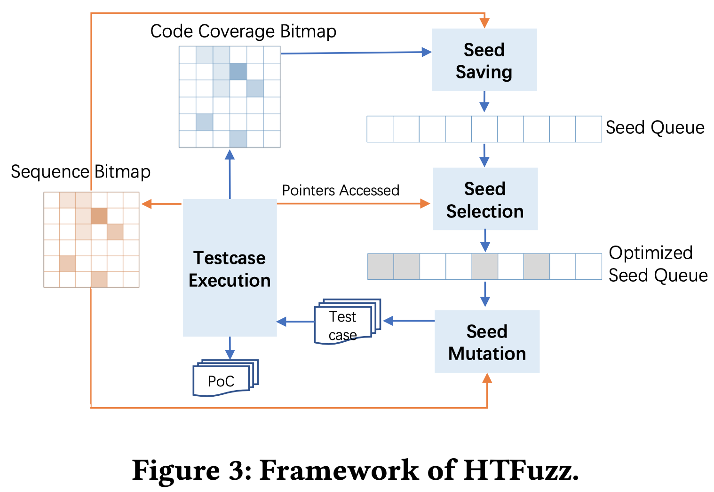

# HTFuzz: Heap Operation Sequence Sensitive Fuzzing [ASE'22]

## Abstract

- heap の時間的脆弱性 (use-after-free, double-free, null ポインタデリファレンス) はヒープ操作の順番に敏感
- この脆弱性を効率的に発見するために従来のコードカバレッジファジングにヒープ操作のシーケンスのフィードバックを統合することが良い
- しかし, 既存手法には限界がある

 

- HTFuzz を提案
- 以下の理由からファジングを利用
  - 実行時のヒープ操作シーケンスのカバレッジを増加させる
    - ヒープ操作シーケンスの制御フローを反映
  - これらの操作によってアクセスされるポインタの多様性を増加させる
    - データフローを反映
- (HTfuzz は実験の結果すごいらしい)

 

## 1. Introduction

- 既存のファザーは一般にコードカバレッジフィードバックに依存している
  - AFL
  - TortoiseFuzz, Ankou: 補足的なフィードバックとして, よりエラーの発生しやすい箇所 (システムコールとループ反復など) を探索しようとする

 

- しかし, ヒープの時間的脆弱性 (HT-Vuls) はコードカバレッジだけでなく, ヒープ操作のシーケンスにも敏感
- ファザーがポインタのデリファレンスコードを探索したとしても脆弱なヒープ操作のシーケンスを満たしていなければ, HT-Vuls を見逃すかも
- HT-Vuls はアクセスされたポインタとその前の操作シーケンスに密接に関係する

 

- 研究者はファジング中にヒープ操作シーケンスを考慮するためのいくつかの解決案を提案している
- それらは脆弱性のある操作の候補を認識するために事前知識や静的解析に依存する
  - [UAFL](https://yuleisui.github.io/publications/icse20.pdf) : 静的解析を利用して HT-Vuls の候補となるヒープ操作を見つけ, ヒープ操作間の遷移を新しいフィードバックとして受け取り, ファザーをターゲットの操作シーケンスに誘導する
  - [LTL-Fuzzer](https://abhikrc.com/pdf/ICSE22-LTLFuzz.pdf) : 時間的な違反に関連する場所で計装し, ファザーがその場所を探索するように誘導する
  - [UAFuzz](https://www.usenix.org/system/files/raid20-nguyen.pdf) : ユーザによって事前に定義された UAF 箇所を探索するために有向ファジングを実行する
- 事前知識や静的解析に依存するため限界がある

 

- HTFuzz : 事前に定義・分析された操作シーケンスの候補に依存しない, ヒープ操作シーケンスガイドファジング
- 限られた操作シーケンスの候補集合を探索することに集中せず, ヒープ操作シーケンスの多様性を高めることを提案する
- 具体的には
  - ヒープ操作シーケンスを追跡し, 
  - コードカバレッジに加えて新たなフィードバックを使用し, 
  - 多様性を高めるようにファザーを誘導する
- ヒープ操作シーケンスの多様性が高まれば, 潜在的な HT-Vuls を発見できる
- 3つの RQ がある

 

- RQ1: ヒープ操作シーケンス・フィードバック取得のオーバーヘッド
- 一般にテストケース実行トレースにおけるヒープ操作の数は非常に多い
  - ファザーが実行時にすべての操作とその順序を記録するのは時間がかかり, メモリが大きすぎる
- さらに, 2つのテストケースのヒープ操作シーケンスを比較することは困難
- シーケンスフィードバックのオーバーヘッドと粒度のバランスを取る
  - HTFuzz ではリングバッファを使用して, 最新の alloc/dealloc 操作を追跡
  - メモリアクセス操作ごとにリングバッファのハッシュをインデックスとして, シーケンスカバレッジビットマップを更新する

 

- RQ2: ポインタエイリアスの感度
- HT-Vuls は操作のシーケンスだけでなく, ポインタの情報も必要
- ポインタのエイリアスが多いほど HT-Vuls が起こりやすくなる
- ファジング中にポインタとそのエイリアスを追跡することは重要だが, 正確な追跡はコストがかかる
- HTFuzz
  - ファジング中にヒープ操作によってアクセスされるポインタ (とエイリアス) の数をカウント
  - シード選択時により多くのポインタにアクセスするテストケースを優先する

 

- RQ3: コードカバレッジフィードバックとの協調
- コードカバレッジフィードバックとヒープ操作シーケンスフィードバックを組み合わせることは合理的
- これら2つのフィードバックは衝突する可能性がある
  - AFL はコードカバレッジに寄与しそうなバイトのみを変異させる
  - スキップされたバイトはヒープ操作シーケンスの多様性に寄与するかも
- HTFuzz
  - ヒープ操作シーケンスも考慮するようにエフェクタマップ識別アルゴリズムをアップグレード
  - MOPT を利用して変異を動的にスケジューリングする (変異の確率?)

 

#### まとめ

1. 新しいヒープ操作シーケンスフィードバックを導入し, シードの保存戦略を調整することで, ヒープ操作シーケンスの制御フローの多様性を高める
2. ヒープ操作によってアクセスされるポインタとエイリアスの数をカウントし, シード選択戦略を調整することで, ヒープ操作シーケンスのデータフローの多様性を高める
3. コードカバレッジと操作シーケンスの2つのフィードバックを連携させるために, シードの変異戦略を調整する

 

もっとまとめると
1. シードの保存戦略
2. シードの選択戦略
3. シードの変異戦略

 

## 2. Motivation

### 2.1 Motivating Example

- 図1 は UAF 脆弱性を含むプログラム
- 図2 はコールグラフでノードは実行された関数, エッジは呼び出し関係

 

- UAF の発生には 3つのステップ
1. $main$ 関数から $gf\_isom\_box\_new\_ex$ ($alloc$ 操作) に到達し, オブジェクトを生成する
2. 関数 $stbl\_AddBox$ が呼び出され, 関数 $gf\_isom\_box\_del$ を呼び出して, オブジェクトを解放
3. クラッシュは関数 $gf\_isom\_box\_del$ の別ポイントで安全に解放されなかったオブジェクトにアクセスするときに起きる

- つまり以下の順でプログラムが実行されたとき
  - [56-45-49-24-28-21-22-36-41-24-26(malloc)-42-31-34-13-14(use)-16(free)-50-13-14(crashed use)]
- 14行目の最初の use ではクラッシュしない
- 16行目の関数ポインタ $a->registry->del\_fn(a)$ が $free()$ を指し, $GF\_Box$ 構造体 $a$ を安全でない形で解放している
- 14行目の $a->other\_boxes$ が異常なアクセスポインタになる
- 構造体 $a$ ダングリングポインタとなった状態で 14行目を実行すると UAF が発生するかも

 

### 2.2 Current Graybox Fuzzing and Limitation

- コードカバレッジは時間軸情報を無視するため, HT-Vuls には適していない
- $seed1$: malloc,use1,use2,free と $seed2$: malloc,use1,free,use2 がファジング中に生成されたとすると, カバーされたコードは同じ
- ダングリングポインタを持つ $seed2$ はより価値があるが, 破棄される

 

- 単純なコードカバレッジフィードバックの補足として, Tortoise-Fuzz, AFL-sensitive, Ankou はフィードバックの感度を高めるが, ヒープ操作のシーケンスは見ていない
- PathAFL はパスカバレッジを記録しようとするが, 記録オーバヘッドのために順序情報は諦める

 

- UAFL や LTL-Fuzzer などは HT-Vuls の発見のためにヒープ操作シーケンスを利用する
- 事前条件や静的解析を利用して脆弱な操作シーケンスの候補セットを作成する
  - 例: UAF シーケンス $malloc \to free \to use$
- 候補シーケンスのカバレッジをターゲットとしてファジングを行う
- しかし, 候補シーケンスは静的解析の課題 (エイリアス解析) などにより多くの false-positive や見逃しなどが発生する

 

- モチベ例では 16行目の $a->registry->del\_fn(a)$ の関数ポインタが $free(a)$ を指している場合, それ以降の $a$ の使用は脆弱なポインタアクセスの候補であり, 関連するシーケンスを候補セットに加えるべき
- $a->registry->del\_fn(a)$ が実行前にどの関数を指すか決めるのは難しいので, いくつかの脆弱な操作シーケンスは除外される
- 図2のような 2つの関数ポインタ ($gf\_isom\_box\_read$ と $gf\_isom\_box\_new\_ex$) やコールバック $gf\_isom\_box\_array\_read\_ex$ も事前解析や事前定義が難しい
- さらにループが絡むとシーケンスの抽出はより困難
  - 48行目の $parent->size$ は操作シーケンスの順序と長さに影響する

 

### 2.3 Observation and Solution

- 既存のファザーの問題点
  - コードカバレッジフィードバック: HT-Vuls を発見するには不十分
  - 操作シーケンスをガイダンスとして利用するファザー: 専門的な知識や静的解析が必要
- HTFuzz では新たなフィードバックの指標として操作シーケンスの追跡を行い, ヒープ操作シーケンスの多様性を高める

 

- HT-Vuls を見つけるには2つの条件が必要
  1. 脆弱な操作シーケンス (制御フロー)
  2. 複雑なポインタ管理 (データフロー)
- しかし, この2つをきめ細かく解析するのはオーバーヘッドが大きく, ファジングのスループットを低下させる
  - 例えば, ヒープ操作とアドレスを関連づけるため, テイント伝搬を行ったが, 非効率なファザーとなった
- 粗い操作シーケンスを追跡する

 

- しかしコード/シーケンス爆発問題はまだ未解決
- 効率とオーバーヘッドのバランスを取るため, 操作シーケンスをメモリアクセス操作によってセグメントに分割する, 軽量なシーケンスフィードバック追跡メカニズムを提案する

 

- 操作シーケンスのフィードバック以外にポインタがアクセスされることも満たすべき条件
- ポインタとエイリアスを正確に追跡するのはコストがかかるため, ポインタがアクセスされる頻度を粗くカウントする

 

- コードカバレッジに基づく最適化は操作シーケンスの発見能力を阻害するかも
- 変異パワーを節約するための effector map 最適化は操作シーケンスの探索において損失を引き起こすかも
- HTFuzz では変異で, 操作シーケンスのフィードバックとコードカバレッジフィードバックをうまく連携させる

 

## Methodology

### 3.1 Overview of HTFuzz

- HTFuzz は AFL をベースに構築される
- シードの保存・選択・変異の部分で改良が加えられる
- ヒープ操作のシーケンスを記録することで, 新しい操作シーケンスフィードバックを導入し, コードカバレッジ, 操作シーケンスカバレッジのいずれかに寄与するテストケースを保存 (3.2)
- より多くのポインタがアクセスされるシードを優先するように, シード選択モジュールを改良 (3.3)
- コード/シーケンスカバレッジのバランスを取るため, 変異にシーケンス情報を導入し, MOPT を利用してスケジューリングする (3.4)

 

### 3.2 Heap Operation Sequence Feedback

- 操作シーケンスフィードバックは, シードの保存・選択・変異の基礎
- シーケンス記録の爆発問題に対処し, 差の比較などの計算を行える効率的な追跡方法を設計

 

- 記録スペース削減のため, ヒープ操作を2進数で表す
  - alloc には 1, dealloc には 0 みたいな
  - ヒープ操作のシーケンスを数字の羅列で表す
- 操作シーケンスをセグメントに分割することで記録効率をさらに高める
  - シーケンスは alloc・dealloc・access のセグメントで構成される?
  - メモリアクセスの瞬間の操作シーケンスは, 直前のメモリアクセスの状態に由来するため, シーケンスの状態は重複するかも
- メモリアクセス操作前の長さ $L$ の最新のヒープ操作シーケンスだけを記録する
  - つまり長さ制限を設けているってこと?
  - オブジェクトまで見てないの?

 

- 長さ $L$ のリングバッファで最新のヒープ操作を追跡する
- [1,1,access,0,0,access,1,access,access,0]
  - $L = 3$ のとき, [0,1,1], [1,0,0], [0,0,1], [0,0,1] が記録される
    - access までの3つ分の alloc・dealloc を記録してる
- リングバッファは10進数にエンコードされ. メモリアクセス操作位置をインデックスとして, 新しいビットマップに保存される
  - [1,0,0] なら4
- ビットマップ全体が, 操作シーケンスをほぼ記録する

 

- リングバッファが大きいほど, フィードバックはヒープ操作の組み合わせに敏感
- しかし, 感度が高すぎるとオーバーヘッドが増加
- 適切な値を定めた (実験: 5.3.1)

 

### 3.3 Pointer Alias Tracking

- シーケンスの考慮により, ファザーは興味深いシードを保存しすぎる可能性があるため, 価値のあるシードを優先的に保存すべき
- AFL は実行時間が短く, ファイルサイズが小さいシードを優先する
- これらのシードは, 更なる変異のために選択されやすくなる

 

- ポインタのエイリアスの多様性も HT-Vuls を見つける上で重要
- HTFuzz ではシード選択時により多くのポインタがアクセスされるシードを優先する
- しかし正確にポインタを追跡することはオーバーヘッドをもたらす
- ポインタ (とエイリアス) アクセスに関する命令を静的に識別し, 各シードの実行中にポインタアクセス回数をカウントする
- アクセスカウントが大きいシードは高い確率で選択される

 

### 3.4 Heap Operation Sequence Coordination

- コードカバレッジと操作シーケンスカバレッジは単純に組み合わせるといくつかの衝突が発生する
- そのため, AFL にいくつかの修正を加える

 

- シード変異で, AFL は多くの変異演算子を提供する
- 一般的に使用されるのは "bitflip 8/8"
  - 多分全部の bit を反転させる
- AFL は effector map を生成して有用な入力バイトをマークし, 無駄なバイトに対する変異を回避する
- [MOPT](https://www.usenix.org/conference/usenixsecurity19/presentation/lyu): 変異演算子の効果が大きく変化することから, コードカバレッジ探索に向けた演算子を動的にスケジューリングする最適化
  - 新しいコードカバレッジに寄与する変異演算子の量分布 (amount distribution) を利用してシード変異を調整する

- たぶん2つの最適化
  1. effector map を生成して有用な入力バイトをマークし, 無駄なバイトに対する変異を回避する最適化
  2. コードカバレッジ探索に向けた演算子を動的にスケジューリングする最適化

 

- しかし, どちらの最適化もコードカバレッジのために設計され, 操作シーケンスの探索に悪影響かも
- effector map のため新しいシーケンスをスキップする
- MOPT は新しいコードカバレッジに向けて変異をスケジューリングするため, シーケンスの探索が遅れる

 

- effector map のアルゴリズムを修正し, 新しい操作シーケンスの興味深いテストケースを生成するバイトも有用だとマークする
- MOPT を参照して, 操作シーケンスのフィードバックから得られる新しい興味深いテストケースに基づいて, 変異演算子をスケジューリングする

## Implementation

### 4.1 Instrumentation

- LLVM を用いてコードに計装し, テスト中のフィードバックを収集する
- AFL のブランチカバレッジに加えて, 我々の計装はヒープ操作シーケンスとポインタ情報を追跡

 

- 各基本ブロックで計装を行い (15行目), 分岐カバレッジフィードバック $BranchCov$ をビットマップに収集 (2-3行目)
- ポインタに関する命令 (オペランド, オペコードのどれかがポインタ) を計装し (18-19行目), 実行時にアクセスされたポインタの数をカウントする (4-5 行目)

 

- さらに, $malloc, realloc, free$ などの確保・解放命令の呼び出しを計装し (20-21行目), 長さ $L$ のリングバッファ $Ring$ に最新のヒープ操作を記録する (6-8行目)
- $L$ の値は$3$で, 詳細は実験の章

 

- 最後に, 基本ブロック最初のメモリアクセス命令 (22-24行目) を計装し, リングバッファを追加のマップ $HeapOpSeq$ に記録する (9-11行目)

 

### 4.2 Fuzzing Loop

- AFL のファジングプロセスを改良し, フィードバックを用いてファジングをガイドする
- アルゴリズム2のように, AFL のシード変異, シード保存, シード選択をアップグレードする

 

- テストケースを変異させるとき, AFL に従ってこのシードの effector map を構築し (6行目), 興味深いバイトを認識する
  - 興味深いバイトの変異は新しいカバレッジをもたらすテストケースを生成する可能性が高い
- AFL のアルゴリズムを更新し, ヒープ操作シーケンスのフィードバックをもたらす新しいテストケースを生成する可能性が高いバイトも興味深いものとみなす
- MOPT を利用して変異演算子をスケジュールし, 新しいテストケースを生成 (7行目)

 

- 新しく生成されたテストケースをテストした後, クラッシュなど起きたら PoC を報告 (9-10行目)
- テストケースが興味深ければシードキューに保存 (11-12行目)
- テストケースは新しいフィードバックをもたらすとき興味深いとして残す

$$
\text { Is_Interesting }= \begin{cases} True, & \text { hasNew(BranchCov) } \vee \text { hasNew(HeapOpSeq) } \\ False, & \text { otherwise }\end{cases}
$$

- さらに, AFL のシード選択戦略も改良した
- AFL の API $Update\_Bitmap\_Score()$ を更新し, キュー内mpシードの順序を調整し, いくつかのシードを有利なシードとしてマーク (13行目)
- 有利なシードが次の変異で選ばれる (3行目)
- AFL は実行時間が短く, ファイルサイズが小さいシードを優先している
- 加えてテスト中にアクセスされるポインタの数が多いシードも有利とみなす
- この定義は以下の式

$$
\text { Is_Favored }= \begin{cases} True, & \text { IsLargest(PtrCount) } \vee \text { IsMinimum(Time * FileSize) } \\ False, & \text { otherwise }\end{cases}
$$

## 5. Evaluation

- RQ1: HTFuzz は実世界の HT-Vuls を発見するのに有効か?
- RQ2: HTFuzz は HT-Vuls に対するファジングの効率にどの程度貢献するか?
- RQ3: HTFuzz は他のファザーと比較してどうか?

### 5.1 Experiment Setup

- [Klee らの提案](https://arxiv.org/abs/1808.09700) に従い実験を行った

#### 5.1.1 Fuzzers to compare against

- UAF 脆弱性のために設計された UAFL, UAFuzz を含む, 11個のファザーと比較する
- UAFL と UAFuzz は HT-Vuls をターゲットとしている
  - これらはオープンソースではないので, それらのベンチマークで HTFuzz が同じ脆弱性を発見できるかで比較する
- 他のファザーはオープンソースなのでデフォルトのパラメータで実行
- AFL と Angora はベースラインファザー
- MOPT は HTFuzzがその変異戦略を活用するので入れている
- AFL-sensitive, TortoiseFuzz, Memlock はメモリ操作に注意を払う
- PathAFL はシーケンス情報は意識するが, オーバーヘッドのため順序情報はあきらめる
- Ankou は組み合わせ分岐差分をフィードバックとして使用し, 暗黙的にシーケンス情報を考慮する

#### 5.1.2 Benchmark applications

- ベンチマークアプリケーションは UAFL と UAFuzz の公開データセット, TortoiseFuzz のリポジトリから収集
- 収集したアプリは頻繁にテストされ, 活発に開発され, HT-Vuls (特に最近報告された脆弱性) を含み, 与えられた PoC ファイルで検証できるものでなければならない
- 脆弱性が存在することを確認するために, 報告されたバグを与えられた PoC で再現できなかった 5つのプログラムと, コンパイルに失敗した3つのプログラムを除外
- 14個のベンチマークデータセット

#### 5.1.3 Performance Metrics

- 評価の指標は以下の3つ
  - 発見した HT-Vuls の数
  - ヒープ操作シーケンス量
  - コードカバレッジ
- ヒープシーケンス量は afl-showmap を用いてシーケンスビットマップ内のサブシーケンスをカウント
- カバレッジは gcov を用いて行カバレッジを求める
- 異なるファザーの脆弱性発見を比較する場合, 統計評価のために Mann-Whitney U-test を用いる

#### 5.1.4 Configuration Parameters

- 各プログラムは72時間テストする
- 各実験を8回実施する
- すべての実験は Ubuntu LTS 16.04 で Intel Xeon CPU E5-2630 v3 プロセッサ (2.40GHZ, 32Core) と 32GB の RAM

 

### 5.2 RQ1. Finding Real-world Vulnerablities

- HTFuzz は 74個の HT-Vuls を含む 92の脆弱性を発見
- 37個が新しい脆弱性で, 32個が新しい HT-Vuls だった

- 表3は脆弱性の詳細

- 図4は HTFuzz によって発見された HT-Vuls を時間経過で累積した図
- ほぼ半数 (34/74) の脆弱性が10時間以内に発見されている

 

- 表4は 0day 脆弱性と 1day 脆弱性を含む HT-Vuls とその他のタイプの脆弱性について, HTFuzz と比較したベースラインファザーが発見した脆弱性の総数を表す
- また, HTFuzz が見逃したが, 個々のファザーが発見した HT-Vuls の数
  - AFL の 64-48-4 個というのは以下の意味
    - AFL が合計 64個の脆弱性を発見
    - そのうち 48個が HT-Vuls
    - 4個の HT-Vuls は HTFuzz が見逃している
- HTFuzz は総数や HT-Vuls を含む脆弱性の発見において, すべてのベースラインを凌駕している
- 0day の行は各ファザーが発見した新しい CVE 脆弱性の数
  - 3つ目が 0 だから HTFuzz はすべての CVE 脆弱性を発見している
- HTFuzz は　HT-Vuls を多く発見してる