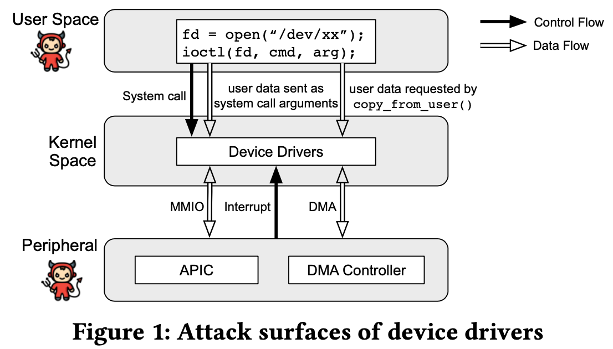
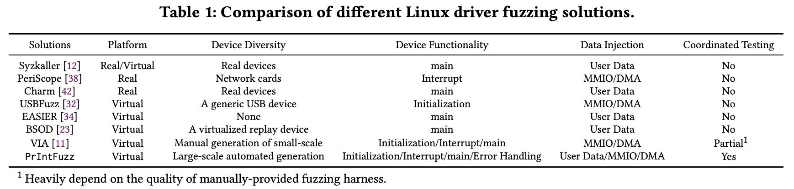
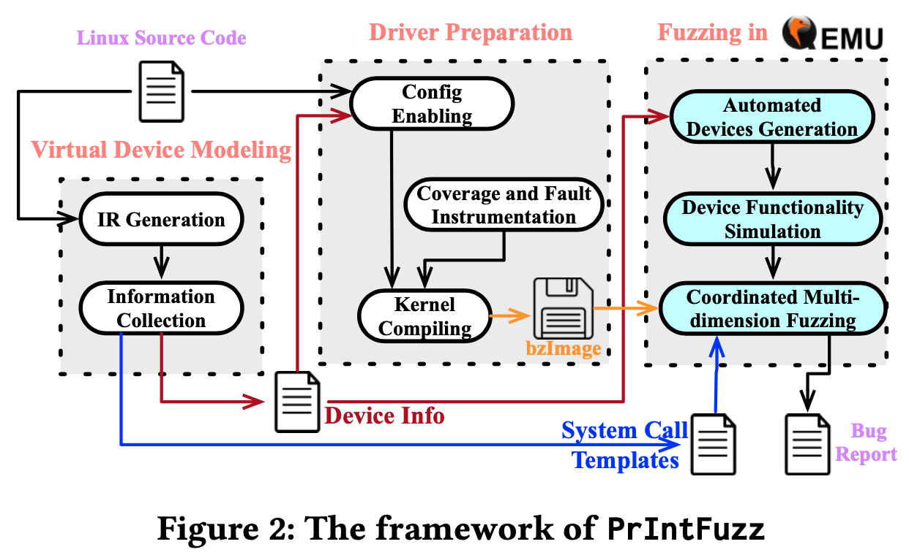
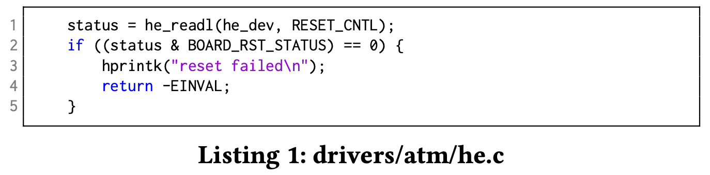
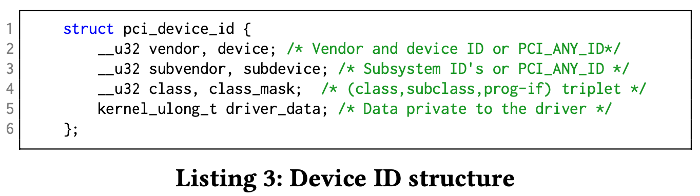
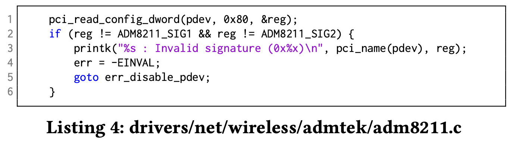

# PrIntFuzz: fuzzing Linux drivers via automated virtual device simulation [ISSTA'22]

## Abstract

- Linux ドライバはカーネルのコアと同じアドレス空間と特権を共有しているが, コードベースと攻撃対象は遥かに大きい
- ドライバは十分にテストされておらず, セキュリティが弱い
- ハードウェアデバイスがないと, 既存のファジングはドライバコードの大部分をカバーすることができない
  - 初期化コードや割り込みハンドラなど

 

- 本論文では probing や 割り込みハンドラを含む, 見過ごされているドライバコードをテストできるファジングフレームワークの PrIntFuzz を紹介
- PrIntFuzz は最初に, 静的解析によって, ドライバから知識を抽出
  - inter-procedural
  - field-sensitive
  - path-sensitive
  - flow-sensitive
- 次にその情報を利用して, シミュレータを構築し, 以下をサポート
  - デバイスプロービング
  - ハードウェア割り込みエミュレーション
  - デバイス I/O インターセプト
- PrIntFuzz は多次元ファジング戦略を適用し, 見落とされたコードを探索する

 

- 以下のデバイスのシミュレーションに成功
  - 311個の仮想PCI
    - PCI (Peripheral Component Interconnect) : PC のメインボードに接続されるインターフェース規格
    - CPU, メモリ以外の周辺機器 (ビデオカード (GPU), サウンドカード, ネットワークカード)
      - これらのカードで, 映像出力, 音声入出力, ネットワークへの物理的接続ができる
  - 472個の仮想I2C
    - I2C (Inter-Integrated Circuit) : 短距離で低速なインターフェース
    - センサ, LCD など (ラズパイでつなげたものか?)
  - 472個の仮想USB
    - USB (Universal Serial Bus) : USB インターフェースを使用して接続する周辺機器
       - キーボード, マウス, プリンタ, 外付けハードディスク
- これらに対応するバグを 150個発見
- Linux5.10-rc6 では 99個のバグを発見したが, 他の最先端のファザーは50個しか発見できなかった
- PrIntFuzz は 11,968 個の基本ブロックをカバー
  - その他のファザーは 2,353個の基本ブロックしかカバーしていない

 

## 1. Intruduction

- Linux のセキュリティはますます注目を集める
- CVE の統計では最も脆弱性のある上位6製品のうち5製品は Liunx ディストリビューションとその亜種
- これらの脆弱性のうちドライバが最も多い
  - Jeff は Android の85%の脆弱性がドライバに存在することを指摘
  - Alireza は Linux の脆弱性のほとんどがドライバに起因することを指摘
- ドライバはカーネルのコアと同じアドレス空間と特権を共有するため, 攻撃者にとって魅力的なターゲット
  - 攻撃者はシステムコールや, 不正なデバイスからの不正な割り込みや不正なデータを介して, ドライバの脆弱性を悪用する
  - さらなる攻撃を仕掛けるためにカーネル特権を獲得する

 

- ファジングはハードウェアデバイスのサポートによってターゲットドライバをテストすることができる
- しかし, 実際にテストできる実デバイスの数は限られるため, 実デバイスに依存するファザーでは, ほとんどのドライバのコードをカバーすることができない
- 最近の研究では, よりスケーラブルで実用的な仮想デバイスに依存したファザーが提案される
- しかし, これらのアプローチは仮想デバイスを開発する際に, 3つの課題に遭遇する

 

- 第1に, ファザーがサポートする仮想デバイスの多様性は限られており, 多くのドライバが実行できない
- 限られた数の仮想デバイスを作成するための手作業に頼っている
  - USBFuzz は仮想 USB デバイスをシミュレート
  - VIA は手動で提供された設定ファイルに基づいて, ごく僅かな PCI デバイスをシミュレート
- 大規模な仮想デバイスの多様性を高めるには, 仮想デバイスを自動生成する必要がある

 

- 第2に, シミュレートされた仮想デバイスの機能は限られており, 対応するドライバのコードカバレッジは低くなっている
- 調査によると, ドライバコードの重要な部分
  - 初期化とクリーンアップ : 36%
  - リクエスト処理と割り込み : 23.3%
  - コンフィグレーション : 15%
  - 電源管理 : 7.4%
  - ioctl : 6.2%
  - エラー処理 : 5%
- 既存手法はデバイスの一部機能しかシミュレートしていない
  - USBFuzz は仮想 USB デバイスのプラグとアンプラグ操作のみ
- ファザーは初期化コードや割り込みハンドラを含むデバイスドライバのコードをテストするために, 仮想デバイスの機能を包括的にシミュレートする必要がある

 

- 第3に, ドライバの攻撃対象が十分に探索されていない
- ドライバは様々なソースから入力を受け入れる可能性がある
  - システムコールの引数を介して, ユーザから提供されるデータ
  - MMIO, PMIO, DMA を介して, デバイスから提供されるデータ
- 攻撃者はこれらの入力ソースのいずれかから攻撃を仕掛ける可能性がある

 

- 本論文では PrIntFuzz を設計・開発する
- 上記の課題を解決する
- 初期化 (probing) コードと割り込みハンドラを含む, ドライバコードの大部分をテストする

 

- 第1に, PrIntFuzz は静的解析を利用して, ドライバが必要とするデバイス情報を抽出し,
- 仮想デバイスを自動的に生成する手法を設計することで, ファザーが様々なドライバをテストできるようにする

 

- 第2に, PrIntFuzz は仮想デバイスの主要な機能をシミュレートする自動化手法を開発し, ターゲットドライバの大半のコードをカバーできるようにする
  - ドライバの初期化中にソフトウェアフォールトを注入
  - ドライバのテスト中に仮想ハードウェア割り込み信号を注入する
- これによって, ファザーはドライバの初期化コードと割り込みハンドラを探索することができる 

 

- 第3に, PrIntFuzz は協調的な多次元ファジングスキームを提案し, ファザーがドライバの攻撃対象領域を徹底的に探索することを可能にする
  - 具体的には以下を特定の順序で編成する
    - ユーザとの対話 (システムコールなど)
    - デバイスの機能 (割り込み発生, フォルトインジェクション)
    - 異なるソースからのデバイスデータの注入
- PrIntFuzz はこれらを統一されたシステムコールシーケンスにカプセル化し, 高品質のテストケースを生成する

 

- PrIntFuzz を Linux5.18-rc1 で評価した
- PrIntFuzz は649個の PCI ドライバを発見し, 311個のシミュレーションに成功
- また, 472個の I2C デバイスと, 169個の USB デバイスにシミュレーションに成功
- 既存手法と比較して, コードカバレッジ・バグ発見が向上
- PrIntFuzz は150個のバグを発見
  - PCIドライバ : 112個
  - I2Cドライバ : 20個
  - USBドライバ : 18個
- 対照実験では, PrIntFuzz は 99個のバグを発見したのに対し, VIA は50個のみ

 

## 2. Background and Related Work

### 2.1 Threat Model of Drivers

- 図1のように, ドライバの攻撃対象は, ユーザ空間プログラムとハードウェアデバイスから構成
- これらが, ドライバの制御フローとデータフローに影響を与える

 

#### 2.1.1 Threars from User Space

- ユーザプログラムは, システムコール (`ioctl` など) を通してドライバと相互作用できる
- システムコールの引数を介して, データを送信し, ドライバの制御フローとデータフローの両方に影響を与える
- 一方, ドライバは `copy_from_user` などの関数を呼び出して, ユーザ空間からデータを要求する必要がある場合がある
- よって, 攻撃者はドライバに予期しないデータやシステムコールを送り, ドライバの制御やデータフローを操作して攻撃を仕掛ける可能性がある

 

#### 2.1.2 Threats from Peripherals

- クラウドの普及に伴い, 周辺機器からの攻撃は現実的な脅威となりつつある
- 悪意のある攻撃者は, 以下のようにクラウドの他のゲストへの攻撃をする可能性がある
  - ハイパーバイザの脆弱性を利用
  - ハイパーバイザ内のデバイスを制御

 

- 周辺機器は割り込みを発生させることでドライバの制御フローを妨害する可能性がある
- ドライバが割り込みを無効にしていなければ, ドライバが動作しているときに割り込みがプロセッサを先取りする可能性がある

 

- 周辺機器はまた, MMIO, PMIO, DMA など, ドライバとのデータ交換も豊富
- 悪意のある周辺機器は, ドライバとの合意に従わず, ドライバに悪意のあるデータを送信する可能性があり, ドライバの動作が未定義になる可能性がある
  - 例えば, プログラマブル USB デバイスが USB ドライバの脆弱性を悪用するかも

 

### 2.2 Finding Bugs in Linux Drivers via Fuzzing

- 研究によると, ドライバサブシステムはカーネルで最も脆弱なサブシステムの一つである
- そのため, ドライバのテストのために, 記号実行, 静的解析, ファジングなど, 多くの手法が提案されてきた
- ファジングはバグを発見する最も一般的な手法

 

- 最も一般的なカーネルファザーは Syzkaller で, `open`, `close`, `read`, `write` などのシステムコールを介して, Linux カーネルをテストする
- Syzkaller はシステムコールシーケンスを生成し, システムコールの引数を記述する, 事前に定義されたシステムコールテンプレートに従って変異させる
- ドライバ用のシステムコールテンプレートを作成するには, 多くの手作業が必要

 

- PeriScope は主にドライバの MMIO と DMA に焦点を当て, ドライバとハードウェア間の相互作用を監視する静的解析フレームワークを提示する
- V-Shuttle もデバイスとドライバの相互作用に焦点を当てる
  - ネストされた DMA 構造の問題を解決し, セマンティクスを意識したハイパーバイザのファジングを実行する

 

- USBFuzz もハードウェアの攻撃対象に注目する
- USBFuzz はエミュレートされた USB デバイスを使用して, ドライバにランダムなデータを共有して, カバレッジガイドファジングを適用する
- ファジングの各反復において, USBFuzz は初期化コードのバグを発見するために, 仮想デバイスのプラグとアンプラグを継続的に実行する
- USBFuzz によって発見されたバグは主に USB descriptor に関するもの

 

- そのほかにもいろいろ

 

### 2.3 Finding Bugs in the kernel via Fuzzing

- ファジングいろいろ

 

### 2.4 Finding Bugs in Linux Drivers via Static Analysis or Symbolic Execution

- DCUAF はローカルグローバル解析によって, 同時実行される可能性のある関数ペアを抽出し, ロックセット解析により, 並行 UAF を検出する
- そのほかにも静的解析いろいろ
- しかし, 静的解析には欠点がある
  - 第1に, ツールによって報告されたバグが実際のバグであるかどうかは, 手作業による解析が必要
  - 第2に, 静的解析は通常ヒューリスティックに基づくため, 特定のバグに対するルールを策定する手作業も必要になる

 

- シンボリック実行は重い
- SymDrive はドライバコードの手動注釈と手動設定が必要となる

 

## 3. Design

- PrIntFuzz は Linux デバイスドライバの初期化コードと割り込みハンドラを探索する
- 静的解析によって抽出されたドライバ情報を利用してドライバを特定し, 多次元でファジングを行う
- PrIntFuzz はドライバの解析とファジングを3段階のワークフローで実行する

 

- 第1に, 仮想デバイスモデリングの段階で, PrIntFuzz は仮想デバイスを2つの側面からモデル化する
- まず, 静的解析によって, ドライバが期待するデータやメモリ, 設定空間?など, 必要なドライバ情報を抽出し, この情報を使用して, ドライバ用の多数の仮想デバイスを作成する (3.1.1)
  - inter-procedural
  - flow-sensitive
  - path-sensitive
  - field-sensitive
- もう一つは, システムコールの様々な記述を含むシステムコールテンプレート (3.1.2)
  - ファザーはこれらのテンプレートを使用して, システムコールシーケンスを生成する

 

- 第2に, ドライバの準備段階で PrIntFuzz は特定の設定ファイルを作成し, カーネルをコンパイルすることによってデバイスドライバを有効にする (3.2.1)
  - ドライバはカーネルにコンパイルされて初めてテストできる
- PrIntFuzz のカーネル計装はコードカバレッジを収集し, フォルトインジェクションを実行する (3.2.2)

 

- 第3に, QEMU でのファジングフェーズ
  - 仮想デバイスの作成 (3.3.1)
  - デバイス機能の一部をシミュレート (3.3.2)
  - ユーザプログラムとハードウェアから多次元のファジングを行う (3.3.3)

 

### 3.1 Virtual Device Modeling

#### 3.1.1 Driver Information Collection

- ドライバがユーザ空間と対話する準備が整う前に初期化プロセスがある
- ドライバは, 初期化プロセス中にハードウェアデバイスのサニティチェックを行い, 正しく動作するか判断する
- 従って, 仮想デバイスモデリングの本質的な部分は, 仮想デバイスをドライバのチェックを通過させ, 通常の対話の準備をさせること

 

- PrIntFuzz はドライバ全体の 36% を PCI ドライバが占めていることから, PCI ドライバを解析の例として取り上げる
  - しかし, PrIntFuzz の手法はその他のドライバにも適用可能
- PrIntFuzz は静的解析によって, データ空間, I/O・メモリ空間, 構成空間の3つの次元で仮想デバイスをモデル化する

 

##### Data Space Modeling

- 初期化プロセス中, ドライバはハードウェアレジスタから値を読み取り, サニティチェックを実行する
- ハードウェアから提供されたデータが制約を満たしていない場合, リスト1のようにドライバはエラーを報告する
- このタイプの制約ではまず, Linux カーネルが提供する読み取り機能を持つ関数 (`readl` など) を公式ドキュメントから収集する
- ドライバによっては組み込み関数のラッパとして読み取り関数を実装するものもあり, PrIntFuzz も以下のルールを使用して, そのような関数を識別する
  - 関数名に "read" が含まれる
  - 関数の基本ブロック数が5未満である
  - 関数が読み込み可能な組み込み関数を呼び出す

 

- 次にいくつかのパターンに基づいて, ハードウェアレジスタが持つべき適切な値を推測しようとする
- 最も一般的なパターンはリスト1
- ハードウェアからの入力を変数に読み込み, マスクでビット演算を行い, 最後に演算結果をチェックする
- このような制約を解決するために, 静的データフロー解析を実行する
- PrIntFuzz は読み取り値を保持する変数の def-use chain をトレースし, その使用がビット演算であるかどうか判断する
- その後, PrIntFuzz はビット演算の結果をトレースし続け, `icmp` 命令がそれを使用しているかどうかを判断する
- もし使用されていたら, `icmp` 命令の定数オペランドを抽出する

 

- 以下のように読み込んだ値に対して他の演算が行われることを除けば, 他のパターンも上記の方法と同様に扱える
  - 定数と直接比較する
  - シフト演算の後にマスクでビット演算を行う
  - ビット拡張の後に比較する

 

- しかし, これだけでは制約を解決することはできない
- PrIntFuzz は制約を満たすべきかどうかも判断する必要がある
- つまり, PrIntFuzz は制約を満たすことでプロービング処理が続行されるのか終了されるのかを判断するために, path-sensitive である必要がある
  - リスト1では制約が満たされるとドライバは終了する
  - 従って, PrIntFuzz はチェックをパスするために, `status & BOARD_RET_STATUS` が 0 でないようにする必要がある

 

- ドライバは特定の順序でハードウェアレジスタを読み込むため, この解析もフローを考慮する必要がある
  - そうしないと, ドライバは順序外でデータを読み取り, プローブに失敗する
- 従って, PrIntFuzz はドライバが読み出し関連関数を呼び出す順序で制約解決結果を並び替える

 

##### I/O and Memory Space Modeling

- 各 PCI デバイスはメモリまたは I/O アドレスで構成される最大6つの I/O アドレス領域を実装できる
- リスト2のように, ドライバは領域タイプをチェックし, 一致しない場合はエラーを返す

 

- PrIntFuzz はこのようなチェックに関連するマクロや関数 (`pci_resource_flags` など) を特定する
- 次に, チェック対象の領域の位置 (この例では `0`) とリソースのタイプ (`IORESOURCE_IO`) を抽出
- PrIntFuzz は領域の位置と対応するリソースタイプを最終解析結果に記録する

 

##### Configuration Space Modeling

- PCI デバイスにはハードウェアに関するコンフィグレーション情報を保持するいくつかのコンフィグレーションレジスタが含まれており, ドライバはこれらのレジスタを読み書きすることができる
- これらのコンフィグレーションレジスタのうち, 5つの標準レジスタが重要
  - vendorID
  - deviceID
  - class
  - サブシステム vendorID
  - サブシステム deviceID
- これらのレジスタは PCI デバイスがデバイスをスキャンする際に読み取られ, このハードウェアがどのドライバと一致すべきか決定する
- これに対応してドライバ側ではリスト3のように, このドライバがサポートする異なるタイプのデバイスのリストを定義するためにm `pci_device_id` 構造体が提供される

 

- この構造体は `pci_driver` 構造体のフィールド
- PrIntFuzz は構造体 `pci_driver` を識別し, ドライバから `pci_device_id` を抽出するために, field-sensitive 静的解析を実行する

 

- リスト4のように, 上記の設定レジスタに加えて, ドライバは他の非標準レジスタをチェックすることもある
- このチェックのために, まずドライバ内の関連する関数 (`pci_read_config_xxx` など) を収集する
- 次に, データ空間制約と同様の制約でこれらの関数でチェックされるレジスタ値を解き, レジスタのアドレスとこのレジスタがあるべき値を保存する

 

- PrIntFuzz は3つの側面をそれぞれ個別に解析するが, 仮想デバイスのモデリングにはこれら3つの側面からの情報を組み合わせる必要がある
- また, いくつかのヒューリスティックなルールを使って適切な値を推論するため すべてのケースに適用できるわけではない

 

#### 3.1.2 System Call Templates Genaration

- PrIntFuzz はドライバの必要な情報を抽出して仮想デバイスをモデル化することに加えて, ドライバのインターフェースを解析してシステムコールテンプレートを生成する
- PrIntFuzz は DIFUZE を最新のカーネルで動作するように修正し, ドライバインターフェースからシステムコールを収集する
- 一般に, ユーザプログラムは, 特定のシステムコールを介してのみドライバと対話できる
- これらのインターフェースは通常, プログラムの構造体に格納される
- したがって, PrIntFuzz はまず, 名前に特定の文字列 (`operation` や `ops` など) を持つすべての構造体を識別する
- 次に, 構造体から関数ポインタを抽出し, 関数名とシステムコールインターフェスの名前を照合する

 

### 3.2 Driver Preparation

#### 3.2.1 Config Enabling

- ファジングを行う前に, ドライバをカーネルのコンフィグレーションで有効にする必要がある
- 多数の特定のドライバを自動的に設定することはできない

 

- PrIntFuzz は設定でドライバを有効にするために2つのステップを踏む
- 第1に, PrIntFuzz はドライバコードがあるディレクトリの下のファイルを再帰的に検索し, ドライバの設定名を含む Makefile を取得する
- 第2に, kconfiglib を使用して Kconfig を解析し, ドライバが依存する他のカーネルオプションを見つける
- そして, ドライバを有効にするために, カーネル設定ファイルでそれらをすべて有効にする

 

#### 3.2.2 Coverage and Fault Instrumentation

- FIZZER にインスパイアされた PrIntFuzz はドライバの初期化コードにソフトウェアフォルトを注入するフォルト注入法を実装する
- フォルト注入は通常の実行ではほとんどテストされないドライバの初期化のエラー処理コードをテストすることを目的とする

 

- ソフトウェアフォルトを注入する最初のステップは, 初期化関数の戻り値に影響を与えるドライバのエラーサイトを認識すること
- PrIntFuzz では以下の3つの条件を満たす関数を潜在的なエラーサイトとみなす
  - 関数の戻り値の型がポインタまたは整数
  - 関数の戻り値が条件文でチェックされる
  - 関数が定義ではなく宣言である
    - つまり, PrIntFuzz はカーネル API の関数に対してのみフォルトインジェクションを行う
- エラーサイトを認識した後, PrIntFuzz は元の関数をラッパー関数に置き換える
- このラッパー関数は, 現在の関数が動的にフォルト注入されるべきかどうかをチェックする
  - つまり, エラーを示す値を返す
- 初期化コードを計装した後, PrIntFuzz は対応するドライバをテストするためにユーザエージェントを使用する
  - これは異なるフォルト位置でのドライバのロード/アンロードを繰り返すことによって行われる
  - ユーザ空間からシステムコールなどで指示を出すということ?