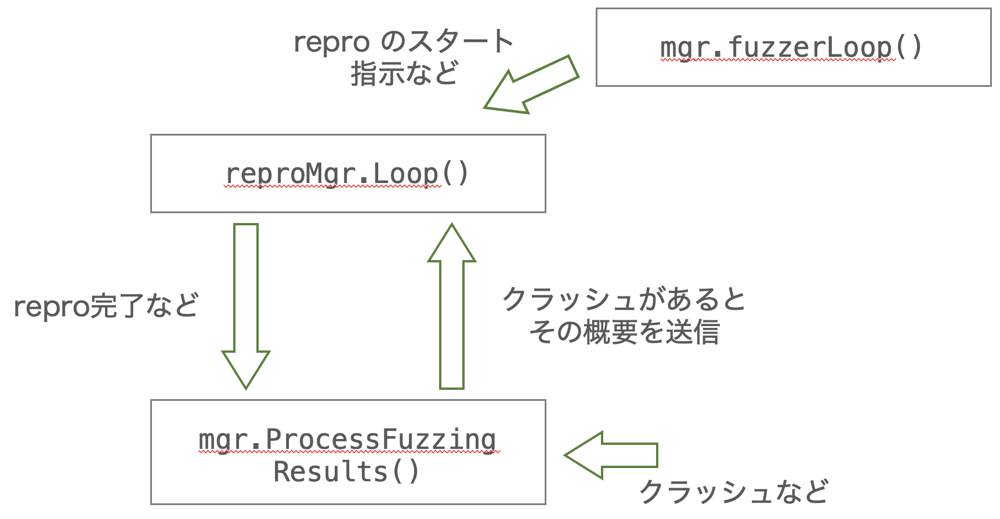

# manager.go

https://github.com/google/syzkaller/blob/61405512146275a395ed4174f448ddc175f8c189/syz-manager/manager.go

<br/>

## main

- ここから syz-manager の実行が始まる

```go=177
func main()
```

- config ファイルの読み込み

```go=183
cfg, err := mgrconfig.LoadFile(*flagConfig)
```

- [RunManager](#runmanager) の実行

```go=215
RunManager(mode, cfg)
```

<br/>

## RunManager

- [main](#main) から呼ばれる

```go=218
func RunManager(mode Mode, cfg *mgrconfig.Config)
```

<br/>

#### RPC サーバ (fuzzer の部分) 関連

- ファザーの処理をする RPC サーバを実行 
- ここからファザーが作られる
- [詳細](../../pkg/rpcserver/rpcserver/)

```go=272
mgr.serv, err = rpcserver.New(mgr.cfg, mgr, *flagDebug)
```

<br/>

#### VM の作成関連

- この中で VM を作成するために必要な VM Pool を作成している

```go=222
vmPool, err = vm.Create(cfg, *flagDebug)
```

- `mgr.vmPool` の情報を使って, `mgr.fuzzerInstance()` を登録する
  - ここでは `mgr.fuzzerInstance()` 関数を実行する登録をするだけで, 実際に実行はされていない

```go=315
mgr.pool = vm.NewDispatcher(mgr.vmPool, mgr.fuzzerInstance) 
```

- 実際に VM を作成する関数
  - この中で `mgr.fuzzerInstance()` が実行 
    - runner (RPCサーバ上で相手との通信に使用する?) と VM が作成される
    - VM 内で syz-executor が実行される
      - syz-executor は `executor/executor.cc` のバイナリ
- `mgr.pool.Loop()` の [詳細](../../vm/dispatcher/pool)

```go=323
mgr.pool.Loop(loopCtx)
```

<br/>

#### VM の状態管理関連



- バグを再現する (reproduction) のマネージャー

```go=316
mgr.reproMgr = newReproManager(mgr, mgr.vmPool.Count()-mgr.cfg.FuzzingVMs, mgr.cfg.DashboardOnlyRepro)
```

- VM のクラッシュが検知されたとき, reproductiion が終わったときなどの処理をする

```go=318
go mgr.processFuzzingResults(ctx) 
```

- reproduction を実際に実行する関数

```go=222
go mgr.reproMgr.Loop(ctx)
```

<br/>


#### コーパスのデータベース関連

- コーパスデータベースからコーパスを取得する
  - これは単純にメモリ上に読み込むだけ

```go=263
go mgr.preloadCorpus()
```

- コーパスをデータベースに保存するハンドラ
  - チャネルを使って, コーパス保存の指示があるたびに保存

```go=268
go mgr.corpusInputHandler(corpusUpdates)
```

<br/>

#### 情報表示関連

- シェルに10秒ごとに表示するやつ

```go=304
go mgr.heartbeatLoop()
```


<br/>

## fuzzerInstance

- [vm/dispatcher/pool.go](../../vm/dispatcher/pool) の `runInstance()` から呼ばれる

```go=688
func (mgr *Manager) fuzzerInstance(ctx context.Context, inst *vm.Instance, updInfo dispatcher.UpdateInfo)
```

- ここで runner を作成する

```go=690
mgr.serv.CreateInstance(inst.Index(), injectExec, updInfo)
```

- ここで VM 内で syz-executor を実行する
  - syz-executor のバイナリは `executor/executor.cc` から作られる

```go=692
rep, vmInfo, err := mgr.runInstanceInner(ctx, inst, injectExec)
```

<br/>

## MachineChecked

- 基本的に RPCサーバで runner を作成するたびに, VM のカーネルの状態をチェックする [pkg/rpcserver/rpcserver.go](../../pkg/rpcserver/rpcserver/) の `runCheck()` : 318行目 から呼ばれそう

```go=1275
func (mgr *Manager) MachineChecked(features flatrpc.Feature, enabledSyscalls map[*prog.Syscall]bool) queue.Source
```

- `preloadCorpus` ( `RunManager()` で取得した) からコーパスを取得する 

```go=1297
corpus := mgr.loadCorpus()
```

- 乱数生成器

```go=1302
rnd := rand.New(rand.NewSource(time.Now().UnixNano())) 
```

- ここでファザーを作る

```go=1303
fuzzerObj := fuzzer.NewFuzzer(...)
```

- 取得したコーパスを candidateQueue に入れる
  - candidateQueue は syzkaller 実行時のログの candidate の項目っぽい
  - syzkaller 実行時の最初だけ?

```go=1325
fuzzerObj.AddCandidates(corpus)
```

- コーパスの最小化
  - 1分おきに条件を満たすとコーパスの数を減少させそう

```go=1328
go mgr.corpusMinimization() 
```

- ファザーのループ
  - バグ再現や Hub の使用などの状態管理に使われる?
- ここから reproMgr にバグの再現を依頼してたりする (最初の図を参照)

```go=1329
go mgr.fuzzerLoop(fuzzerObj)
```