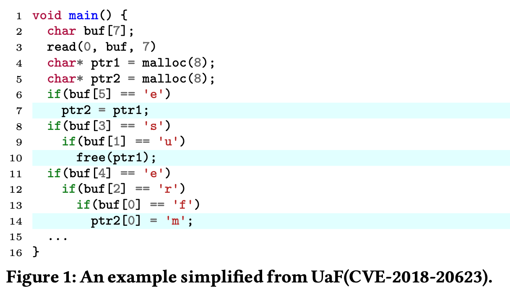
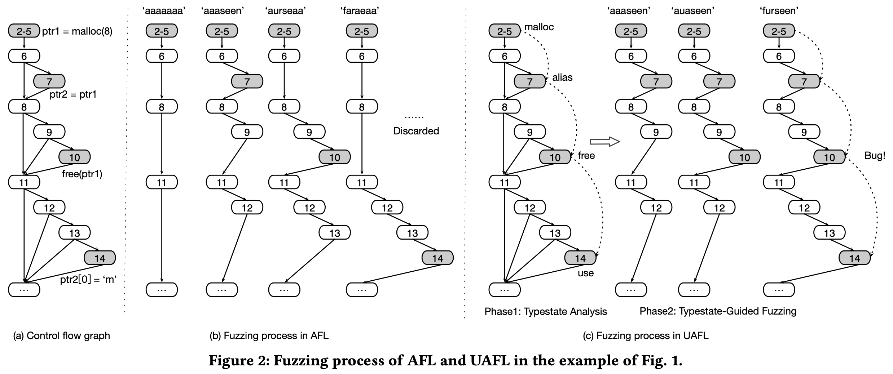
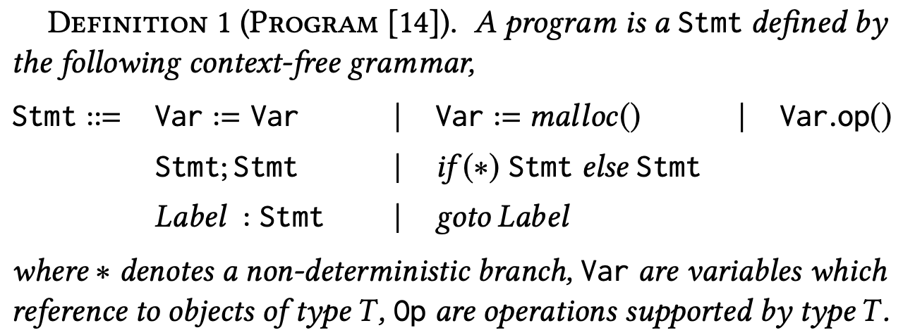
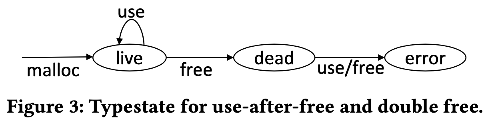
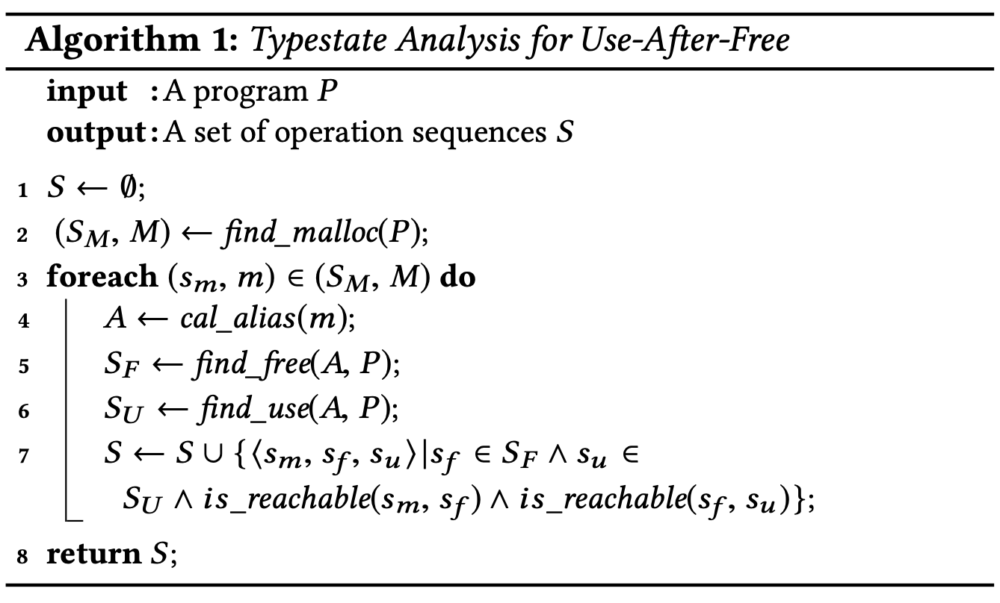
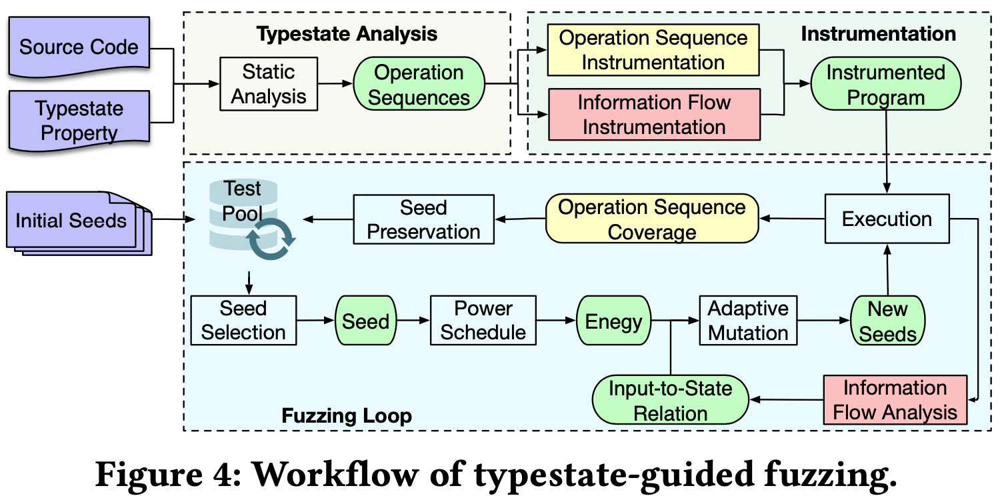
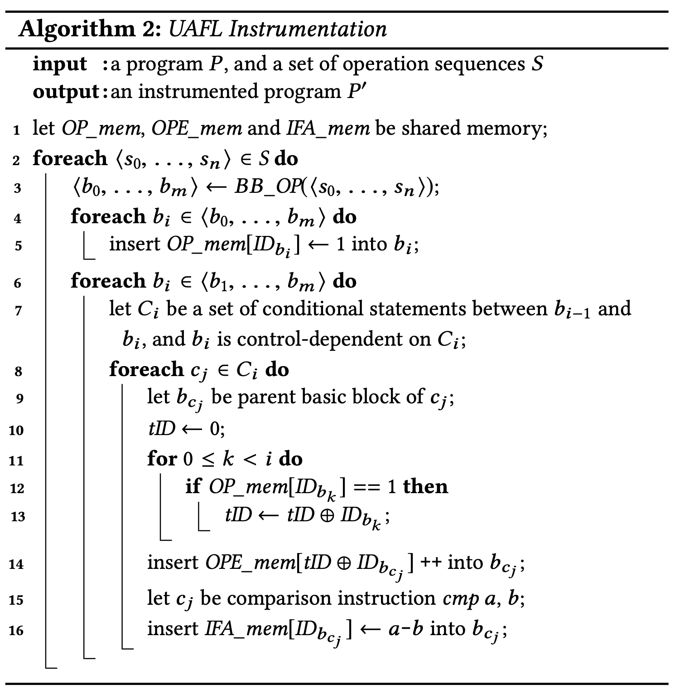
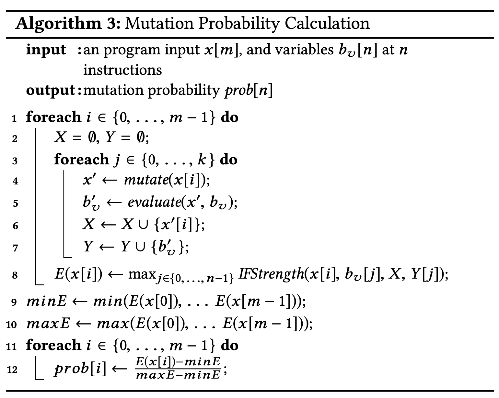

# Typestate-Guided Fuzzer for Discovering Use-after-Free Vulnerabilities [ICSE'20]

## Abstract

- 既存のカバレッジベースのファザーは CFG のエッジカバレッジを使用してガイドする
- use-after-free のような脆弱性はこのカバレッジは効果的ではない
  - UAF を発見するためには特定の順序でプログラムを実行する必要あり
- UAF を typestate property としてモデル化し, 性質に違反する脆弱性を発見するためのファザー (UAFL) を開発
- typestate property が与えられると, 
  1. 静的な typestate 解析を行い, 性質に違反する可能性のあるシーケンスを見つける
  2. このシーケンスを基に, プロパティ違反を引き起こすプログラムを生成するファジングを行う
- ファジングプロセス効率化のために情報フロー (information flow) も導入

 

## 1. Introduction

- UAF 脆弱性はかなり悪用される (UAF)
 

- UAF は一連の操作を特定の順序で行う必要があり, 検出が難しい
  - コード内では同じ場所にないかも

 

- 静的解析による UAF の検知は false positive が多い
  - スケーラブルで正確な inter-procedural なエイリアス解析が困難
- エイリアス解析の不正確な結果は実行時検出メカニズムの有効性にも影響するかも
  - [FreeSentry](https://www.talosintelligence.com/freesentry), [DangNULL](https://wenke.gtisc.gatech.edu/papers/dangnull.pdf)

 

- 動的な手法 (グレーボックスファジングなど) は誤検出が少ない
  - しかし既存の手法は UAF の検出に効果的ではない
- 既存のカバレッジファザー (AFL など) は CFG のエッジカバレッジを使用する
  - しかし UAF 脆弱性をトリガーするには CFG エッジをカバーするだけでなく, 特定の順序で実行する必要あり
  - 最先端のグレーボックスファザー ([MOpt](https://www.usenix.org/conference/usenixsecurity19/presentation/lyu), [ProFuzzer](https://ieeexplore.ieee.org/document/8835384)) は UAF をほとんど発見できない

 

- 特定の typestate プロパティに違反する脆弱性を発見するための typestate-guided fuzzer (UAFL) を提案
- 多くの一般的な脆弱性は特定の typestate プロパティの違反として見ることができる
  - UAF : $malloc \to free \to use$
  - Null pointer dereference : $nullify \to dereference$
- 色んな typestate 違反に対応できるが, 論文内では UAF に焦点を当てる

- 流れ
  1. typestate 解析を行い, プロパティに違反する可能性のある操作シーケンスを特定
  2. 操作シーケンスのカバレッジをターゲットプログラムに計装
- 計装から収集した情報に基づいて, ファザーの有効性を向上させる2つの戦略
  1. 操作シーケンスカバレッジをフィードバックとして使用する
  2. テスト入力がプログラム状態にどのような影響を与えるか推測するために情報フロー解析を導入し, 不要な変異を避ける

 

## 2. Motivating Example

- 図1 は 4,7,10,14行目が実行されると UAF になる
  - つまり $\mathtt{buf = "furseen"}$ 

### 2.1 Exising Coverage-based Fuzzers

- AFL では CFG エッジカバレッジを利用する
- プログラムが与えられると
  - 各基本ブロックに対してランダムな ID を生成
  - 2つの基本ブロックに基づいて CFG エッジ ID を計算
- 例: エッジ $A \to B$ について
  - $ID_{A \to B } = (ID_A >> 1) \oplus ID_B$ (排他的論理和)
  - $A \to B$ と $B \to A$ を区別するためにシフト演算を行う

 

- 共有メモリ $shared\_ mem$ はエッジのヒット回数をカウントするために使用される
  - $shared\_ mem[ID_{A \to B}]++$ は $A \to B$ のヒット回数が 1回増えることを表す
  - ヒット回数は 1, 2, 3, 4-7, 8-15, 16-31, 32-127, 128-255回に分類される
- AFL はテストケースを変異させ, 以下のどちらかを満たす場合に, 更なる変異のためテストプールに追加される
  - 前のテストケースで発見されなかったエッジをカバーしている
  - エッジの新しいバケットに触れる
- 全体として, [エッジ $\times$ 8] のバケット の情報を管理しているってことと思う
 

### 2.2 Limitations of Coverage-based Fuzzers

- 既存のカバレッジベースのファザーは CFG エッジのカバレッジを個別に考慮する
  - $A \to B \to C$ のパスに関して, $A \to B, B \to C$ を個別にカウントする
  - このパスのヒット数はカウントできない
- よって時間的メモリ安全性違反を検出することは困難

- 図1 のコードでは $4 \to 7 \to 10 \to 14$ 行目がこの順で実行されると UAF が発生する
- 図2(b) のように初期シードが [aaaaaa] で, AFL が 3つの変異体 [aaaseen], [aurseaa], [faraeaa] を生成するとする
- 4つのプログラムはすべての CFG エッジをカバーできるが, UAF をトリガーすることはできない
- それらに続く変異体は新たな CFG エッジをカバーできず, 破棄される
 

- $4 \to 7 \to 10 \to 14$ をカバーできるテストケースを生成するのは非常に困難
 

### 3. Our Approach

- UAFL : typestate プロパティに違反する脆弱性を検出することを目的とした typestate-guided ファザー
- typestate 解析と typestate-guided ファジングの2つのフェーズで動作する

#### Phase1: Typestate Analysis

- UAFL は typestate プロパティに基づき, まず静的な typestate 解析を行い, プログラム内の操作シーケンスをとらえる
- 例えば, UAFL は $malloc \to free \to use$ のパターンのすべての操作シーケンスを特定する
- UAFL はポインタのエイリアス解析も行う ( $\mathtt{ptr1}$ と $\mathtt{ptr2}$ はエイリアスである可能性がある)

#### Phase2: Typestate-Guided Fuzzing

- UAFL は段階的に操作シーケンスを実行するようなテストケースを生成する
- まず操作シーケンスに基づいて計装を行う
  - この操作シーケンスのテストケースを生成するようなフィードバックを提供するため
- 図2(c) は UAFL のファジングプロセスを表す
- UAFL が図2(b) のテストケースを生成し, すべての CFG エッジをカバーしたとする
- 操作シーケンス ($4 \to 7 \to 10 \to 14$) を基に UAFL は操作シーケンスをカバーする新しいテストケースを生成できる
  - [aaaseen] から [auaseen] を生成できる
    - 新しい CFG エッジをカバーしないため, AFL では破棄される
  - [auaseen] から [furseen] を生成できる

 

## 3. Typestate Analysis

- typestate プロパティと
- 静的 typestate 解析によって UAF に違反する可能性のある操作シーケンスを特定する方法

### 3.1 Typestate Properties

- 簡単のため, 以下のプログラミング言語で考える

- プログラム $P$ のパス $p$ :
  - $P$ のエントリから始まるステートメントの有効なシーケンス
- オブジェクトごとに複数の操作シーケンスを抽出することができる
 

- $\operatorname{Definifion} 2$: 操作シーケンス
  - $P$-path $p$ が与えられたとき, $\mathcal{U}(p)$ はこの実行中に作られたオブジェクトの集合
  - $o \in \mathcal{U}(p)$ について, $p[o]$ は $p$ の実行中に $o$ に対して行われた操作シーケンスを表す

- 例: $p = \langle a.malloc(), a.insert(), b.malloc(), b.free(), a.free() \rangle$
  - $\mathcal{U}(p) = \{a, b\}$
  - $p[a] = \langle a.malloc(), a.insert(), a.free() \rangle$

 

- $\operatorname{Definifion} 3$: Typestate property $\mathcal{P}$
  - 有限状態オートマトン $\mathcal{P} = (\Sigma, \mathcal{Q}, \delta, init, \mathcal{Q} \backslash \{err\})$
    - $\Sigma$ : 操作のアルファベット
    - $\mathcal{Q}$: 状態集合
    - $\delta$: ((状態, 操作) $\to$ 次の状態) の map
    - $init \in \mathcal{Q}$: 初期状態
    - $err$: エラー状態 ($\sigma \in \Sigma, \delta(err, \sigma) = err$): $\mathcal{Q} \backslash \{err\}$ は受理状態
- 操作シーケンス $\alpha = \langle \mathrm{op}_0, \dots, \mathrm{op}_n \rangle$ が与えられたとき
  - $\alpha \in \mathcal{P}$: $\mathcal{P}$ によって受理される
  - $\alpha \notin \mathcal{P}$: $\mathcal{P}$ によって受理されない

#### Typestate Analysis

- オートマトンが受理する操作の集合は有効なトレース
- 受理しない操作は typestate プロパティに違反する可能性がある
- typestate 解析問題:
  - typestate プロパティ $\mathcal{P}$ が与えられたとき,
  - $\exists o \in \mathcal{U}(p): p[o] \notin \mathcal{P}$ となるパス $p$ が存在するかどうか

 

### 3.2 Use-After-Free Detection Problem

- UAF の typestate プロパティ (オートマトン)
  - $\Sigma = \{malloc, free, use\}$
  - メモリが確保されたときアクセスできる
  - メモリが解放された後, use/free を行うとエラー状態となる
- UAF の検出は図3の typestate プロパティに違反する操作シーケンスを実行するテストケースを発見すること
 

- 図1の例では, $P$-path: $\langle 2-5, 6, 7, 8, 9, 10, 11, 12, 13, 14 \rangle$ は $ptr1$ のメモリに対する $\langle 4, 7, 10, 14 \rangle$ という操作シーケンスを含んでいて, typestate プロパティに違反する

 

### 3.3 Use-after-Free Typestate Analysis

- UAFL は typestate プロパティが与えられると, 静的 typestate 解析を行い, これに違反する操作シーケンスを見つける

- 2行目: プログラム $P$ に対して, すべてのメモリ割り当て命令 $S_M$ を見つける
- 3行目: $s_m$ で割り当てられた各メモリ $m$ に対して,  
- 4行目: エイリアス解析を行い, $m$ を指すポインタの集合 $A$ を求める
- 5行目: $A$ 内のポインタによって $m$ を解放するステートメントの集合 $S_F$ を求める
- 6行目: 同様に使用するステートメントの集合 $S_U$ を求める
- 7行目: 操作シーケンス $\langle s_m, s_f, s_u \rangle$ が出力 $S$ に追加される
  - $s_m \to s_f \to s_u$ が到達可能なら

 

- typestate 解析は path-insensitive なので false-positive が発生する
- ファジングで実際にプロパティ違反が発生するか確認する

#### Example1

- 図1では, 4行目と5行目にポインタ $ptr1$ と $ptr2$ が確保される
- $ptr1$ では7行目でエイリアスされたポインタ $ptr2$ を特定する
- 10行目で $ptr1$ によってメモリが解放
- 14行目でエイリアスされたポインタ $ptr2$ によってメモリにアクセスする
- 10行目は4行目から, 14行目は 10行目からアクセス可能なので $4 \to 10 \to 14$ の操作シーケンスを特定
- より正確にはエイリアス文もシーケンス内に入れる
- その結果 $4 \to 7 \to 10 \to 14$ というプロパティ違反を起こす操作シーケンスが得られる

## 4. Typestate-Guided Fuzzing

- 静的な typestate 解析によって特定の操作シーケンス (OSs) が与えられると, 
- OS-guided 計装をしてファジングプロセスを誘導し,
- typestate シーケンスを徐々にカバーするテストケースを生成することができる
 

- ファザーの有効性を向上させるための2つの戦略
  
  1. OS-guided 機構は UAFL が操作シーケンスをカバーするテストケースを段階的に生成するようにガイドする機構
     
     例) 図2の $4 \to 7 \to 10 \to 14$ をカバーするために, UAFL は $4 \to 7$, $４ \to 7 \to 10$, $4 \to 7 \to 10 \to 14$ と順番にカバーするテストケースを徐々に生成する

  2. ガイドを調整するための変異戦略が必要

     UAFL は情報フロー解析を利用して入力と変数の関係を構築し, それに基づいて入力を変異させる

     例) 図1のプログラム: 入力 $buf$ は 8, 9 行目に関連しており, UAFL はこれらを変異させて 10行目を実行できるテストケースを生成する

 

### 4.1 Fuzzing Workflow

- 図4はファジングのワークフロー
- typestate 解析によって操作シーケンスを特定した後, OS-guided 情報をプログラムに計装する
- 2つの戦略を実現するために 2つの計装 (Section 4.2)
  - 操作シーケンスの計装
  - 情報フローの計装
- ファジングのループ
  - テストプールからテストケース (シード) を選択する (Section 4.4)
  - シードの品質を測定し, パワースケジューリング戦略によってシードにエネルギーを割り当てる (Section 4.5)
  - 情報フロー解析を用いて適応的変異戦略を生成する (Section 4.3)
  - 新しいシードが生成されると, それを実行して新しい操作シーケンスカバレッジがあるかチェックする
  - もしあれば, さらなる変異のためにテストプールに追加される

 

### 4.2 Instrumentation

- 入力: プログラム $P$, 操作シーケンス $S$
- 出力: 計装されたプログラム $P'$
- 計装の 3つのステップ
  1. 共有メモリ $OP\_mem[]$ を使用して, 操作シーケンスの文が実行されたか記録する
  2. 共有メモリ $OPE\_mem[]$ を使用して, 操作シーケンスのエッジがカバーされているか記録する
  3. 共有メモリ $IFA\_mem[]$ を使用して, 将来の情報フロー解析のために比較命令の変数の値を記録する

 

- 計装は基本ブロックに対して行われる
- 各操作シーケンス $\langle s_0, \dots, s_n \rangle$ から基本ブロック列 $\langle b_0, \dots, b_m \rangle$ を得る (3行目)
  - いくつかの文は同じ基本ブロックに含まれるため, 基本ブロック列は操作シーケンスより短くなるかも
- 各 $b_i$ について, $b_i$ が実行されたか表す $OP\_mem[ID_{b_i}] \gets 1$ を計装 (5行目)
  - 1ビットで実行されたかどうかだけを表してる (回数までは見ない)

 

- 第2のステップは操作シーケンスのカバレッジを記録するための計装
- 操作シーケンスのエッジは P-パスの CFG のエッジを実行する必要がある
  - 例) 操作シーケンス $7 \to 10$ をカバーするには, $8 \to 9$, $9 \to 10$ を実行する必要がある
- 操作シーケンスのエッジを直接カバーすることは困難
  - $8 \to 9$, $9 \to 10$ の順でカバーする

 

- 操作シーケンスのエッジをカバーするためのガイドを提供するために, 支配的な基本ブロックを考える
  - 例) $7 \to 10$ について 8, 9 行目の基本ブロックは支配基本ブロック
- シーケンスの各 $b_i$ に対して, $b_{i - 1}$ と $b_i$ の間の条件文 $C_i$ を解析する (7行目)
- 各ステートメント $c_j \in C_i$ に対して, その基本ブロック $b_{c_j}$ を取得し (9行目), $b_{c_j}$ に　$OPE\_mem[tID \oplus ID_{b_{c_j}}]++$ を計装 (14行目)
- $tID$ を使用して $\langle b_0, \dots, b_{i-1} \rangle$ の実行状況を表す (10~13行目)
  - $b_k$ が実行された場合 ($OP\_mem[ID_{b_k}] == 1$ (12行目)), その $ID$ が $tID$ に埋め込まれる (13行目)
  - その結果, $tID$ を用いて実行プロセスを $b_{c_j}$ に導くことができる
- $tID$ は新しい基本ブロック $b_k \in \langle b_0, \dots, b_{i - 1} \rangle$ が実行されると異なる値になる

 

- 第3のステップでは情報フロー計装を行う
- 条件文は比較命令と仮定 ($cmp \ a \ b$)
- UAFL は基本ブロック $b_{c_j}$ に $IFA\_mem[ID_{b_{c_j}}] \gets a - b$ を計装し, $a - b$ の値を記録する

 

#### Example2

- 図2(c) の操作シーケンスのエッジ $7 \to 10$ を考えると, 基本ブロックのシーケンスは $b_7 \to b_{10}$ であり, $ID$ は $ID_{b_7}, ID_{b_{10}}$
- $b_7$ が実行されたとき, $OPE\_mem[ID_{b_7} \oplus ID_{b_{10}}]++$ で $b_{10}$ を計装する
- そうでない場合は $OPE\_mem[ID_{b_{10}}]++$ が $b_{10}$ に挿入される
- この計装は実行時に $b_{10}$ に到達した時点で, $b_7$ が実行されたかどうかを区別できる

 

### 4.3 Information Flow Analysis based Mutation

- 操作シーケンスとその支配的な基本ブロックが特定されると, 次の課題は操作シーケンスを迅速にカバーできる変異を見つけること
- $cmp \ a \ b$ の場合, 入力のどの部分が $a - b$ の値を変化させられるか特定し, その入力を変異させることにリソースを注ぐ
- 情報フロー解析を導入する

#### Information Flow Strength

- 変数 $x$ から $y$ への情報フロー強度を以下のように定義する

$$IFStrength(x,y, V_x,V_y) = H(x,V_x)-H(x|y,V_x,V_y)$$

<ul>

  - $V_x, V_y$ は $x, y$ の値域
  - $H(x, V_x)$ は変数 $x$ の不確実性を測定する情報エントロピー

</ul>

$$H\left(x, V_x\right)=-\Sigma_{x_i \in V_x} P\left(x=x_i\right) \log _2 P\left(x=x_i\right)$$

<ul>

  - $H(x|y,V_x,V_y)$ は変数 $y$ の分布が与えられたときの変数 $x$ の条件付き情報エントロピー

</ul>

$$\begin{gathered}
H\left(x \mid y, V_x, V_y\right)=-\Sigma_{y_j \in V_y} P\left(y=y_j\right) \\
*\left[\Sigma_{x_i \in V_x} P\left(x=x_i \mid y=y_j\right) \log _2 P\left(x=x_i \mid y=y_j\right)\right]
\end{gathered}$$

- アルゴリズム3 は主に2つのステップ
  1. 入力の各バイトとターゲットの比較命令の変数 ($a - b$) の情報フロー強度を計算する (1-8行目)
   
     情報フロー強度が高ければこのバイトが変数の値に与える影響が強いことを意味する

  2. これらのバイトはターゲット命令の値を変化させる可能性が高いため, 入力のこれらのバイトに高い変異の可能性を割り当てる (9-12行目)

 

- アルゴリズムの入力は $m$ バイトのプログラム入力である配列 $x[m]$ と $n$ 個の比較命令の変数を含む配列 $b_v[n]$
- 出力は入力 $x$ の各バイトに対する変異確率の配列 $prob$
- 入力 $x$ の各バイトについて (1行目), $b_v$ の各変数への情報フロー強度を計算する

 

- $X$ と $Y$ を使って, $x$ の各バイトと $b_v$ の各変数のサンプリング値を格納する (2行目)
- $x$ の各バイト ($x[i]$) を $k$ 回変異させ (3行目), $b_v$ の各変数について $k$ 個の値を得る
  - 新しい変異体 $x'$ を得る (4行目)
  - $x'$ を実行することで (5行目), 変数 $b_v$ の値を評価
- $k$ このサンプルを生成した後, $x[i]$ と $b_v$ の各変数との間の情報フロー強度を計算 (8行目)
  - 各 $x[i]$ について $n$ 個の情報フロー強度のあたいを計算し, その最大値を $x[i]$ の情報フロー強度とする

 

- 情報フロー強度に基づいて, $x[i]$ の変異確率を計算 (9-12行目)
- 直感的には, $x[i]$ とプログラム変数との間に強い情報フロー強度があれば, その変異確率は大きくなる

 

#### Example3

- 図1 において, 入力 $buf = [aaaaaaa]$ が与えられ, ターゲット命令を $buf[3] == s$ とする
- 入力のバイト (例えば, $buf[3]$ と $buf[6]$ とする) と 8行目の変数 ($buf[3] - s$) との情報フロー強度を考える
- 各バイトを 10回変異させると, 情報フロー強度は $buf[3]$ が $3.3$, $buf[6]$ が $0$ となる
  - $buf[3]$ と 8行目との間に強い情報フローが存在する
- そのため, $buf[3]$ にさらに変異を割り当てる

 

### 4.4 Seed Selection

- シード選択ステップはテストプールから次のテストケースを選択すること
  - 選択されたテストケースに何らかの変異がある場合, ターゲット操作シーケンスをカバーする可能性が高くなる
- シードをスコアに基づいて 3段階のキューに分割
  - 最上位のキューにあるシードが最も優先度が高くなる

 

- 3つの階層は操作シーケンスエッジ (例: $7 \to 10, 10 \to 14$) と CFG エッジカバレッジ (例: $8 \to 9, 9 \to 10$) に基づいて設計される
- 新しく生成されたシードが与えられたときの追加方法
  - 新しい操作シーケンスエッジをカバーすると最上位のキュー
  - 新しい CFG エッジをカバーすると 2番目のキュー
  - そうでなければ最下位のキュー

 

#### Example4

- 図2 において新たに生成されたテストケースは操作シーケンスのエッジ $7 \to 10$ をカバーするため, 最上位のキューに入れられる
- $7 \to 10$ をカバーせず, CFG エッジ $8 \to 9$ をカバーする場合は, 2番目のキューに入れられる